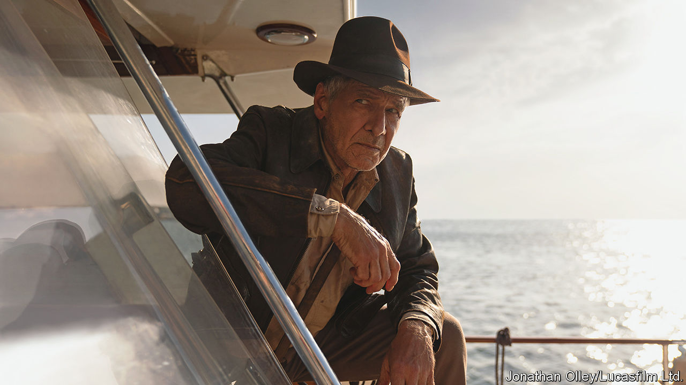

###### Back Story

# The secrets of Indiana Jones 

##### “Indiana Jones and the Dial of Destiny” is his last adventure. It wasn’t all just fortune and glory, kid 

 

> Jun 29th 2023 

We saw the whip—and saw him use it—before we saw his face, Harrison Ford’s rugged features perspiring beneath that battered fedora. The first blast of the triumphant music sounded early in “Raiders of the Lost Ark” (released in 1981), as, dodging poison darts, Indiana Jones Tarzan-swung to a moving seaplane. The pilot’s pet python slithered onto his lap. Snakes! He hated them.

The whip, the hat,  and the phobia of snakes have punctuated all Indy’s adventures. He cracked the whip as part of his combative seduction technique in “Indiana Jones and the Temple of Doom”; while being whacked in the kidneys in “Indiana Jones and the Last Crusade”, he used it to secure his father to a runaway tank. He grabbed the hat from beneath a deadly descending door and had it blown back to him after falling off a cliff. He was entombed with snakes and fed them.

These accoutrements have two origin stories. “Crusade” traced the whip, hat and snake issues to a teenage tussle on a circus train in Utah. They also came from the magical pairing of  (director of the first four Indy films) and George Lucas (who dreamed up the idea). So many bits of old Westerns and war movies,  and Bogart, went into Indy that he was almost a walking homage. Yet he was his own man: an archaeology professor but a fighter, whose punches made a special  snap; a guy who took his own whisky to face down the Nazis in a Cairo bar.

Just when Indy thought he was out, he has been pulled back in for a fifth and last caper in “Indiana Jones and the Dial of Destiny”, directed by James Mangold (Mr Lucas and Mr Spielberg are executive producers). It is 1969 and Indy is set to retire; female students no longer swoon at him. Mr Ford is 80, but he and Indy are put through the usual stunt-a-minute frenzy, taking breaths only for wisecracks and just enough exposition for the plot to make sense, more or less. The quarry is the dial of Archimedes, an ancient calculator. Indy teams up with his louche goddaughter Helena (), who comes with her own sidekick, a Moroccan urchin named Teddy (Ethann Isidore).

The greatest-hits motifs return for the finale, including a rickety rope-bridge, creepy-crawlies and giant eels in lieu of snakes. The dial is kicked around a mêlée like the vial of antidote in “Doom”. The red lines on the map that track Indy’s odysseys streak from Tangier to the Aegean. Where he’s going, though, he won’t need maps, for the wondrous dial can predict “fissures in time”. To reverse an old line of Indy’s: it’s not the mileage, honey, it’s the years.

So, after five films, four decades and all those booby traps, cobwebby cadavers and cryptic clues; all the chases through souks, palisaded walls, fisticuffs on the bonnets of trucks and messy encounters with propellers; all the planes, trains, automobiles, zeppelins and horses (in “Dial” Indy rides one into the New York subway): what was it all about? The main meaning of Indiana Jones lies in the joy he has given generations of viewers. But it wasn’t just fortune and glory, kid.

First, those Nazis. Bumbling American Feds got in the way, but the Nazis were Indy’s main foe. (The fourth film, “Indiana Jones and the Kingdom of the Crystal Skull”, roped in both the Soviets and aliens, a classic case of more equalling less.) With its ineffable Sieg-Heiling monkey, “Raiders”, like “Crusade”, was specifically a fantasy of besting the Nazis in the 1930s, before the horrors of war. Indy is still beating them in “Dial”, in the form of a renegade physicist enlisted in the Moon-landing programme.

Next, the dreadful allure of knowledge. In Indy’s world, knowledge is noble and sexy—“the search for fact” is his calling—but too much, or the wrong sort, is hubristic and malign. The Ark of the Covenant in “Raiders”, the Holy Grail in “Crusade”, the urge to “know everything” in “Crystal”, that time-scrambling dial: pursuing these mysteries can make a baddy’s face melt amid a sandy whirlwind. Stay in school, runs the moral of Indy’s story, but stay in your lane.

Another, everyday tension courses through his quests. In each he must balance his mission against his personal feelings—for a hard-drinking ex-lover, a young apprentice, an absentee dad (it was complicated), a long-lost son and finally his godchild. The future of the world is at stake, too, but Indy’s basic dilemma—work or family?—is shared by every office schlub who yearns to head home from a desk, or vice versa. His darkest secret is that he was always one of us. As a villain says in “Raiders”, then prematurely: “Indiana Jones, adieu!” ■


