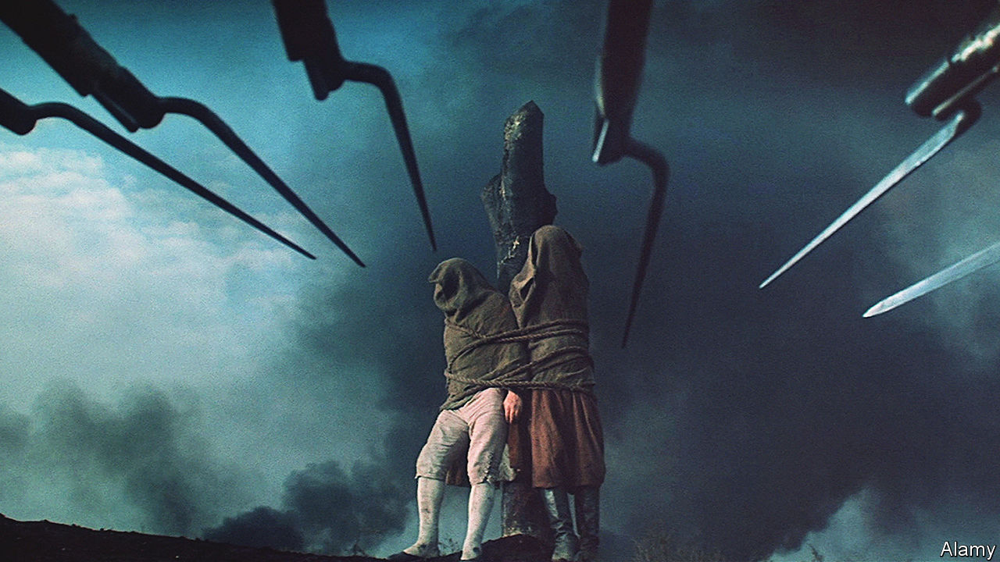

###### Bethink yourselves!

# Used and abused by Russian rulers, Tolstoy has always resisted 

##### The novelist and prophet of peace is at his most urgent in a time of war 

 

> Jun 29th 2023 

“Evil has become a heroic act,” declared Dmitry Muratov, a courageous Russian journalist and a winner of the Nobel peace prize, in a recent speech in Bonn. Never again, he lamented, will Russians and Ukrainians “be fraternal nations”. He was interrupted by the sound of air-raid sirens played by Ukrainian reporters on their phones. He did not complain: “The world needs to hear the sound of war.”

These days many Ukrainians find it hard to listen to Russian voices, even those of dissidents. Volodymyr Zelensky, Ukraine’s president, recently signed a law that restricts the printing of contemporary . A magnificent exception to this rupture is a production this year of Sergei Prokofiev’s “War and Peace” at the Bavarian State Opera in Munich. Under a Russian director, Dmitri Tcherniakov, and conducted by Vladimir Jurowski, a Russian-born German citizen, Ukrainian, Moldovan and Russian singers are performing an opera based on Leo Tolstoy’s . 

Part of what brings them together is Tolstoy’s pacifism. The young writer who fought in Russia’s wars in Crimea and the Caucasus evolved into an opponent of all forms of violence and repression and an inspiration to Gandhi. Applying the artistic and psychological mastery of his fiction to these radical ideas, he became a prophet of peace. He loathed war “not because he was afraid of death, but because of how war poisons the human soul and is inevitably steeped in lies and hatred”, says Andrei Zorin, a biographer of Tolstoy at Oxford University. 

In Munich, the hatred and lies are exposed on stage. Why, ask both Tolstoy and the production, do people travel far from home to kill total strangers? How do human beings become possessed by the rage of violence and war? These urgent questions, immortally formulated by an author who , loom over Russia’s past, present and future. 

“Tolstoy is making a comeback. Now he is not only the brilliant author of ‘War and Peace’,” declared InLiberty, an educational project in Russia, on the centenary of his death in 2010, “but also an ideologue of non-violence.” Russians who considered themselves individuals rather than disempowered subjects of the state found in his writings an ideal version of nationhood that had yet to materialise in real life. As a 19th-century literary critic says in Tom Stoppard’s “Coast of Utopia”, a trilogy of plays about Russian thinkers: “In Russia, there’s no division of labour, literature has to do it all.” In fact, “literature can replace, can actually become Russia!”

When Vladimir Putin launched his full-scale invasion of Ukraine—waging war to suppress independence and freethinking in both countries—Russians who were ashamed and appalled . A man who held up a copy of “War and Peace” in Red Square was promptly detained. The most quoted text was a searing essay Tolstoy wrote in 1904 in response to Russia’s humiliating war against Japan, which he entitled “Bethink Yourselves!” “Stupefied by prayers, sermons, exhortations,” Tolstoy thundered, thousands of soldiers “will commit the most dreadful act of killing men whom they do not know and who have done them no harm.” A man who posted these words online last year was charged with discrediting the Russian army.

, Russia’s imprisoned opposition leader, spoke Tolstoy’s words in court: “War is a product of despotism. Those who want to fight war must only fight despotism.” It was not the first time he had enlisted Tolstoy to his cause. In a film about Mr Putin’s secret palace on the Black Sea, released on the day of Mr Navalny’s arrest in 2021, he cited Tolstoy’s image of Russia’s rulers: “The villains have gathered. They have looted people, they have hired soldiers and judges to guard their orgy. And they are having a feast.”

The villain-in-chief moved to neutralise Tolstoy and co-opt him for his own purposes. Less than a month before sending his forces into Ukraine, Mr Putin signed a decree. “Taking into account the outstanding contribution of Leo Tolstoy to national and world culture,” it read, “I hereby resolve…to celebrate the 200th anniversary of Tolstoy’s birth in 2028.” 

Mr Putin was not the first Russian leader to lay claim to Tolstoy’s legacy while trampling on his ideas. Nor was he the first to find that Tolstoy fiercely resisted.

A crackpot and a mirror

“What happiness it was to live in the time of Tolstoy,” wrote Konstanin Stanislavsky, a legendary theatre director, on the day Tolstoy died, “and how scary it is to remain on this Earth without him.” Lenin branded him a “crackpot” for urging non-violent protest. But in power the Bolshevik leader, who had also called Tolstoy “the mirror of the Russian revolution”, sought to nationalise him. In 1920 Lenin authorised the publication of Tolstoy’s works in full.

The 90-volume project was launched in 1928—the centenary of Tolstoy’s birth and the beginning of Russia’s descent into ’s totalitarianism. Statues of Tolstoy were erected and medallions minted. Yet even as Tolstoy was canonised, thousands of his disciples were arrested and murdered. Famine was inflicted on the peasantry, which he had striven to raise up. 

During the second world war, Stalin’s regime ransacked “War and Peace” for parallels between the struggle against the Nazis and Russia’s defeat of Napoleon in 1812. On the day the Soviet Union was invaded, Vyacheslav Molotov, the foreign minister, declared: “Napoleon’s march into Russia was answered with a patriotic war, and Napoleon was defeated…The Red Army and all our people will once again lead a victorious patriotic war for the fatherland, for honour and for freedom.” 

But the novel, like the author, fought back. As Pierre Bezukhov, one of its main characters, says: “They took me and shut me up. They hold me captive. What, me? Me? My immortal soul? Ha ha ha!” 

Soviet citizens turned to the book of their own accord, seeing it as a reservoir of national unity and courage in a country where honour and freedom were suppressed. “People avidly read ‘War and Peace’ as a means of testing their reactions (not Tolstoy’s, because no one doubted he was equal to life’s challenges),” wrote Lidiya Ginzburg in “Blockade Diary”, a chronicle of the siege of Leningrad. “The reader would say to himself, ‘Yes, now I know that my feelings are accurate’.” Leading actors read chapters of the story on the radio.

Prokofiev began composing his operatic version before the invasion. He was more interested in the lyrical “peace” scenes than in the stylistic diktats of Socialist Realism. When war began he was advised to rethink the heroic aspects of the story and enhance the choral elements that could represent a unified mass rising against invaders. Prokofiev complied—but never saw his opera fully staged. Stalin feared Soviet soldiers would return from the war with new ideas of freedom, like the Russian officers who triumphed in 1812. He barely celebrated victory and was quick to rebrand his wartime allies as enemies. 

In 1948 Prokofiev, along with other great artists, was declared guilty of “formalist perversions and anti-dramatic tendencies alien to the Soviet people”. He died on March 5th 1953—the same day as Stalin. The volume in the collected works that included Tolstoy’s denunciation of the death penalty was belatedly printed in 1956. A few years later, as the defeat of Hitler came to replace the Bolshevik revolution as the country’s unifying myth, the authorities dragooned Tolstoy into service once again, adapting “War and Peace” into an epic film (see main image above). Thousands of Soviet soldiers appeared as extras. 

Returning in July as part of the Munich Opera Festival, the Bavarian production, too, was conceived before an invasion. But it opened a year into the war. It is set in the Hall of Columns in the House of Unions in Moscow, where Stalin’s corpse lay in state. Instead of an overture, a quote from “Bethink Yourselves!” is projected above the stage: “Again war. Again sufferings, necessary to nobody, utterly uncalled-for; again fraud, again the universal stupefaction and brutalisation of men.” 

The murderer’s fallacy

The first sound is not music, but a despairing animal yelp that merges with Prokofiev’s chords and emanates from Prince Andrei Bolkonsky, another of the story’s characters (sung here by Andrey Zhilikhovsky, a Moldovan baritone). The atmosphere of war is present from curtain-up; peace is already a memory. Mattresses are strewn on the floor, as in a shelter for internally displaced people. 

 


Yet if war is ever-present, the enemy is absent. The invasion does not come in the shape of French troops—there are none—but rather from within. It is not borders that are violated but the bounds of decency and the bonds of family and love.

A vast chorus that emerges from the darkness at the start of the second act breathes war. Intoxicated with Prokofiev’s music and by propaganda, the crowd whips itself into a patriotic frenzy, punching the air as if possessed. The “feverish, hot-headed, insane excitement which has now seized the idle upper ranks of Russian society”, Tolstoy wrote in 1904, was a symptom of a guilty conscience. So were the mendacious vows of “readiness to sacrifice life (or one should say other people’s lives)”, and promises to “defend with one’s breast land which does not belong to one”.

This insanity is a form of self-destruction. In the novel, Prince Andrei is wounded in battle. Here he puts a gun to his own chest and pulls the trigger. In one of the production’s most moving scenes, which forms a climax in the novel, his sometime fiancée Natasha Rostova, sung by the Ukrainian soprano Olga Kulchynska, tries to lift Andrei’s bleeding body and lead him in a waltz. His limbs flop like a broken puppet’s; she lowers him onto a mat, covers him with a blanket and lies beside him.

Just as “the murderer who has begun to assassinate his victim cannot stop”, wrote Tolstoy, so the Russian people imagine that “the fact of the deadly work having been commenced is an unanswerable argument in favour of war.” The antidotes, he knew, were empathy, tenderness and love. ■


