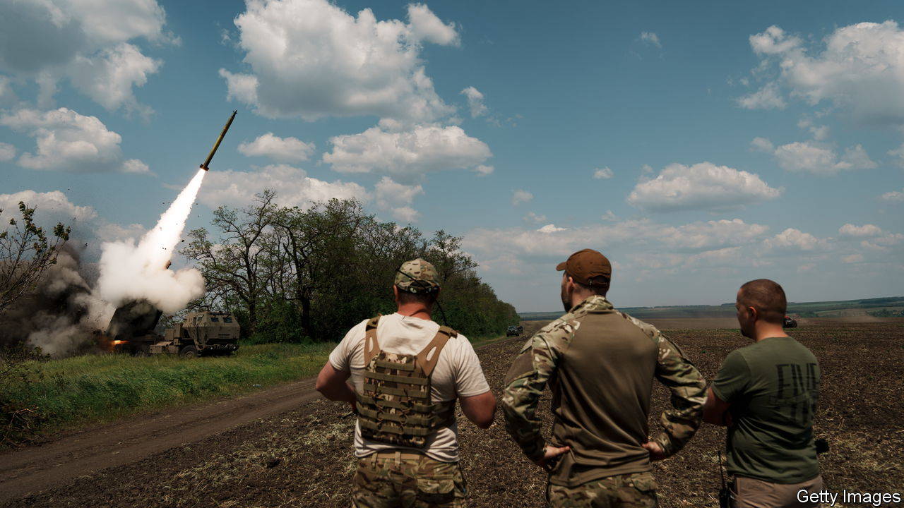
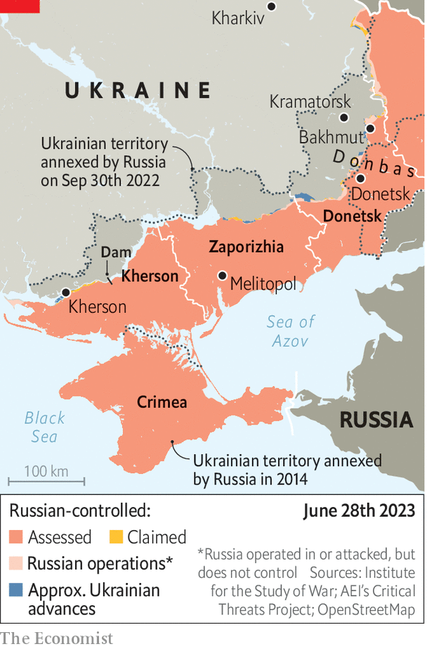

###### Party like it’s 1917

# Can Ukraine capitalise on chaos in Russia? 

##### Ukraine’s counter-offensive is going slowly 

 

> Jun 28th 2023 


UKRAINIANS WATCHED with glee as Russia  on June 24th. They had hoped that Yevgeny Prigozhin’s march on Moscow would tie up Russian troops and destabilise Vladimir Putin’s regime. Alas, the  proved short-lived. In recent days Ukraine’s army has made modest advances in the east. But a counter-offensive that began on June 4th shows little sign of breaking through Russian lines in force any time soon, making some Western officials nervous.

 


Still, Ukraine has made some hay with the disarray next door. Its army made striking progress in the eastern town of Bakhmut, which Mr Prigozhin’s Wagner Group had captured only last month after almost a year of fighting. Ukrainian forces now threaten to encircle Russian defenders from the north and south. Volodymyr Zelensky, Ukraine’s president, hailed a “happy day” after visiting front lines on June 26th. Russia responded with a dinner-time missile strike on a popular restaurant in Kramatorsk on June 27th, 30km from the front line. It killed at least eight people, including three children.

The aim of Ukraine’s offensive towards Bakhmut appears less to enter the city than to surround it. “We can now hit any point in the city and on the approaches…We are working to cut off their logistics,” says Denys Yaroslavksy, a special-forces officer fighting to the north of Bakhmut. Serhiy Cherevaty, a military spokesman, confirmed that a number of brigades advanced around Bakhmut by around 2km on the day of Mr Prigozhin’s mutiny.

The front lines shifted elsewhere, too. Ukraine’s capture of territory in the western suburbs of Donetsk city was especially telling: troops crossed into territory which Russia had captured in 2015, during its first invasion of Ukraine. Farther west, in the Kherson region, Ukrainian forces established small bridgeheads above and below the partially destroyed Kakhovka dam. Some officials suggest that Ukraine may be able to conduct a more serious crossing of the rapidly desiccating Kakhovka reservoir in the weeks to come. 

The question is whether the convulsions in Russia will have longer-lasting effects on the battlefield. One issue is the future of the Wagner Group. “What set them apart from the rest was that they just stormed forward,” says one soldier in Bakhmut. “They didn’t run because they would be shot if they retreated.” The group had left the city in late May, replaced by low-quality Russian regulars, but Ukraine expected Wagner to return.

Some of its fighters have indeed gone back to Ukraine, where Mr Putin says they will be absorbed into Russia’s regulars. Others, including the 2,500 to 5,000 troops who took part in the mutiny, may join Mr Prigozhin in Belarus. Alexander Lukashenko, that country’s dictator, has offered the use of an abandoned military camp. Satellite images show tents cropping up 120km south-east of Minsk. “These are professional troops who could be used on diversionary missions,” warned a Ukrainian government official. A military-intelligence source said the prospect of another Russian invasion from the north remained slim. “There may be a game to get us to move forces to the north,” he suggested. “But we play games too.”

The second issue is the impact on morale. A spokesperson for Ukraine’s 56th Motorised Brigade, now fighting on the outskirts of the city, says her colleagues had observed new levels of “confusion” among their Russian counterparts since June 23rd. Their befuddlement is understandable. Mr Prigozhin now insists that he was never out to topple Mr Putin. But on the eve of his mutiny, on June 23rd, he publicly skewered Mr Putin’s rationale for war by rubbishing claims that Ukraine had bombed the Donbas region for eight years and that Ukraine and nato intended to attack Russia. The war, he said, was launched for the benefit of Russia’s “oligarchic elite”.

In angry remarks the next day Mr Putin himself drew an indelicate comparison to 1917, a year in which revolution at home contributed to the mutiny of Russian armies in France. Anthony King, a military sociologist at Warwick University, warns against over-egging the effect of Mr Prigozhin’s subversive messaging. Troops tend to fight for several reasons, he says. A political cause is just one. Others include the bonds of loyalty within small units, and the effect of coercion—such as Russian “blocking detachments” which threaten to shoot retreating soldiers. Mr King says he is sceptical that “political shenanigans” will have much of an effect on platoons and companies at the tactical level.

The impact on Russia’s high command, the third question raised by the insurrection, could be more severe. The divisions and intrigues inside Russia’s leadership are becoming more apparent. On June 28th the  reported, quoting American intelligence sources, that General Sergei Surovikin, the commander of Russian forces in Ukraine between October and January, had prior knowledge of the rebellion. Other reports suggest that he may have been arrested; he has not been seen in public since the the mutiny. The  has also reported that Mr Prigozhin had intended to kidnap Sergei Shoigu, Russia’s defence minister, and General Valery Gerasimov, the country’s chief of general staff, during their visit to a region near Ukraine’s border. 

For now, Ukraine is making slower progress than many American and European officials had hoped. “It is still too early to tell how successful the ongoing counter-offensive will be,” acknowledged General Sir Patrick Sanders, Britain’s army chief, on June 26th, adding: “Russia has been a country of comebacks.” Ukraine has yet to commit the majority of its new Western-equipped brigades. But its initial attacks against well-defended Russian positions, including minefields, have exposed its troops’ limited training. They have taken heavy casualties, according to people familiar with the details.

Ukrainian commanders want to protect their depleted forces; Western advisers retort that a lack of shock and momentum will cost more lives in the longer term. A Ukrainian military-intelligence source complains that the country is moving as fast as it can, given the tools at its disposal. “Let me put this as diplomatically as I can,” he says. “Certain partners are telling us to go forward and fight violently, but they also take their time delivering the hardware and weapons we need.” ■

