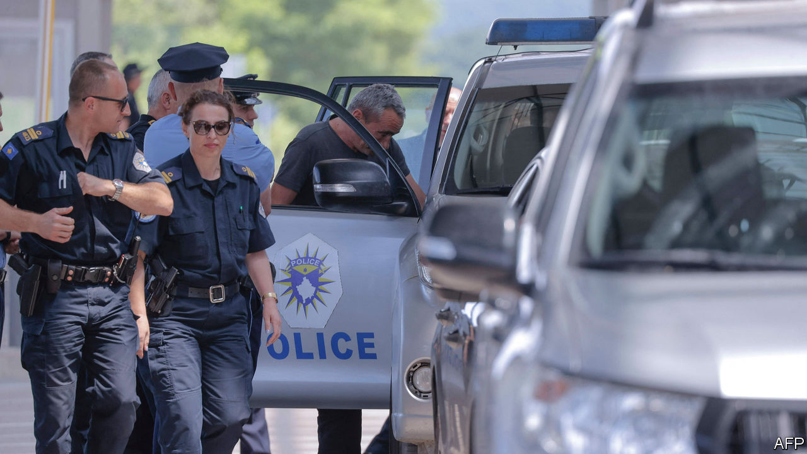
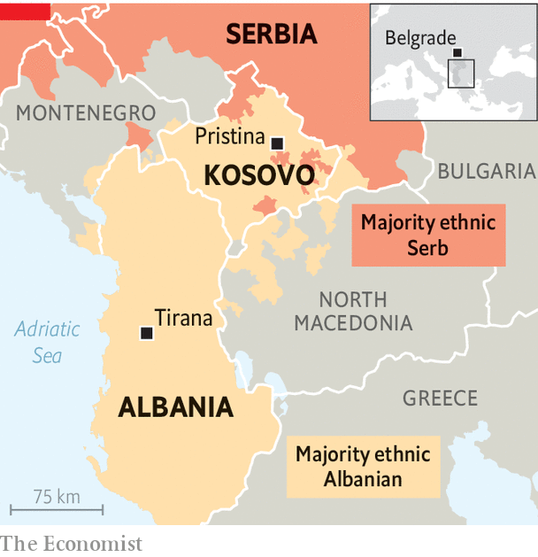

###### Kosovo rumbles again

# Ethnic Serbs and Albanians are at each others’ throats 

##### This time Kosovo’s ethnic Albanians are largely to blame 

 

> Jun 29th 2023 

It was “an escalation on top of a previous escalation,” said Gabriel Escobar, an American diplomat charged with helping the EU to calm relations between Serbia and Kosovo, a republic of under 2m people which most of the Western world recognises as an independent country but which Serbia still considers its own land. On June 14th three Kosovo policemen were arrested by Serbian police, though the two sides dispute which side of the border they were on. On June 26th they were freed. But this latest of many Kosovo-Serbia crises persists. 

 


Kosovo police have been arresting local Serbs who, they say, have attacked NATO peacekeepers and journalists. The police also claim to have found a big weapons cache in the northern bit of Kosovo, where most people are ethnic Serbs. Ethnic Albanians are a large majority elsewhere. American and EU diplomats are crisis-fighting, afraid that another violent incident could blow up into a bigger conflict. 

Last November Kosovo’s Serbs resigned from the country’s institutions, including the police. Elections in the Serb-populated north to replace the mayors who had quit were boycotted by Serbs, so ethnic Albanians were elected in their place, often by only a handful of voters. When the new mayors tried to move into their offices in May, local Serbs protested and a mob attacked NATO peacekeepers trying to keep demonstrators back. The Serbian government in Belgrade had hitherto kept a tight grip on Serb paramilitary-cum-criminal groups in northern Kosovo, but has recently seemed less active in doing so.

Mr Escobar and Miroslav Lajcak, the EU’s negotiator, had achieved a breakthrough in the spring by securing an agreement to implement a plan whereby Serbia would treat Kosovo as a state in all but name. In return, Kosovo’s tiny Serb minority would be given a form of autonomy, which they had been promised in an earlier agreement, in 2013. 

But Serbia broke the new agreement by trying to block Kosovo’s accession to the Council of Europe. America and the EU then asked Albin Kurti, Kosovo’s prime minister, not to physically install the ethnic-Albanian northern mayors in their town halls. He did it anyway. Backed up by ethnic-Albanian policemen, he is changing the status quo of the past 20 years, alarming Kosovo’s Serbs. A former political prisoner in Serbia, Mr Kurti has found that playing hardball pays dividends. 

Russia’s invasion of Ukraine is changing the political landscape. Serbia’s president, Alexandar Vucic, though declining to join sanctions against Russia, is letting Serbian companies send weapons to Ukraine. America’s ambassador to Serbia lauds it as a “better and better partner”. So it is Mr Kurti who is getting the blame.

One diplomat says he doubts Mr Kurti is likely to keep his promise of autonomy for Kosovo’s Serbs and suggests that the crisis in the north may help him disguise the fact that he has failed to fulfil many of his pledges elsewhere. Trouble in Kosovo may also be a welcome distraction for Mr Vucic, since he faces demonstrations at home. 

For 30 years America has been the Kosovo Albanians’ greatest benefactor. In 1999 an American-led intervention by NATO ended Serbian rule in Kosovo. Now not only have the Americans come out against Mr Kurti, but so has Edi Rama, the prime minister of neighbouring Albania. Mr Kurti is unperturbed. America and the EU have begun to impose sanctions on Kosovo, but not on Serbia. There is no end to this crisis in sight. And the threat of violence on a wider scale is real. ■

