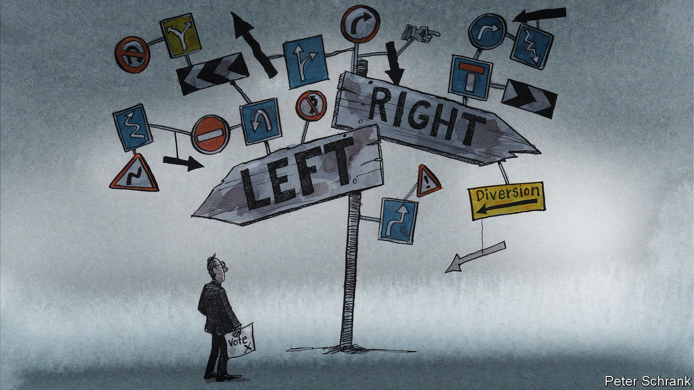

###### Charlemagne

# European politics has gone from complicated to impenetrable 

##### Liked coalition governments? Wait until you hear about coalitions of coalitions 

 

> Jun 29th 2023 

The idea of a political “left” and “right” originated in revolutionary France: members of the freshly minted National Assembly picked their seats according to their fealty to either the king (they sat on the right) or the people (on the left). For as long as the idea of a political spectrum has existed, there have been complaints that a single axis is inadequate to reflect the complexity of multifaceted civic matters. Still, the idea has proved enduring, even as the meaning of being left- or right-wing has evolved. For people not obsessed with politics, the shorthand provides an adequate framework for understanding the values of those running the country. Care about locking up criminals, rewarding work, defence spending and family values? Tick this box. You favour better public services, giving people second chances, foreign aid and social justice? Tick that one. Other options available on request. 

From America to India and Japan, voters in democracies the world over will recognise such polarising partisanship. Often there is too much of it. Europe now has too little. Its political waters are muddied as never before. Power in many of the EU’s 27 member states has become increasingly fragmented. Beyond left and right, centrist liberals now vie for office, as do greens, on top of populists on either fringe of the spectrum. Bring this electoral jumble up to the quasi-federal European level, where most big decisions are made nowadays, and it becomes impossible to work out what ideas those running the show have in common (not to mention that it can be hard to figure out  is running the show). Across Europe, coalitions have long been a cumbersome necessity to form national governments. At the EU level, you now have coalitions built atop coalitions. 

European politics has become like quantum physics: anyone who claims to understand it doesn’t. It was not always thus. In 2010, nine of the 12 biggest countries in the EU had governments led by the centre-right; the rest were in the hands of the centre-left. The EU institutions in Brussels were also controlled by the right, starting with the European Commission, the bloc’s executive arm. When the continent’s big beasts came together—Germany’s Angela Merkel and France’s Nicolas Sarkozy, or José Manuel Barroso, the commission boss—they thought in broadly similar ways. They spoke the same language, albeit in different tongues. 

Even then, decision-making could be tortuous: being right-wing in Poland is not quite the same thing as being right-wing in Portugal, and national interest can divide more than ideology unites. Nonetheless, when deals had to be struck, for instance on how to bail out Greece, a common intellectual framework existed. You might not have liked Europe’s fiscally rigid ways, say, but you understood where they came from. EU leaders met regularly (as they did this week, starting on June 29th). The thorniest decisions were quietly pre-arranged at meetings of the centre-right leaders that immediately preceded the summits.

But look at the 12 biggest EU countries these days, and no clear pattern emerges. Four political families—centre-right, centre-left, liberals and a populist conservative bloc—now hold sway in three countries each. Getting Germany, Italy, France and Sweden to agree on much was hard enough in 2010, even when their leaders hailed from the same political group. Now Germany has a three-way coalition led by a centre-left chancellor, France a liberal president with no parliamentary majority, Sweden a right-wing prime minister backed by hard-right populists, and Italy vice versa. 

If there is a convincing narrative of what is going on in European politics, Charlemagne has yet to hear of it. The centre-right is not the force it once was, but nor is it completely doused: Kyriakos Mitsotakis triumphed in Greece last weekend, and the right is odds-on favourite to win in Spain on July 23rd as well as in Germany in 2025, displacing left-led governments in both cases. Liberals have probably the most prominent EU leader at the moment in Emmanuel Macron, but he has no clear succession plan. Think socialism is kaput? In France and Poland perhaps. But a third of EU citizens live in countries led by centre-left heads of government, more than any other political group. Populists, especially on the right, for a while were thought to be unstoppable at the ballot box; the hard-right is now second in the polls in Germany, and first in Austria. In other places, such as the Czech Republic and Slovenia, they look a spent force. 

Could elections for the European Parliament in a year’s time provide a sense of the political direction in which Europe is heading? Probably not. There also, two parties used to dominate: the centre-right (European People’s Party) and centre-left (Socialists &amp; Democrats). Now they control, respectively, a quarter and a fifth of the seats: not enough for a majority. Both are likely to lose ground next June. In any event, few people look to the parliament—a place where regulation is finessed, not high politics crafted—when it comes to setting a pan-European direction. 

All directions, please

Europe’s political mush has not mattered so much in recent years, dominated as it has been by one crisis after another. Fighting covid-19 was a multipartisan affair. Dealing with the pandemic’s aftermath was mostly consensual, too. Everyone from small-state conservatives to hardened communists agreed it was time for government to spend lavishly to keep the economy afloat. The war in Ukraine united Polish populists and lefty Finns by way of liberal Dutch, all as keen as one another to combat Russian aggression.

But politics cannot be suspended for ever. If Europe is to feel like a single polity, as its proponents advocate, citizens must grasp what they are signing up for. Right now they do not. The Punch-and-Judy politics of two-party states has its drawbacks, but the clarity that emerges from such elections is enviable. America will go to the polls in 2024, and emerge with a government either of the right or left. The EU will keep opting for all-of-the-above. ■


