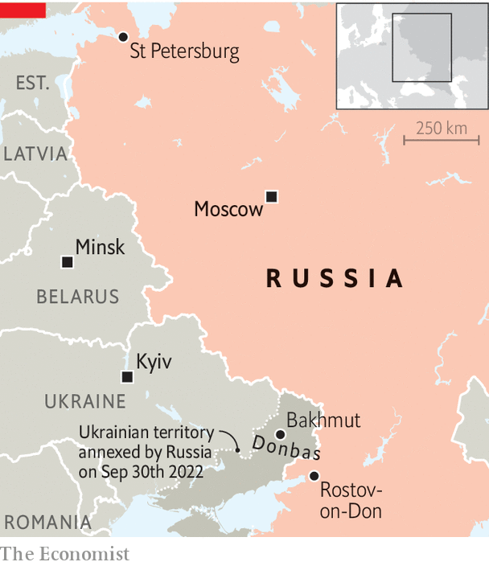
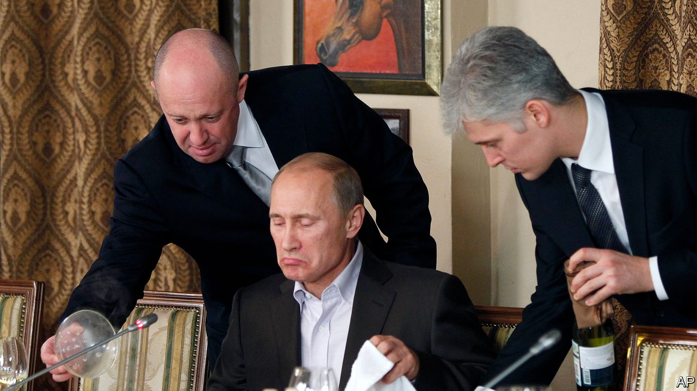

###### The time of troubles

# The Wagner mutiny has left Putin dangerously exposed 

##### Factions close to the Russian president are thinking about life after him 

 

> Jun 29th 2023 


AFTER Vladimir Putin was anointed as Russia’s president at the end of 1999, he compared the first post-Soviet decade to , the time of troubles—the uprisings, famine and invasions of the late 16th and early 17th centuries, before the rise of the Romanovs. He was casting Boris Yeltsin, Russia’s first democratically elected president, as Boris Godunov, the Russian regent, and himself as the beginning of a new line of tsars, promising stability, prosperity and the restoration of the state. 

On June 24th, as a convoy of armed militia charged at high speed towards Moscow, that promise—which was first broken years ago—looks more bankrupt than ever. Led by a violent warlord, Yevgeny Prigozhin, Wagner Group mercenaries drove from Russian-occupied Ukraine,  and a military plane, and killing perhaps 20 Russian troops along the way. A furious Mr Putin spoke about history once again, evoking the return of soldiers from the front in 1917 and “the tragedy of the civil war”. This time, as he conjured up the spectre of the Bolshevik revolution, he looked not like the first Romanov, but the last. 

 was Mr Putin’s creation in more ways than one. He is an ex-convict who ran a restaurant in St Petersburg where Mr Putin entertained his guests; he supplied mercenaries who could be deployed with plausible deniability for the Kremlin across Africa and in Syria; and his trolls could tamper with Western elections. The funding, as Mr Putin himself admitted, came from the state. 

 


Mr Prigozhin came into his own after the invasion of Ukraine in 2014. In last year’s much bigger assault, its business grew. Wagner’s equipment was supplied by the GRU, Russia’s main intelligence directorate. It also lent the mercenaries some commanders, and Russian prisons provided cannon fodder. When Wagner captured Bakhmut, a town in south-eastern Ukraine, at the cost of some 20,000 Russian lives, according to Mr Prigozhin, Mr Putin deemed it effective. 

However, since Wagner operated outside the regular army, Mr Putin has let it impose a heavy cost on Russia. Part of this is financial. As Russia’s president has revealed, Wagner received $3bn, which is equivalent to 6% of national defence spending in the first year of war. At least $1bn of that went straight to Mr Prigozhin’s catering firm, which supplied the army. 

Worse was the corrosion of Russia itself. To protect his business, Mr Prigozhin built a populist political platform, pitching himself against the rich and lazy elites. Wagner’s mutiny exposed the state’s decay. Russia has lapsed into a violent, lawless place with undefined borders and rival private militias. Alexei Navalny, an imprisoned opposition leader who faces another 30-year sentence for charges including “extremism”, expressed his view through his lawyers: “There is no greater threat to Russia than the Putin regime.” 

Throughout his rule Mr Putin has talked up the state while, behind the façade, gutting its institutions, rules and laws. Having emerged from gangster-ridden St Petersburg, he looked to informal arrangements to get things done. , a former tycoon who first challenged Mr Putin over corruption, says that his two main tools of political control are corruption and violence.

The system sponsored criminal interests; personal loyalty was secured with (blackmail). In this one-man system, Mr Putin was not so much a dictator as a kingpin, fomenting rivalries between his chiefs so as to make himself indispensable: the only man powerful enough to stand between order and chaos. 

Mr Prigozhin’s mutiny represents a public breakdown of that system. Mr Putin did not mind him occasionally attacking the army chiefs. It was a way of spurring them on. But when the conflict started to spill into the open, Sergei Shoigu, the defence minister, and Valery Gerasimov, chief of the defence staff, persuaded him to integrate Wagner into the regular structure. With Mr Putin’s blessing, they ordered Mr Prigozhin to sign a contract with the army, and bring in his men and equipment by July 1st. Mr Prigozhin realised he was about to get cut off from state finance and maybe eliminated. He struck first, aiming to remove them instead. 

A gifted communicator, he armed himself with the rhetoric of Mr Navalny and declared “a march for justice”. In a video that he posted on the eve of his mutiny, he called it how it was: Donbas, which Mr Putin claimed to defend, had been robbed and plundered by Russia’s officials since 2014, he growled. Nobody had threatened Russia. Instead of killing Ukrainian Nazis, who did not exist, Russian forces were killing ethnic Russians in the east of Ukraine. While Russian soldiers were dying and killing Ukrainians, Mr Shoigu was treating his guests to caviar and cognac. Mr Prigozhin said he was marching to Moscow to liberate Russia from crooks. 

Mr Prigozhin’s words rang true to many army officers and the public. Most of the officer corps did not join Mr Prigozhin’s mutiny—but neither did they try to stop it, even as Wagner seized the military headquarters in Rostov-on-Don, the key hub for the war in Ukraine. 

Indeed, Mr Putin’s vast repressive machine terrorises Russian society by torturing peaceful protesters—including a man who died in custody in Rostov for handing out anti-war leaflets a week before the city was taken by mutineers who have not been charged. But it faltered when faced with armed soldiers and ex-convicts. The FSB intelligence service, heirs to Stalin’s secret police, kept their heads down. The army stayed in its barracks. The national guard were nowhere to be seen. Ramzan Kadyrov, Chechnya’s warlord and strongman, boasted on Telegram that his fighters would “crush the rebellion”, but they did not materialise. Even some propagandists suddenly lost their voice. Margarita Simonyan, the boss of RT, the state’s main propaganda outlet, claimed to have spent the weekend on a river cruise, blissfully ignorant of events.

The rusty nail

Mr Prigozhin’s mutiny may have lasted only 36 hours, but it has brought down a large part of the edifice of Mr Putin’s state, leaving him humiliated and wounded in the eyes of his peers. The most serious blow was not the attempted coup—Mr Prigozhin probably never intended to take over the Kremlin—but what it revealed: the hollowness of Mr Putin’s popular support. 

Not a single person took to the streets to rally around the tsar. Instead, crowds of spectators came out to witness the excitement. They did not take anyone’s side, but many observed the cowardice of the police and security services with evident glee. When Mr Prigozhin’s car left Rostov, people treated him like a celebrity. The police returning to the streets were heckled. 

A similar collapse of Mr Putin’s authority emerged in jokes circulating on social media. A portrait of Mr Putin, who apparently fled to his residence near St Petersburg, was captioned: “I need a ride, not ammunition”. And the joke went round that the biggest city taken by the Russian army in its war with Ukraine was Rostov. 

Now that Mr Putin has shown such obvious weakness, nobody can say how fast his remaining authority will crumble, if it does so at all. Much depends on the factions close to power. Within the government there are broadly three: the army, the FSB and the technocrats who make things happen. Outside it are several clans of Mr Putin’s cronies.

 


All of these have children with business interests and all of them are thinking about life after Mr Putin. Yet even if they see him as a liability, they may not be prepared to act. They do not just fear repression, although the danger of that is real. They also see Mr Putin as a nail holding their dysfunctional system together. The nail is rusty and bent, but if they pull it out, the whole lot will come tumbling down—and they along with it.

Despite this, Mr Putin will surely not be sleeping soundly. Many strongmen in his position would purge the army and the security services. But in a time of war he needs them. That is why he is more likely to unleash repression not against those who threatened him with arms, but against those who laughed at him, though  that General Sergei Surovikin, a former commander in Ukraine, has been arrested. 

Already Mr Putin is trying to cover up his mistakes with spin. On June 27th he staged a display of victory over the rebels. He lined up roughly 2,500 men in parade uniforms in the historic Cathedral Square of the Moscow Kremlin. Just like a tsar, he descended along a long red carpet to address them from the steps of the armoury. 

That square provides the setting for the concluding scenes of “Boris Godunov”, Pushkin’s play about the time of troubles. After Godunov dies, boyars whip up a mob and his children are murdered. But then a feeling of revulsion passes over the crowd. A boyar roars at them: “Why are you silent? Let’s hear you cry: Long live the Tsar, Dmitry Ivanovich!” But the mob has subsided. The play ends with the most famous stage direction in Russian literature: “The people are speechless.” Andrei Zorin, a Russian historian at Oxford University, notes that the time of troubles often follows the end of a tsar’s reign. In Mr Putin’s case, it could yet bring the end about. ■

