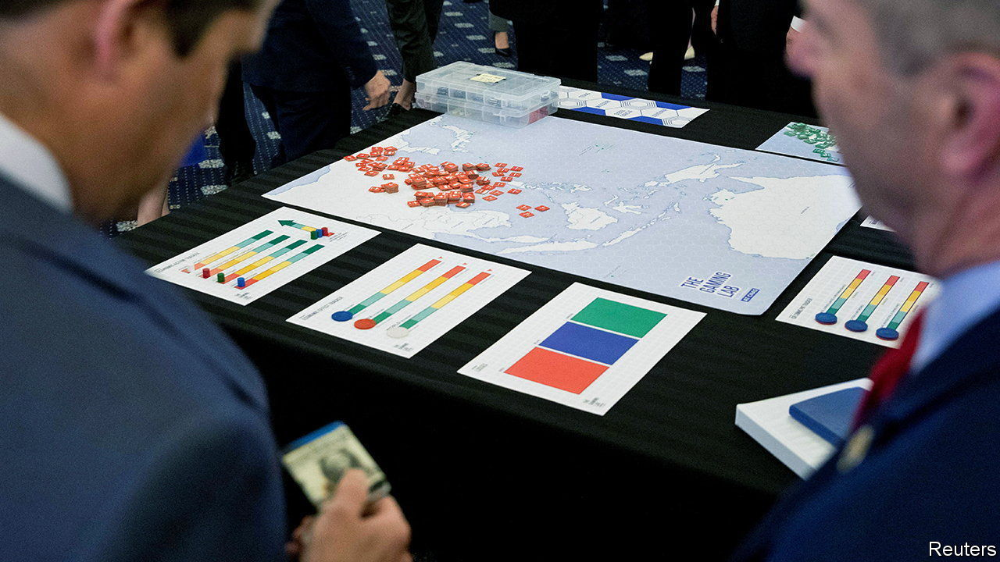

###### Too little or too late

# Financial sanctions may not deter China from invading Taiwan 

##### Wargaming what an economic conflict would look like 

 

> Jun 29th 2023 

A few months ago the China Select Committee in America’s House of Representatives took part in a war game, complete with tabletop maps and blue and red counters. It simulated a Chinese invasion of Taiwan, and revealed familiar weaknesses in America’s position: its bases need strengthening and it soon ran out of precision munitions. Yet the game also highlighted a less obvious risk: America’s economic weapons went off half-cocked.

In the simulation, the Blue Team (ie, the Americans) had to cobble together sanctions on the hoof. They punished a few Chinese state-owned banks, putting only “moderate” pressure on their adversary. The conclusion was that the best time to plan sanctions is before they are needed.

Until recently, such talk might have seemed alarmist. But a Taiwan crisis is now all too thinkable. For the past eight months, Charlie Vest and Agatha Kratz of the Rhodium Group, a research firm, have met officials, analysts and businessfolk in Berlin, Brussels, London and Washington to discuss sanctions. They found that the topic is not only an American obsession. 

Sanctions talk can, however, lack detail. “There was a lot of discussion about this, but not really a clear sense of the magnitude of economic assets and flows that would be put at risk,” says Mr Vest. In a new report with the Atlantic Council, a think-tank, he and Ms Kratz try to remedy this. They consider sanctions that might be imposed in a Taiwan crisis short of war, such as a blockade of the island. They put numbers on several scenarios, including sanctions on individuals, industries and financial institutions. The most sweeping measures resemble the punishment inflicted on Russia after its invasion of Ukraine. The g7, acting together, would block dealings with China’s central bank and its “big four” state-owned commercial banks.

These measures would freeze about 95% of China’s foreign-exchange reserves (the remainder is mostly in gold). It would also cut off China’s banks from most of their foreign assets (worth $586bn). The g7 would have to forfeit the modest reserves (of $52bn) they hold in yuan. And g7 banks would have to forgo claims, including loans, deposits and bonds, on Chinese banks, which amount to less than $126bn, or 1% of their total cross-border claims.

When foreigners buy goods, services or assets from Chinese residents, payments pass through local banks. The same is true when the transactions flow the other way. Mr Vest and Ms Kratz guess that the big four banks handle almost 40% of this business, a percentage roughly in line with their share of Chinese banks’ overseas assets. Sanctions on such institutions could jeopardise about $127bn of annual foreign-direct investment, another $108bn of “portfolio investment” (purchases of stocks and bonds) and $148bn in repatriated profits from investments in China. Dwarfing these costs would be the hit to trade in goods and services. The report estimates the big-four banks settle about $2.6trn-worth per year.

Yet sanctions would not have an “immediately crippling effect”, Mr Vest warns. China would impose tight controls on the outflow of capital and let the yuan fall. The report assumes the g7 would allow other banks to fill the gap left by the big four. The resumption of exports would bring in the dollars to stabilise China’s economy. 

Rather than disrupting trade indirectly, through financial sanctions, the g7 could restrict it directly, by banning exports or imports. The report considers sanctions on a single industry, such as aerospace, as well as sweeping ones aimed at chemicals, metals, electronics, aviation and transport equipment. Such measures could put at risk 13m Chinese jobs across the industries, the authors reckon. It could also endanger 1.3m jobs in the g7 firms that supply them. 

All told, broad financial sanctions are disruptive enough that it is hard to imagine their use in any scenario short of war. But if a war did break out, even severe sanctions might do little. Armed conflict would, after all, impede vital shipping lanes, break the Taiwan-dominated supply chain for high-end chips and spread panic. “In effect, the military conflict would itself act as the sanction,” as Gerard DiPippo and Jude Blanchette of the Centre for Strategic and International Studies, another think-tank, have argued. The economic weapons discovered by the g7 after Russia’s invasion of Ukraine are not just double-edged. They may also be redundant in the only scenario in which they are feasible. ■


