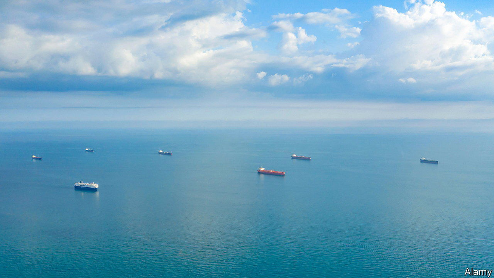

###### Pump prizes

# How Russia dodges diesel sanctions 

##### Restrictions are bringing easy bucks to those who do not observe them 

 

> Jun 29th 2023 


On june 26th the , a Greek-owned vessel transporting 730,000 barrels of diesel from Russia, reached the Suez canal. The crew are familiar with the passage, through which they usually ferry oil from the Gulf or India to Europe or Africa. This time, though, the ship is going the other way: it is due to unload its cargo in the United Arab Emirates (uae).

In February, when the EU banned imports of refined oil from Russia, many doubted the country could redirect its vast exports of diesel, which amounted to 950,000 barrels a day (b/d) last year, and made up most of its $65bn-worth of petroleum-product sales. At the end of last year the eu still bought two-thirds of the country’s exports. China and India, which fast replaced Europe when it boycotted Russian crude, were uninterested. The rest of the market was fragmented. Yet as the ’s odyssey suggests, trade has been rerouted. New buyers have already emerged—as have methods for minting money by exploiting sanctions. 

 


Indeed, take a glance at aggregate trade figures and you would think Europe’s ban had never been imposed. In March Russian exports of diesel reached a record 1.3m b/d. Although they have fallen below 900,000 b/d since May, their level remains on par with recent years, and the drop is largely a result of seasonal refinery maintenance. 

The countries enabling such a feat fall into two camps. First are those that buy more diesel from Russia, at a discount, to replace supply from elsewhere. They include South American countries, led by Brazil. Having bought nothing from Russia in January, Brazil received 152,000 b/d in June, equivalent to 60% of its total diesel imports. North African countries, such as Algeria, Egypt and Morocco, also smell a bargain. In recent months Russia even exported refined oil to North Korea, the first such shipments reported since 2020. These new buyers export little themselves.

The second category comprises countries that have become greedy for Russian products despite having refineries of their own. Chief among them is Turkey. It is now buying twice as much diesel from Russia as in January, but its own exports have grown more rapidly still. It is unlikely Turkey is re-exporting much of the stuff under a new label. Instead, it is probably taking advantage of its proximity to Europe to “triangulate” Russian flows, using cheap imports to meet its domestic needs while selling its pricier production to the bloc. 

The Gulf states are making a similar trade. Saudi Arabia did not import diesel from Russia for years; since April, its purchases have passed 150,000 b/d. It is not unusual for Saudi imports to rise before the summer, when power demand for cooling soars. This year, however, the country’s exports of diesel have risen in tandem—by around 120,000 b/d between April and June compared with the same period in recent years. A lot of that is going to Europe and, increasingly, to Asia.

This flourishing trade implies that—in addition to new customers—Russia’s export machine has enough ships to serve them. This was far from a given. “Clean” products like diesel cannot be carried on regular tankers, where traces of crude or heavier products may sully them. The tiny global fleet of diesel tankers could have been stretched when Russia’s barrels started making longer journeys. February’s sanctions threatened to make the problem worse. Europe bars its dominant shippers, traders and insurers from facilitating Russian sales, unless the oil is sold below a price set by the g7 at $100 a barrel for premium products. Compliance headaches, plus the PR risk of dealing with Russia, have kept many Western firms at bay. 

But not all. Gunvor and Vitol, two giant traders in Geneva, were still ranked among the top ten buyers of Russian oil products in the first four months of the year, according to reports citing customs data (both firms have said they comply with relevant regulations). The rest include the trading arms of Russian energy firms, as well as a mixture of obscure merchants, often set up after the war started, in Hong Kong, Singapore or the UAE. These do not seem to be short of barges to carry their wares. The , for example, is chartered by Bellatrix, a once-unknown trader that controls 36 vessels, most of them carrying clean products from Russia. 

Creative techniques are being employed, too. Ship-to-ship transfers involving Russian cargo, notably near Greece and Malta, have soared since last year, suggesting attempts to circumvent restrictions. The EU admitted as much on June 21st, when it said that it would ban tankers suspected of dodgy transfers from docking at its ports. Some vessels also use military-grade equipment to send fake location signals. It helps that importers wary of legal troubles are often happy to buy Russian fuel via indirect routes. Since February Russia has sent record volumes of naphtha, a clean product used to make plastics, to Malaysia and Singapore, where it is stored in vast tanks. It is then shipped piecemeal to customers across Asia, who claim to believe it is a local product. 

A refined state of affairs 

In recent years, Russian exports have made up around 15% of global diesel trade. Their resilience in the face of sanctions will probably lead to a glut over the rest of this year. Prices soared in 2022 when the risk of disruptions coincided with a post-covid rebound in demand. Yet supply shocks are now dissipating at the same time as Gulf states are adding refinery capacity and slowing economic growth is dampening Western consumption. The cost of a barge of diesel delivered in Rotterdam has fallen by a quarter in a year. Refining margins are a third of what they were. 

This will hurt Europe’s and rich Asia’s ailing refiners, which are already being pushed out of the market by cheap products. At best, they may cut refinery runs; at worst, they will have to slash capacity. As with crude, sanctions are bringing easy bucks to those who do not observe them. ■


