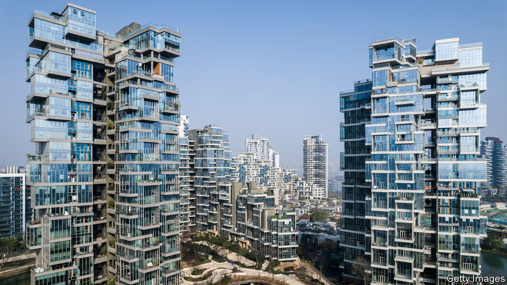
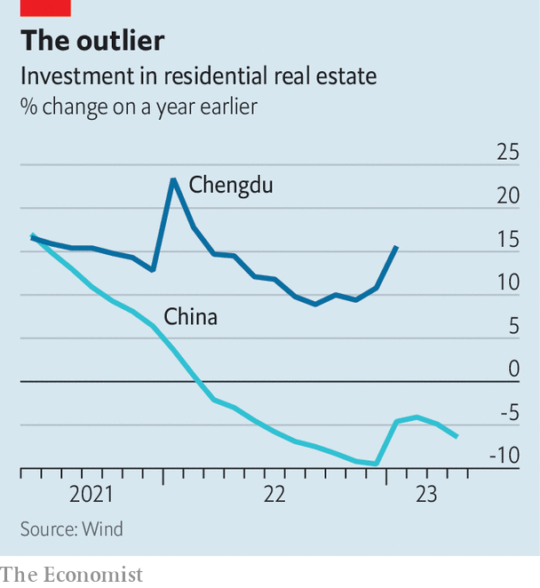

###### Sichuan pep

# How to escape China’s property crisis 

##### Lessons from a city that is flourishing 

 

> Jun 28th 2023 

Getting into Jinjiang Ode is a little difficult. The luxurious property development in central Chengdu will not allow potential buyers through its four-metre-high palatial gates without an appointment. Even finding out about the project in the south-western metropolis, home to 16m people, is tricky. The company behind it is so confident of demand that it does not deign to advertise the flats—a confidence which is not unjustified. Chengdu has a distinct, laid-back atmosphere epitomised by its public tea gardens, in which patrons spend hours sipping hot beverages and having their ears cleaned. The leisurely pace of life and tongue-numbing local cuisine appeal to younger Chinese people, who have come in droves in recent years, says Zhang Xiaojun, a sales agent at the development. Many of them buy homes.

As a prolonged downturn in  takes hold, Chengdu is an exception. By several metrics, including house prices and sales of new homes, it is faring better than almost anywhere in the country. At a national level, the central government’s response to the deepening property crisis, including an interest-rate cut announced on June 13th, has underwhelmed. China’s benchmark stock index has fallen by 8% since peaking this year in early May, when the country still appeared to be rocketing towards a full . Now investors fear more developers will start to fall short of cash, defaulting on dollar debts in the process. Experts are asking how much local measures can pump up growth. Chengdu is a good place to search for answers.

 


There is a faint air of unreality about the local market. New home sales between April and June were nearly a third higher than in the same period in 2019, the year before the covid-19 pandemic struck, notes Larry Hu of Macquarie, an investment bank. In contrast, across China’s 30 largest cities, sales have fallen by a quarter. Meanwhile, in May home prices in Chengdu rose by 8% compared with the previous year, the most of any large city. It has notched month-on-month rises for 17 straight months. Many Chinese municipalities are working through vast inventories of flats that have been built but not sold: it will take the southern city of Zhuhai more than 12 years to sell homes that have been completed or are still under construction if sales stay at the current pace. Chengdu will sell such flats in just over three years.

What explains this success? Since 2016 officials in every Chinese city have been able to devise their own measures for cooling or heating local property markets. Most of the rules employed are restrictions on who can buy a flat, how many they may purchase and the size of the downpayment required. In most large cities, only people with local , or residence permits, are allowed to buy homes. In Chengdu, high-level purchase controls remain in place. But officials have sought to attract families as a way of expanding the city and increasing demand for homes. Residents with two or more children are, for instance, allowed to buy additional homes, and local holders may buy up to three. Even those without a  may buy two. Since the start of the year, elderly parents who move to Chengdu to join their adult children may also purchase a flat.

Other cities have experimented with similar policies, but enjoyed much less success. Shenzhen, the technology hub across the border from Hong Kong, has relaxed some of its restrictions. Yet property prices are still down 1.8% year-on-year. One explanation for this is sweeping lay-offs in the city’s tech sector. Another is that Chengdu’s policies are more effective because they are paired with reforms to attract educated workers, which have helped boost growth. Since 2017 local authorities have handed out housing subsidies and cash rewards to talented people who move to the city in order to work in its rapidly growing industrial base, points out Sandra Chow of CreditSights, a research firm.

Chengdu’s officials also did a better job of tackling the crisis of confidence that spread across the country last year. As developers went bust, many failed to finish flats. Thousands of homebuyers responded by halting mortgage payments. Many more delayed buying new homes. Officials in Chengdu went to great lengths to ensure homes were handed over, funnelling cash to developers, says Ms Chow. Even defaulting developers managed to complete homes. About 40% more apartment floorspace was finished in the first two months of 2023 compared with the same period the year before. This probably encouraged wavering buyers to take the plunge. Other regions may have wanted to follow suit, but lacked the cash. Sichuan, where Chengdu sits, notched up the strongest growth in municipal land sales of any province in the first half of 2022, which will have freed up funds to keep builders at work.

Chengdu benefited from some other factors that will be difficult, if not impossible, to replicate elsewhere, and perhaps even in the city itself. Its population rose by more than 7m from 2011 to 2021, making it one of the fastest-growing urban areas anywhere in the world. These inflows have been the biggest driver of housing demand, says Yan Yuejin of E-House China, a research firm. But urban migration has since slowed. There are simply not enough people in China for another population boom. Chengdu’s location in the south-west also meant it did not see rapid rises in prices in past housing booms. Moreover, its growing manufacturing industry continued to lift incomes. As Louise Loo of Oxford Economics, another research firm, notes, it is thus one of a few second-tier cities that have not seen rapid price increases relative to local incomes.

A few levers remain for Chengdu’s officials should things start to look peaky. For instance, they have yet to drastically ease restrictions to allow many more people to buy homes. Market-watchers are waiting for such a development, says Guo Jie of the Local Association of Real Estate Enterprises, an industry group, for it would indicate that steam is running out and that even the best-prepared cities are being swept into the crisis. Policymakers elsewhere in the country will be watching closely, too. ■


