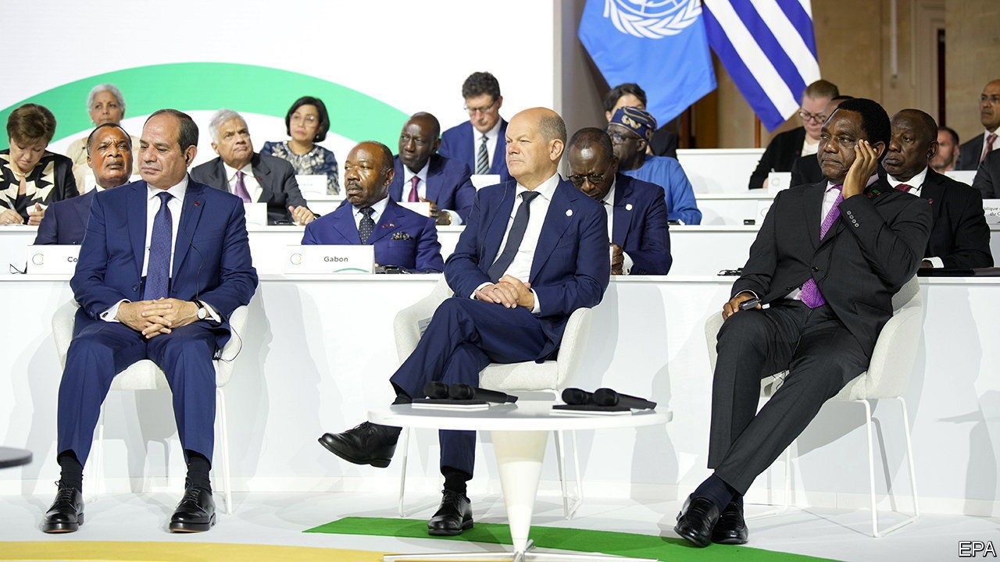

###### Blow the whistle

# New forms of debt restructuring reward bad behaviour 

##### China reschedules Zambia’s debts without writing them off 

 

> Jun 29th 2023 

Negotiations over international debt are often headspinning. To reduce the debts of a country that can’t pay the bills, it takes referees from the imf, teams of lawyers and a contest between a country and its creditors. Everyone wants a deal, but no one is keen on taking losses. Just as creditors agree on who should club together, they start arguing about the terms. The chaos can go on endlessly. Countries, unlike bankrupt companies, are never liquidated. “It was a zig-zag, sideways, forwards, backwards, down, up, but we kept our eyes on the ball,” reported Haikande Hichilema, Zambia’s president, after his country finally managed to strike a deal. 

On June 22nd, at a , Zambia’s rich-country creditors announced said deal: they had agreed to push back repayments on their lending by two decades to 2043. The wriggle room created by the extension, as well as accompanying interest cuts, could make Zambia’s debt burden considerably lighter—a surprise, since the biggest of the country’s creditors is China, which holds $4.2bn out of $6.3bn of its external debt to official creditors, and has spent the past few years obstructing an already chaotic process. 

Dragged to the negotiating table after its two-decade  went awry, Beijing’s reluctance to write down loans and class those from state-owned banks as official has brought restructurings across the world to a standstill. Zambia had been stuck since November 2020, when it ran out of dollars to pay its foreign bills (and its currency reserves dipped below $1bn, or just over two months of imports). It has since run up $1.8bn in unpaid interest. 

Thus international financiers were forced to get creative. Before the deal was announced, the amount Zambia owed official creditors fell from $8bn to $6.3bn. The borrowing was reclassified as having been lent by the private sector, so it could be left out of this part of the process, even though in reality it came from one of China’s state-run banks and was guaranteed by Sinosure, a state-run insurer. China still point-blank refuses to cut the face value of its loans. 

The breakthrough also relied on unusual stipulations. Zambia will pay 1% annual interest on borrowing until 2025, a big discount. At this point, if Zambia’s economy is judged by the imf to be picking up, which is likely, the rate will rise to close to 4%, wiping out lots of the country’s debt relief. In this scenario, creditors, including Beijing, will earn about the same as they would have by putting the cash in ten-year Treasuries. Oddly the deal gives Zambia better terms the worse the country’s economic performance, creating moral hazard. 

Zambia’s is the latest of several strange restructurings. In May Suriname, which owes China $155m (or 6% of its external debt) and had been waiting three years for a deal, bucked a trend. It restructured lending from the private sector before it had reached an agreement with China, an official creditor. Last year Chad also managed to strike a deal, but only by rescheduling rather than lowering payments. Under the agreement, the country can also pay its interest bills using commodities; additional help is again conditional on economic indicators (this time the price of oil).

In richer countries, the stakes are higher. The imf’s plan for Sri Lanka, which owes China $7.4bn (or 20% of its external debt), means its debt-to-gdp ratio will remain above 100% until at least 2026. This will make borrowing from markets even more expensive. Some observers worry that the imf’s analysis of how much debt a country can handle is becoming too optimistic. Others think restructurings that reduce debts by pushing their repayment out, which look set to be the status quo until China changes tack, will transform insolvent countries into permanently illiquid ones, meaning they swing between endless short-term crises. 

For now, that does not bother Mr Hichilema. He needs to tackle the next stage in his country’s restructuring deal: private-sector creditors. He must decide whether to emphasise the generous terms he has won from official donors, which stay if the economy struggles, or reassure bondholders that he is already working to ensure a world in which the terms become stingier, and his country is on the up. ■


