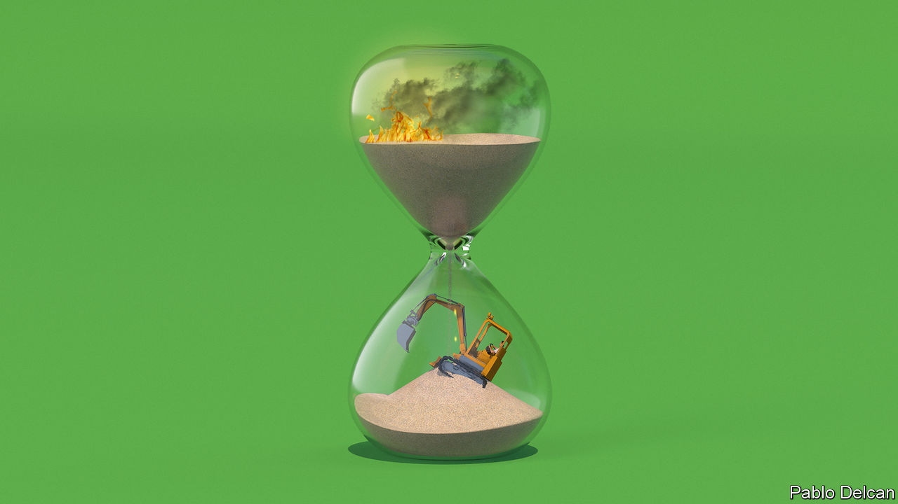
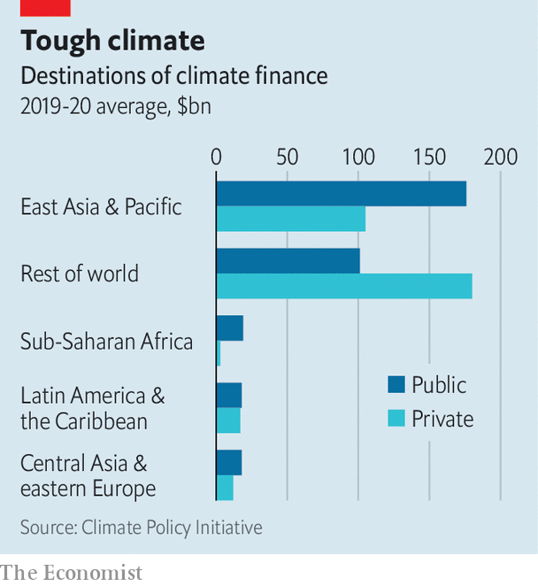
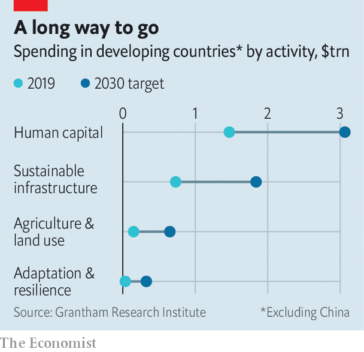
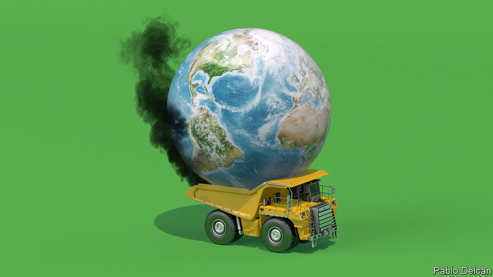

###### Development v climate

# The choice between a poorer today and a hotter tomorrow 

##### Without trillions of extra dollars, policymakers face a terrible decision 

 

> Jun 27th 2023 

Suppose, for a minute, that you are a finance minister in the developing world. At the end of a year in which your tax take has disappointed, you are just about out of money. You could plough what little remains into your health-care system: dollars spent by clinics help control infectious diseases, and there is not much that development experts believe to be a better use of cash. But you could also spend the money constructing an electrical grid that is able to handle a switch to clean energy. In the long run this will mean less pollution, more productive farmland and fewer floods. Which is a wiser use of the marginal dollar: alleviating acute poverty straight away or doing your country’s bit to stop baking the planet?

The thought experiment is a simplified version of a dilemma currently facing global institutions and developing countries. On June 22nd politicians arrived in Paris for a summit to design “a new global financial pact”. The aim was to work out how to spread the cost of climate change. Leaders from poor countries turned up in droves; aside from Emmanuel Macron, France’s president, no Western head of state made it. Little surprise, then, that the jamboree ended without rich countries contributing a single extra dollar. Instead, attendees tinkered with the World Bank and the imf, the biggest of the multilateral agencies that seek to reduce poverty. The lack of action means painful trade-offs lie ahead.

A huge amount of money is needed to help poor countries go green. In 2000 the developing world, excluding China, accounted for less than 30% of annual carbon emissions. By 2030 it will account for the majority. The Grantham Institute, a think-tank at the London School of Economics, estimates that at this point poor countries will need to spend $2.8trn a year in order to reduce emissions and protect their economies against climate change. The institute thinks these countries will also need to spend $3trn a year on sectors like health care and education to keep tackling poverty. This figure could rise. Since covid-19, gains in development indicators, ranging from hiv deaths to the number of people in absolute poverty, have stalled.

 


The world is spending nowhere near such amounts at present. In 2019, the latest year for which reliable data are available, just $2.4trn went on climate and development combined. According to the Grantham Institute, rich countries and development banks will have to stump up at least $1trn of the annual shortfall (the rest should come directly from the private sector, and from developing countries themselves). In 2009 rich countries agreed to provide $100bn a year in fresh finance by 2020. They have missed the target every year since, reaching just $83bn in 2020—with much of the money coming from development banks. Excluding climate finance and spending on internal refugees, aid from oecd countries has been flat over the past decade.

In a recent article, a number of world leaders including Joe Biden of America, William Ruto of Kenya and Muhammad bin Zayed of the United Arab Emirates wrote that they were convinced “poverty reduction and protection of the planet are converging objectives”. Some policies do indeed provide useful fixes for both. Sustainable agriculture cuts emissions, climate-proofs the food supply and reduces the risk of famine. Mangrove preservation sequesters carbon, protects against storm surges and helps provide fishermen with a living. Across the board, damage from climate change makes development more expensive—and halting climate change makes it more affordable.

But although alignment is possible, it is also rare. Spending to cut emissions will inevitably be aimed at middle-income countries, which pollute more; spending to cut poverty will be aimed at low-income places, where poor people live. Researchers at the imf who have analysed data from 72 developing countries since 1990 find that there is an unfortunate pattern: a 1% rise in annual gdp is on average followed by a 0.7% rise in emissions. 

 


The reasons for this are simple. Growing industries require lots of power. Big, mechanised agriculture requires lots of space; its growth is the main reason for deforestation. The African Development Bank (afdb) reckons that Africa needs 160 gigawatts (gw) of extra capacity by 2025. The continent now generates just 30gw or so of renewable energy. At the African Exim Bank’s recent annual meeting in Accra, the talk was about how to mine metals for the green transition, with little concern about the pollution this would involve. 

In theory, the next generation of industrialising countries could power their growth using renewable grids, rather than ones that run on oil and gas. Africa has more solar potential than any other continent, as well as plenty of minerals that could be used for batteries. Yet although green growth is possible, —replacing old grids and installing new technology is just too expensive for developing countries. To reach net-zero emissions by 2050, the International Energy Agency, an official forecaster, reckons developing countries would have to spend at least $300bn on renewable grids until 2030, five times their current outgoings. 

Green dreams

Thus there is no way round the missing finance. And as the meagre progress in Paris demonstrates, an enormous increase in aid spending is unlikely. After the conference, donor countries and the World Bank plan to suspend more repayments in the event of extreme-weather disasters, and have recycled from rich countries a modest amount of special drawing rights, a financial instrument the imf allocates to the balance-sheet of every country’s central bank. Where some of the promised finance will come from has yet to be revealed, as have the mechanics of spending it. 

More ambitious proposals came from African politicians. They included ideas for global taxes and a new international financial institution, as Mr Ruto put it, “not hostage to its shareholders”. They were treated as outlandish. “Taxed by whom? And for whom?” demanded Mr Macron. Even a worldwide tax on shipping, which Mr Macron supports, faces years of political wrangling. “We will forget all about it in a few months,” sighed a finance minister. “There is a clash between the global good and the national interest,” Mr Ruto said. “And the national interest always wins.” 

This produces two bleak trade-offs. The first concerns priorities for national governments. Given their lack of preparation and sweltering temperatures, developing countries are among the most vulnerable to climate change. In the next couple of decades, pollution and extreme heat will worsen people’s health. Natural disasters will wreak havoc and impose vast reconstruction costs. But in the short run, governments are unsure how to grow without fossil fuels. Their economies are held back by dodgy electrical grids and insufficient energy, meaning officials are on the hunt for power. Oil, gas and other raw commodities are valuable sources of foreign exchange for exporting countries. Without fossil-fuel revenues, at least a dozen poor countries, including Ecuador and Ghana, would face , according to reports by the imf. Governments are not always responsible with their fossil-fuel bounties—but pollutants have nonetheless paid for billions of dollars in African social spending and pension contributions in recent years.

The short-term pressure to find funding for public services is intense. Last year, after paying creditors and civil servants, Zambia had just 13% of its budget left. The country is an extreme case, but governments in most of the developing world have little room for manoeuvre. “How do I justify to voters taking away subsidies, school funding and health care to build a waste-processing plant or a big sea wall?” asks a finance minister. “In 20 years of course it will be useful, but it is the cost now that is concerning.” He reckons that the cost of building a school in his capital city has doubled in the past decade, because of the need to make facilities green and resilient. “What about when we have to choose between hospitals treating lung disease and swapping to electric buses?”

As a result, developing countries are a long way from the national climate targets first offered at the cop21 meeting in 2015. New coal plants will provide Indonesia with 60% of its electricity until at least 2030. The associated carbon release will push the country even further from the recent emissions target it submitted to cop. Between 2019 and 2027 Brazilian policymakers, seeking to avoid hydropower shortages that occur thanks to increasingly frequent droughts, plan to spend $500bn on oil and gas. “African countries need a fair exit plan from fossil fuels,” says Mavis Owusu-Gyamfi of the African Centre for Economic Transformation, a think-tank. 

The Matthew effect

That brings international financiers to the next trade-off. If the aim is to cut emissions as fast as possible, or to “mitigate” climate change, then the best way to spend is to pump cheap loans and grants into big, middle-income countries. Last year Indonesia’s coal-powered energy industry released more carbon dioxide than sub-Saharan Africa minus South Africa. The country’s coal plants will be profitable until 2050, unless the government is coaxed to retire them early through cheap loans and grants. According to researchers at the imf, some $357bn will need to flow to three big middle-income countries (India, Indonesia and South Africa) each year until 2030 in order to phase out their coal-power plants by 2050. Mia Mottley, the prime minister of Barbados, who served as Mr Macron’s co-host for the conference in Paris, is pushing the World Bank to offer middle-income countries the cheap loans it usually reserves for the poorest. 

Dollars go further in middle-income countries, since it is easier to attract private money. In Paris, Ajay Banga, the World Bank’s new president, led a group brimming with ideas about guarantees and insurance schemes that need concessional finance. Most will land in middle-income countries, where there are big private sectors and doing business is relatively straightforward. Such countries also have more desire for clean energy, which will yield a return, than for costly adaptation to protect against climate change, which does not bring in cash. “Every month, I have oil-and-gas [companies] knocking on my door. Do you know how much [of the private sector] has knocked to protect my forests? None,” says an African minister. Kenya and rich countries hosted a humanitarian fund-raiser for Africa in May. Advanced economies committed just $2.4bn out of a $7bn target. 

The biggest climate-finance projects to date are jet-ps—or “Just Energy Transition” packages—comprising loans and grants from banks, rich countries and private firms, which are intended to shepherd middle-income countries from fossil fuels to cleaner energy. Indonesia’s package is worth $20bn, some $10bn of which comes from other governments at cheap rates. South Africa has won $8.5bn in concessional finance. Such plans offer a healthy bang per buck. If Indonesia sticks to its jet-p promises, rather than its national energy plan, it will limit annual power emissions to 290 megatonnes in 2030. This will involve shutting multiple coal plants and becoming one of the few countries with emissions close to those required for a world with only 1.5°C of warming.

Grants are development finance’s gold-dust. With a limited amount to go around, the concern is that low-income countries, which have come to rely on cheap financing, are going to miss out. Ministers in such countries are worried about a lack of finance for their energy transition. Without support, they will be left with stranded assets from investment in fossil-fuel facilities, for which there will be little demand. But they are more worried about having to whittle down spending on health and education. Ultimately they may have little choice. In 2021 less than a quarter of grants and cheap loans from development outfits went to the poorest countries, down from almost a third a decade earlier. Eighty poor countries, including Nigeria and Pakistan, together received just $22bn in mitigation and adaptation aid in 2021. Last year bilateral aid to sub-Saharan Africa fell by 8%. 

In Paris, the presidents of both Kenya and Chad held up events in order to criticise rich countries’ paralysis when it comes to debt relief. “We would appreciate a little understanding,” complained Mr Ruto. To scant surprise, they did not back Ms Mottley’s campaign for lending on more generous terms to middle-income countries. In private, they also complained about Western hypocrisy. European leaders ask poor countries to stop subsidising fossil fuels and skip developing gas and coal as domestic energy sources altogether, all the while bringing coal-power plants online at home and increasing imports of gas from Africa in the wake of Russia’s invasion of Ukraine. 

The world’s biggest provider of climate and development finance—the World Bank—is caught between the two aims. Janet Yellen, who as America’s treasury secretary has outsize influence over the institution, spent much of a tour of Africa last year bemoaning the quality of its climate finance. Research by the Centre for Global Development, a think-tank, finds that the 2,500 climate-finance projects the Bank has set up since 2000 have had almost no discernible impact on emissions, or on how well prepared countries are for a hotter world. Despite the projects’ stated green intentions, most of the money disbursed went on work that served the Bank’s poverty-alleviation aims. 

 


Indeed, part of the reason for the Bank’s troubles when it comes to climate change is that it is geared towards tackling poverty. It is planning to set up a new system to track the impact of money it spends on climate change. And there are a number of suggestions for how it could go further. These include devoting extra lending to climate change, which already makes up more than a third of its total, and changing the criteria by which its staff get bonuses, from the amount of loans they get out of the door to the amount of private-sector finance they attract. Such proposals feed fears among low-income countries that fixing the World Bank risks diminishing the flow of funds for poverty alleviation. 

Financial trouble

Behind the scenes in Paris, faultlines solidified. Some in international finance think climate is now the priority. They argue that if there is no planet on which to live, poverty alleviation is somewhat beside the point. “We have been talking about development for 40 years,” says Vera Songwe of the Grantham Institute. “This is a luxury we do not have with climate.” The hope is that some countries will get rich from the green transition. Regardless, all countries need to eliminate net emissions, this camp argues, including those in Africa, some of which emit next to nothing. Vast amounts of finance should be diverted to countries that emit the most. Compromises should be made to get private capital on board. Multilateral development banks need new criteria by which to judge their lending, and governments need help spending their climate finance effectively. 

Others disagree. “Please do not make [climate finance come] at the expense of basic investments in human capital,” says Mark Suzman, chief executive of the Gates Foundation, a charity. The green transition, argues this group, will work only if a productivity boost from gains in health and education for skilled workers lays the groundwork. The group’s members wonder if middle-income countries need quite as much help as they claim. The poorest countries should get climate finance for adaptation, they argue, rather than funds that come with emissions limits attached.

What counts as adaptation finance is an early flashpoint. The development camp counts spending to increase “climate resilience”, which includes providing schools with storm drains, as well as teaching children about green tech. The climate camp calls some of this “greenwashing”. The idea that international financiers are having this debate between themselves—rather than giving the main say about what to do with such cash to developing countries—is making local ministers furious. Even smaller institutions are taking sides. The Asian Investment and Infrastructure Bank, an outfit led by China, is considering shifting all its lending to climate finance. Unlike the World Bank, it is not beholden to poverty alleviation. “[That] will become a second-order priority,” shrugs one official. 

While reporting this article, your correspondent spoke to more than 20 economists, financiers and policymakers involved in the debate. When asked whether climate or development should be the priority, their allegiances were evenly divided. As the world gets hotter and poverty becomes no less pressing, the schism will only widen. ■


