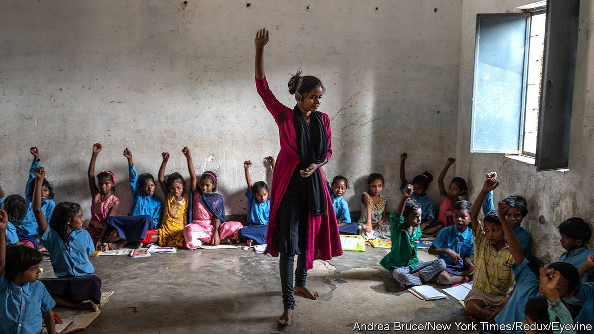
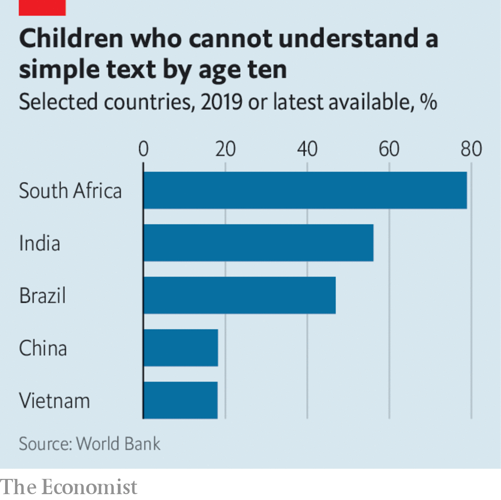

###### Half-marks for Indian education

# Can India educate its vast workforce? 

##### Poor schools put the economic boom at risk 

 

> Jun 29th 2023 

When narendra modi, India’s prime minister,  last week, he did so as the leader of one of the world’s fastest-growing big economies. India is expanding at an annual rate of 6% and its gdp ranks fifth in the global pecking order. Its tech industry is flourishing and green firms are laying solar panels like carpets. Many multinationals are drawn there: this week Goldman Sachs held a board meeting in India. 

As the rich world and China , India’s huge youth bulge—some 500m of its people are under 20—should be an additional propellant. Yet as we report, although India’s brainy elite hoovers up qualifications, education for most Indians is . Unskilled, jobless youngsters risk bringing India’s economic development to a premature stop.

India has made some strides in improving the provision of services to poor people. Government  have simplified access to banking and the distribution of welfare payments. Regarding education, there has been a splurge on infrastructure. A decade ago only a third of government schools had handwashing facilities and only about half had electricity; now around 90% have both. Since 2014 India has opened nearly 400 universities. Enrolment in higher education has risen by a fifth.

 


Yet improving school buildings and expanding places only gets you so far. India is still doing a terrible job of making sure that the youngsters who throng its classrooms pick up essential skills. Before the pandemic less than half of India’s ten-year-olds could read a simple story, even though most of them had spent years sitting obediently behind school desks (the share in America was 96%). School closures that lasted more than two years have since made this worse.

There are lots of explanations. Jam-packed curriculums afford too little time for basic lessons in maths and literacy. Children who fail to grasp these never learn much else. Teachers are poorly trained and badly supervised: one big survey of rural schools found a quarter of staff were absent. Officials sometimes hand teachers unrelated duties, from administering elections to policing social-distancing rules during the pandemic.

Such problems have led many families to send their children to private schools instead. These educate about 50% of all India’s children. They are impressively frugal, but do not often produce better results. Recently, there have been hopes that the country’s technology industry might revolutionise education. Yet relying on it alone is risky. In recent weeks India’s biggest ed-tech firm, Byju’s, which says it educates over 150m people worldwide and was once worth $22bn, has seen its valuation slashed because of financial troubles. 

All this makes fixing government schools even more urgent. India should spend more on education. Last year the outlays were just 2.9% of gdp, low by international standards. But it also needs to reform how the system works by taking inspiration from models elsewhere in developing Asia. 

As we report, in international tests pupils in Vietnam have been trouncing youngsters from much richer countries for a decade. Vietnam’s children spend less time in lessons than Indian ones, even when you count homework and other cramming. They also put up with larger classes. The difference is that Vietnam’s teachers are better prepared, more experienced and more likely to be held accountable if their pupils flunk.

With the right leadership, India could follow. It should start by collecting better information about how much pupils are actually learning. That would require politicians to stop disputing data that do not show their policies in a good light. And the ruling Bharatiya Janata Party should also stop trying to strip textbooks of ideas such as evolution, or of history that irks Hindu nativists. That is a poisonous distraction from the real problems. India is busy constructing roads, tech campuses, airports and factories. It needs to build up its human capital, too. ■

