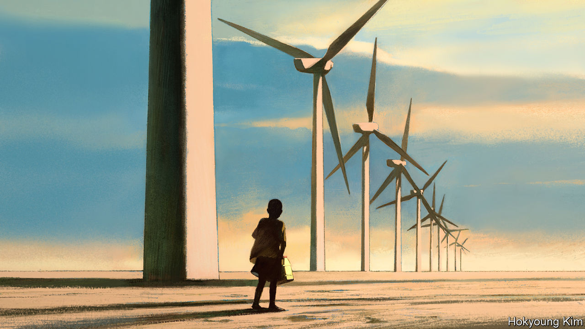

###### Hard truths about green growth

# How misfiring environmentalism risks harming the world’s poor 

##### The trade-off between development and climate change is impossible to avoid 

 

> Jun 29th 2023 

THANK GOODNESS for the enthusiasts and the obsessives. If everyone always took a balanced view of everything, nothing would ever get done. But when campaigners’ worldview seeps into the staid apparatus of policymaking and global forums, bad decisions tend to follow. That, unfortunately, is especially true in the world of climate change.

One example is the effect of global warming on the world’s poorest people. As the planet , extreme events such as  are becoming more common and more severe. Many places are becoming less habitable. Over the coming decades many vulnerable farmers, from Mali to the Mekong Delta, will find their crops failing more frequently. And as resources grow scarcer, more fighting will break out. 

This pattern is no longer just a warning by activists. It is accepted by the mainstream to the point where fears of a surge in climate migration are fodder for the nativist right. Because people are understandably troubled by the idea of climate change forcing poor farmers to leave behind their ancestral lands, an important goal of adaptation spending is to help them stay.

Yet the truth is more complex. The vast majority of displaced people will not cross international borders but move . By 2050, 50m-216m people could be on the move internally. And many will be rural folk moving to cities, where their lives are likely to become better. Urbanisation usually aids development, bringing people closer to schools, health care and well-paying jobs, as well as more liberal social norms, particularly for women. This is not an argument in favour of climate change. But it suggests that one cost-effective and beneficial form of climate-adaptation spending would be helping people move, rather than preserving small farms in ever-harsher conditions. 

There is another, more profound, example of the danger of climate groupthink. From the panels of Davos to the pages of newspapers, it is increasingly argued that no trade-off exists between the economic development of low- and middle-income countries and reducing their greenhouse-gas emissions. This is partly because much of the rich world has successfully made some cuts in emissions while continuing to grow, and its leaders want more of the same. But more crucially, it is because governments and development banks with limited budgets struggle to admit that not all their goals can be reconciled, and that they must therefore choose between them.

Yet choose they must, because the trade-off is in plain sight. Growth is the best way to lift people out of poverty and improve average living standards. But in the developing world, more growth still leads to more emissions. Researchers at the IMF have found that in 72 developing countries since 1990, a 1% rise in annual GDP was on average associated with a 0.7% rise in emissions. By 2030, fast-growing India and Indonesia alone will have increased their annual emissions by the equivalent of over 800m tonnes of carbon dioxide—an extra Germany’s-worth of greenhouse-gas belching. In other big emerging markets such as Brazil, Egypt and the Philippines, emissions are rising, too.

Many rich-world leaders say they can square the circle by  which, in theory, cut emissions and boost growth at the same time. That is true to a degree. But, without adequate carbon pricing and cross-border emissions trading to encourage the private sector to invest on its own initiative, it is an enormously expensive and fiendishly complex task. On June 23rd, at the conclusion of a summit in Paris, rich countries again pledged to meet a target of providing $100bn a year in “climate finance” to fund such projects. Yet that is only a fraction of the $2.8trn annual investment thought to be needed by 2030 to put the developing world on a green growth path, at least $1trn of which probably needs to come from rich countries.


The reality of limited resources worsens the trade-off. The need to spend money decarbonising big developing economies that already offer citizens reasonable services threatens aid budgets which help pay for things like vaccines and schooling in the poorest parts of Africa. Unlike Brazil or India, say, such nations are unlikely ever to contribute significantly to global emissions. 

They lose out, however, when foreign aid and loans come with green strings attached. As well as facing stingier health-care and education budgets, they might find scant funding for expanding a gas-powered electricity grid, even though nobody stands ready to pay for the far greater costs of converting it to a green one. African governments rightly resent being told to cut emissions rather than help people in desperate need—especially given that Westerners continue to belch carbon.

As a result, while leaders offer bromides about sustainable growth,  rages behind the scenes between those who favour development as practised in decades past and those who want the world’s foreign-aid apparatus to turn wholeheartedly towards decarbonisation. It is a battle over what is worse: a poorer today or a hotter tomorrow.

The virtue of hard choices

That is an excruciating choice, given the moral force of the argument that the rich world should pay the developing world’s climate bills. Global temperatures depend on the stock of carbon in the atmosphere, not the current flow of emissions. On a per-person basis, the rich world has been disproportionately responsible for rising global temperatures and has more capacity to respond to them. Poor countries lack the resources to invest to cut emissions or adapt to climate change themselves. Yet relative to the size of their economies, they face the biggest costs.

As with the decision between forestalling or accommodating climate-induced migration, pretending that this choice does not exist helps no one. Politics mean that neither an adequate carbon price nor sufficient Western money are likely. Limited resources make it essential to squeeze as much value as possible out of what is available. Squeamishness about weighing costs and benefits—stemming from a well-meaning desire to avoid every injustice—gets in the way. And the consequences of that evasion fall most heavily on those in the greatest need. ■


