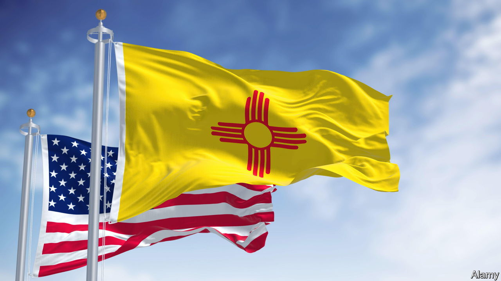

###### Don’t be a flaggard. Raise your standards!

# How to design better flags 

##### Some tips to avoid having an embarrassing emblem 

 

> Jun 29th 2023 

HAVE YOU ever met a vexed vexillologist? This is someone who frets when flags are badly designed. Sadly, too many flags flutter to deceive: they are cluttered with imagery, a mess of colours and all too easily forgettable. Yet flags matter. Witness  blue-and-yellow banner, which now serves as a potent symbol around the world (not to mention on this newspaper’s covers). A fine flag can be something that citizens feel proud to pledge allegiance to, as well as an excellent marketing tool. Canada’s red maple leaf, for example, has advertised the country on countless backpacks across the world. 

A bad banner has an obvious solution: change it. That is what several American states and cities have been doing, or at least contemplating. In March, Utah approved a new standard with a bold beehive to replace its fussier old flag. Maine  in November whether it should switch from its current, over-intricate design to a different one with a plain pine tree and a blue star, a reinterpretation of an older banner, which is already proving popular. The design is not yet settled, so perhaps a flag with a lobster could pinch the honours at the last minute. 

Many people in Minnesota may not even realise they have a state flag—which is lucky. The state representative who has led a campaign to replace the current one has described it as “a cluttered genocidal mess”. Its imagery includes three dates from the 1800s, a French motto and a Native American riding away in the background while, in the foreground, a farmer tills the land. A new design is due to replace it next May. 

Fortunately, the world has centuries of experience that can help guide better flag design. This has led to a few well-established rules. First, keep it simple. A good test is whether a child can draw it from memory. Japan’s red circle in a white rectangle passes the test with, er, flying colours. So does New Mexico’s design (pictured), another red-sun symbol, against a yellow background; it is a thing of simple beauty. 

Second, use meaningful symbolism: think Israel’s Star of David, the Soviet hammer-and-sickle or America’s 50 stars, representing all its states, and 13 stripes, evoking the original colonies. (Mozambique, displaying an AK-47 assault rifle, perhaps went too far.) Third, limit the palette to just a few basic colours. True, as South Africa’s black-gold-green-white-red-blue emblem shows, it is possible to break this rule successfully, but even the rainbow , in its most familiar version, cut two colours from its original eight, because hot pink and cool turquoise made it hard to manufacture. The fact that banners are often viewed from the back helps explain a fourth sensible rule: avoid lettering.

Last but certainly not least: be distinctive. You will then avoid the situation of Indonesia and Monaco, whose flags look the same, as do Romania’s and Chad’s. Nepal’s jagged double-pennon, by contrast, is delightfully unique—the only national flag with an irregular shape. Similarly, Jamaica’s is the only one without red, white or blue. Switzerland and the Vatican stand out as the only countries with flags that are square.

Sometimes proposals for new flags fail. Badges of identity arouse strong feelings. New Zealanders rejected a switch in a referendum in 2016. Traditionalists can feel attached to old emblems. But from Maine to Milwaukee, plenty of places—call them flaggards—have dreadful, old-fashioned banners that are ripe for change. In 2004 Pocatello, Idaho, was reckoned in a survey of vexillologists to have the worst city flag in America. It was changed in 2017, and in a survey last year the new flag ranked 11th in the country. Come on, flaggards, do the Pocatello. ■

