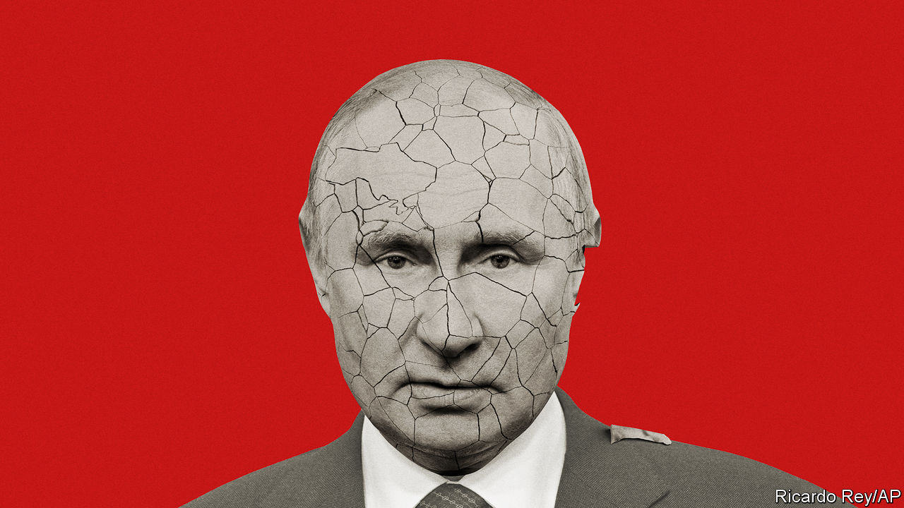

###### Russia

# The humbling of Vladimir Putin 

##### The Wagner mutiny exposes the Russian tyrant’s growing weakness. But don’t count him out yet 

 

> Jun 29th 2023 


THE LAST pretence of Vladimir Putin to be, as he imagines, one of his nation’s historic rulers was stripped away on June 24th. A band of armed mercenaries swept through his country almost unopposed, covering some 750km (470 miles) in a single day, seizing control of two big cities and getting to within 200km of Moscow before withdrawing unharmed.

Mr Putin long ago failed as a reformer, having presided over ever-deepening corruption and economic stagnation and unable to make Russia anything more than a purveyor of hydrocarbons just as the age of oil and gas is coming to an end. He is failing ever more obviously as a great wartime commander, 16 months after starting an  that he expected to be over in a matter of days but which has turned into a quagmire. Now he has shown that he cannot even discharge a leader’s first and greatest responsibility, to ensure the security of the state.

Whether Mr Putin’s fall comes soon, or in months or years, he stands revealed as a blunderer. He is not so much a tsar as simply the top thug in the hollowed-out gangland to which he has reduced Mother Russia. What is more, in a world where power is everything, he now looks like a weakened thug.

, the leader of the Wagner Group, serves as an encapsulation of everything that is despicable about Mr Putin. An ex-con turned restaurateur turned murderous mercenary in , Syria and Ukraine, Mr Prigozhin ascended only because of Mr Putin’s paranoia and brutality. Mr Putin mistrusts his own army, so he needed a loyal band of thugs. He wanted deniability for some of his gorier actions abroad, so “private military contractors” like Wagner went on to commit war crimes on three continents. And Mr Putin used Mr Prigozhin to interfere (again, deniably) in foreign elections, including the one that brought Donald Trump to power in 2016.

Wagner’s mutiny also encapsulates the  that Mr Putin has created. Amid a feud with his rivals in the regular army, Mr Putin decreed that Wagner should be brought directly under the defence ministry’s control. That threatened to destroy Mr Prigozhin’s power base, so he mutinied, railing against Mr Putin’s misconceived war, the incompetence of the Russian army and the losses it was suffering in Ukraine. For all Mr Prigozhin’s brutality, it was a truth that cut through the Kremlin’s empty propaganda.

Even more shocking, Mr Prigozhin has exposed Mr Putin as out of touch. The mutiny seems to have taken the Kremlin by surprise—so corroded are the intelligence agencies under the presidency of a former spy. On the morning of June 24th a shaken Mr Putin denounced his creature as a traitor and vowed he would be punished. Yet just hours later, he agreed to let Mr Prigozhin go scot-free to Belarus, taking Wagner troops with him. 


Having created one-man rule, Mr Putin also seemed unable to command loyalty. Although support did not flock to Mr Prigozhin, neither did it to Mr Putin, either on the streets or among the political and military elites. For 24 nerve-jangling hours Russia stayed silent and inactive, waiting to see which way the wind would blow. 

Optimists will take Mr Putin’s weakness as proof that his rule is doomed. If only that were so. The reality is that despots, even weak ones, can survive for a long time if no obvious alternative is available, and if they still have plenty of guns on their side and the ruthlessness to use them. Look at Alexander Lukashenko in next-door Belarus, or Bashar al-Assad in Syria. 

However, two extra factors are working against Mr Putin. The first is the war itself. Ukraine’s counter-offensive continues to make steady progress. Although it is slower than hoped for, it is chipping away at the territorial gains Russia has made since February 2022, and in some places even taking back ground that Russia seized in its first incursion, in 2014. 

Mr Putin’s theory of victory is that Russia can wait out the West. If Ukraine cannot accomplish the breakthroughs it needs—severing the land bridge connecting Russia to Crimea is the key one—Western support might in time start to fracture. But Mr Putin’s theory is looking ever less plausible. Yes, Russia has succeeded in hurting Ukraine; but far from being conquered, it has been forged as a nation, and is on a path to membership of the European Union and perhaps of NATO, too. And far from Mr Putin’s vision of Western disarray, NATO has expanded to take in Finland, and soon Sweden; European defence spending has risen; and dependence on Russian energy has been eliminated.

By contrast, the loss of over 100,000 Russians, dead and wounded, has brought little for even the Kremlin’s best propagandists to spin as success. The narrative instead is for the need for ever more sacrifice. Every piece of bad news for Russia from the front adds to the pressure on Mr Putin. That is why the counter-offensive is so critical, and why the evidence of division in the Russian ranks is so welcome.

Mr Putin’s second problem is the economy. Last year it held up pretty well, thanks to oil and gas prices that rocketed as the war took hold. Oil shipments have continued and the state still has plenty of cash. Though growth is down, a full-blown economic crisis looks unlikely this year at least. 

However, Mr Putin does not have the resources for a big new offensive. Russia’s gas revenues have crashed (it cut off its best customer, after all), and the global oil price is down, too. The gap between government spending (including the huge costs of the war) and receipts is widening, forcing Russia to raid its sovereign-wealth fund. The rouble has lost almost 40% of its value in the past year. China has bought Russian oil—at a discount—but it has not yet supplied large amounts of weapons. 

Mr Putin now appears to be bent on re-establishing his authority by presiding over savage repression and purges. But sooner or later, his ability to ride out trouble will desert him. The world will need to be ready for that. Of the many possible outcomes, the collapse of order in a country with more than 4,000 nuclear warheads would be terrifying. Yet Mr Putin has shown that corrupt, one-man rule is no way to run a superpower. The path back to order and sanity for Russia will be perilous, but for as long as Mr Putin wears the crown and his soldiers dream of imperial rule over Ukraine, the journey cannot even begin. ■


