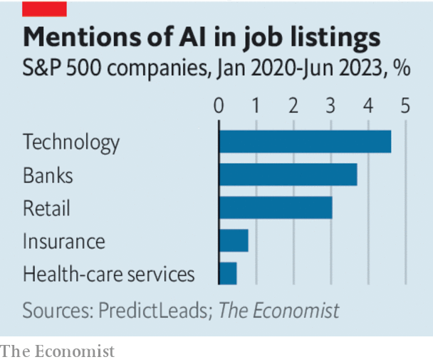

###### AI and productivity

# The widespread adoption of AI by companies will take a while 

##### For the technology to make its mark on productivity, even mediocre firms will need to make the leap 

 

> Jun 29th 2023 

The 2010s brought no shortage of miraculous technologies, from tablet computers and 4G mobile internet to new forms of —Hey, Siri! But these had surprisingly little effect on the economy. During that decade productivity growth in the rich world averaged a measly 1% a year, holding down average wages. Innovative firms embraced new tech, but many less adventurous ones did not bother, and saw few efficiency gains as a result. The experience showed that technological wizardry and improvements in average living standards do not always go hand in hand. 

Generative ai, its boosters say, will be different. Not since the invention of the internet has a new technology so captured the public imagination. The technology is consumer-friendly: within days of its release to the public, , the most famous AI chatbot, had millions of users. It is easy to see how this innovation could improve all types of work at all types of firms, from increasing the accuracy of doctors’ diagnoses to helping programmers write software code more efficiently.

 


Some companies are already incorporating ai  Tech firms are investing heavily in the technology, advertising for many thousands of roles. So are some bricks-and-mortar companies. A drug discovered and designed by ai is progressing through human trials in China. Analysts at ubs reckon that Domino’s Pizza can use ai to “improve the accuracy of order-delivery-time estimates”. Investors are rewarding the early adopters. Since the start of the year, the median share price of the most ai-enthusiastic firms in the S&amp;P 500 has risen by 11%. For those moving more slowly, it has not changed at all.

The potential is huge. Yet for ai to truly , it needs to make its mark beyond the most go-getting companies. And this will take time. Although the internet began to be used by some companies in the early 1990s, it was not until the late 2000s that two-thirds of American businesses had a website. Some 70 firms in the s&amp;p 500 still show no interest in AI, according to our analysis. And below the corporate crème de la crème, the trends look even less encouraging. According to one recent survey of American and Canadian firms, a third of small businesses have no firm plans to try generative-ai tools over the next year. Some evidence even suggests that usage of Chatgpt and its competitors is falling—perhaps as people have tried it out, and then decided it is not for them. 

Can AI live up to its promise? Organisations like the OECD propose lots of ways to improve diffusion from the best firms to the rest, including through better education, schemes to raise business investment and changes to competition policy. Such goals are worthy, but hard to achieve. Efforts by technology firms to make AI cheaper and easier to use will do more to speed up adoption. In practice, most companies will adopt AI by default, as new, AI-powered features are added to the software and services that they already use.

Indeed, even the most powerful technologies take time to diffuse, because companies tend to use a hotch-potch of software and services, some of which may be years or even decades old. Replacing outdated systems can be costly, complicated and painful. Moreover, in the many industries either run or heavily regulated by the government, such as health care, education and construction, bosses and trade unions often resist the deployment of new technology, worried that it will lead to job losses. In time ai could well transform how people live their lives and do their jobs. But the road to widespread diffusion, and any resulting productivity boom, will be a long one. ■

