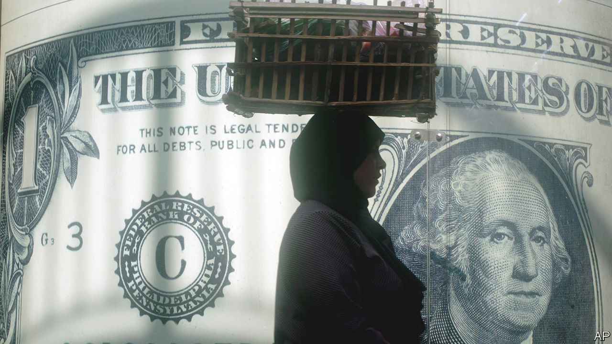

###### Don’t care too much for money

# After years of talks, indebted Arab states and the IMF are at an impasse 

##### They need loans, but have good reasons to balk at the terms 

 

> Jun 27th 2023 

THE IMF likes to say it will never walk away from the negotiating table. If a country needs a bail-out, talks have no deadline. A few countries seem determined to put this promise to the test.

, Lebanon and Tunisia are all in dire need of help. Home to roughly one-third of the Arab world’s population, they are burdened with high levels of debt and dwindling foreign reserves. They are struggling to import basic necessities and prop up their flagging currencies.

Lebanon has already defaulted on its debts, ; bonds from the other two countries pay high yields because of their junk ratings. “The most vulnerable economies are being pushed to the brink of debt distress,” says Jihad Azour, the IMF’s Middle East director (who took temporary leave in June after being named a candidate for president in his native Lebanon).

All three countries have sought loans from the IMF, hoping to augment their financial buffers and reassure foreign investors. Yet after years of talks with the fund, all are stalling. The delays illustrate the economic dysfunction in the Arab world’s oil-importing states—but also the problems with imf programmes in the region.

Egypt reached a $3bn deal with the IMF in December. Since 2019 its foreign reserves have fallen from $44bn to $35bn, while public debt rose from 80% of GDP to a projected 93% this year. Investors, spooked by Russia’s invasion of Ukraine, pulled $22bn of portfolio investments out of the country last year. With dollars scarce, Egypt has devalued the pound three times since the start of 2022, halving its value to around 30 to the dollar.

Abdel-Fattah al-Sisi’s government had hoped an IMF deal would restore confidence. It promised to shift to a flexible exchange rate and to sell billions of dollars in state assets. The pound still looks overvalued, though, trading in the high 30s on the black market. Annual inflation hit a near-record high of 33% in May, far outpacing the central-bank interest rate of 18.25%.

The government insists it must build up a buffer of hard currency before devaluing the pound or raising rates again. Foreign investors, understandably, want that sequence reversed: negative real interest rates and a too-strong currency make both Egypt’s debt and its state-owned assets look like bad bets. So its economy and its IMF programme are at an impasse. The first review of its progress under the agreement, which would unlock more aid and was due in March, remains unfinished.

Tunisia, with government debt of more than 80% of its GDP, started talks with the fund early last year. Foreign reserves have fallen from $9.8bn in 2020 to $6.8bn today. Staple foods and many medicines are frequently in short supply.

While it will probably get through 2023 without a default, it may struggle to repay close to $2.6bn in external debts next year. But Kais Saied, the authoritarian president, all but rejects the idea of an IMF deal, calling “foreign diktats” unacceptable.

Then there is Lebanon, which reached a preliminary agreement with the fund last April. Since 2019 it has plunged into one of the worst economic crises in modern history, the result of a years-long central-bank Ponzi scheme to prop up the currency. Banks are insolvent. The lira has since lost 98% of its value. Annual inflation has been above 100% for almost three years.

To finalise the agreement, the IMF asked Lebanon to implement a few modest reforms: draft a plan to restructure the banks, overhaul the bank-secrecy law and unify its myriad exchange rates. The government has dawdled for more than a year.

Powerful elites are blocking progress in all three countries. Egypt’s army does not want to sell off lucrative assets and allow civilian firms to compete. Trade unions in Tunisia, which periodically call crippling strikes, reject efforts to cut subsidies or trim the wage bill. Politicians and bankers who led Lebanon into crisis are loth to admit that the financial sector is zombified.

Yet Mr Sisi is not wrong to fret that another devaluation will hurt Egyptians, nor Mr Saied to worry about increased poverty. Egypt weakened the currency, cut subsidies and raised taxes after signing a $12bn deal with the IMF in 2016. That meant painful inflation and tighter budgets for citizens—without fixing the country’s underlying problems. Mr Sisi had to come back for another imf loan before he finished repaying the last one.

Austerity brings only a small reprieve in countries that share deeper ills. One is a reliance on tourism and remittances, rather than exports, as the main source of hard currency. They spend hefty sums on enormous public-sector wage bills, which leaves little in the budget for social services or investment. Growth has been sluggish: Egypt’s non-oil private sector has contracted for 30 consecutive months.

In my dreams I have a plan

Fixing these problems requires a bigger strategy to boost growth. That seems implausible with the current crop of leaders—and they seem unlikely to go anywhere.

Presidential elections in Egypt are scheduled for next February, but there is talk that Mr Sisi may bring them forward to late 2023. Frustrated military officers and powerful businessmen might support a challenger. No one has announced plans to run, however, which is understandable: before the last election, in 2018, several of his would-be opponents were arrested.

Mr Saied’s five-year term is also due to end in 2024. He has spent the past few years hacking away at the foundations of Tunisia’s young democracy, sacking parliament and drafting a new constitution to expand his powers. A fair election therefore seems improbable.

In Lebanon sectarian politics mean that most voters choose the same warlords and criminals who plunged the country into crisis. The country has not had a president since October and may soon lack a central-bank chief: Riad Salameh, the longtime governor, is due to leave office this summer.

For now, then, these countries are stuck. Tunisia has taken some loans from Algeria; Egypt has received a bit of help from its Gulf allies. European leaders, worried about illegal migration, are also becoming more generous. Some 3,200 Tunisians crossed the Mediterranean to Italy in the first four months of this year, up 154% from the same period in 2022. Giorgia Meloni, the Italian prime minister, recently pledged €700m ($764m) in aid to Tunisia. Irate Italian officials have even wondered privately if the IMF might sign a deal with Tunisia without Mr Saied’s approval. The answer, unsurprisingly, was no. ■

