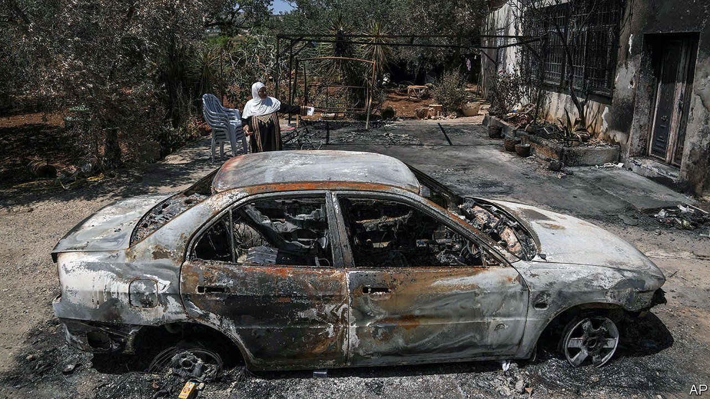

###### Out of control

# Settler vigilantes are getting more violent—and Israel’s government is encouraging them 

##### Binyamin Netanyahu is in hock to their supporters 

 

> Jun 29th 2023 

A narrow valley separates the Israeli settlement of Shiloh and the Palestinian town of Turmus Ayya in the West Bank. On June 21st over 200 Jewish settlers crossed the valley and set Palestinian fields, homes and cars ablaze in revenge for the killing a day earlier of four Israeli civilians at a nearby settlement. “If the army won’t do what’s necessary to prevent Jews from being murdered, we will create deterrence ourselves,” said one. 

Only a small military force was deployed, but it protected the settlers and fired tear gas at the Palestinians, said a villager. One Palestinian was killed by an Israeli officer who said he had been fired on. 

Turmus Ayya was one of several Palestinian villages attacked in a three-day spree. Such vigilante action has long been common in the West Bank. But in the past it was carried out by small groups, usually at night, says Omer Bar-Lev, a Labour politician who as public security minister in the previous Israeli government urged the army to arrest violent settlers. “Now it’s much more brazen, with hundreds attacking villages in broad daylight. They are being encouraged by cabinet ministers.”

Support for the settlers from Binyamin Netanyahu’s far-right government is unprecedented. Last week Itamar Ben-Gvir, the national security minister, told settlers they had his “full and complete backing” and called on the army to “exterminate” terrorists. Following a previous rampage in the Palestinian town of Huwara, after two Israelis had been killed there, Bezalel Smotrich, the finance minister, said in March “Huwara needs to be wiped out.” (He later tried to soften his remarks.) Some ministers have in the past been implicated in such attacks.

By contrast, in a rare joint statement on June 24th, the army’s chief of staff, the police commissioner and the head of the Shin Bet, Israel’s internal security service, denounced the settler attacks. One minister then likened the trio to the Wagner Group and lambasted them for “preaching”.

Mr Netanyahu, who  for his majority, offered a weak remark in support of the army. But his woolly criticism of the settlers paled in comparison with his excoriation of recent  against his government. As long as he remains in hock to his most vicious nationalist allies, he is unlikely to take on the settlers, however violent they are. ■

