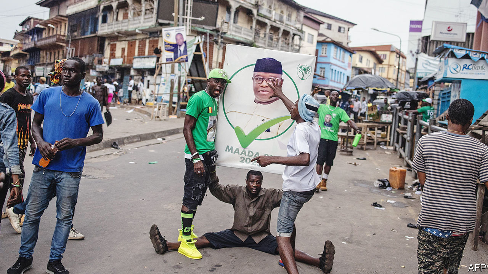

###### Not so transparent

# Sierra Leone’s president is re-elected in the first round 

##### But the results look fishy 

 

> Jun 29th 2023 

Inside the opposition headquarters people suddenly hit the floor and crawled for safety; outside, the security forces kept firing. Samura Kamara, the main opposition candidate in the presidential election the day before, circulated photos of holes in a door. “Live bullets fired at my private office,” he wrote. A woman was found dead under a window with a fist-sized hole in it. The police insisted they had merely fired tear gas to disperse a crowd in the street. 

After the violence came the result. On June 27th the electoral commission declared Julius Maada Bio, the incumbent, the winner with 56% of the votes. This squeaked him over the 55% threshold needed to avoid a run-off. Mr Bio was hurriedly sworn in within an hour. Mr Kamara called the outcome “a frontal attack on our fledgling democracy”. 

Others agree. For more than 15 years National Election Watch (new), a coalition of civil-society organisations, has produced a tally of results based on a representative sample of polling stations. In the previous three elections, its results matched the official ones. Not this time. It reckons Mr Bio scored about 50%. The electoral commission also reported a voter turnout that was well above new‘s estimates. More worryingly, it reckons that in some districts there were more votes cast than there were registered voters. Foreign observers also raised concerns about transparency.

Sierra Leone, a country of 8.4m people, has been widely seen as a success after its 11-year civil war ended in 2002. It has since held four mostly clean elections, twice witnessing peaceful transfers of power to opposition parties. The government has been lauded for efforts to promote education by its Harvard-trained education minister, David Sengeh, whom foreign donors love. 

Yet troubling signs have emerged. Last August some 21 civilians and six police officers were killed in protests triggered by soaring inflation. Mr Bio claimed, without evidence, that the protesters were trying to overthrow him. Having staged two coups in the 1990s before handing over to civilians, Mr Bio may consider himself something of an expert. 

A rigged poll could have grim consequences. Donors might withhold hundreds of millions of dollars in aid. Clashes and ethnic violence could break out amid opposition protests. For now Freetown, the capital, is calm. It is not certain that it will remain so. ■

