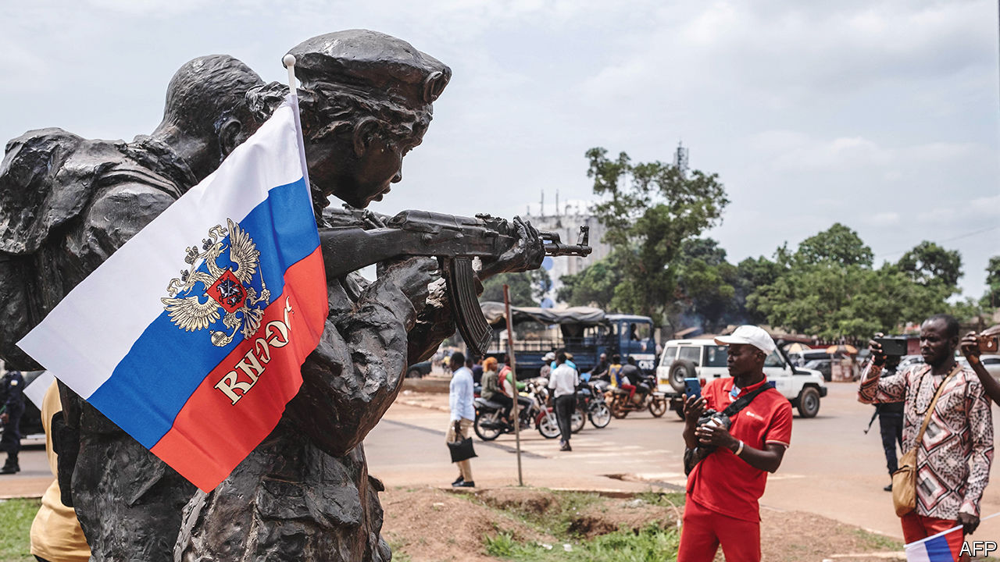
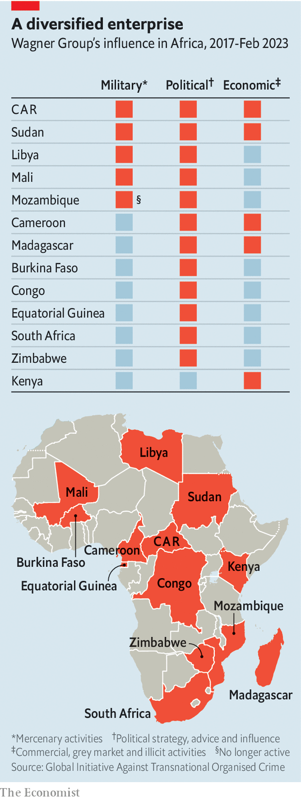

###### Wagner in Africa

# What next for Wagner’s African empire? 

##### The group is unlikely to pack its bags. But African states may rethink Russia’s reliability 

 

> Jun 27th 2023 

Until the events of the past week it seemed that the Wagner Group’s next outpost was more likely to be Burkina Faso than Belarus. But on June 27th  arrived in the latter, as part of a deal between the mutinous leader of the paramilitary network and Vladimir Putin. From there Mr Prigozhin hopes to run the brutal African operations that have become crucial not just to his empire but to the Kremlin’s approach to the continent.

Wagner has carried out “a huge number of tasks in the interests of the Russian Federation” in African and Arab countries, Mr Prigozhin complained in a Telegram message on June 26th. The mercenary group has sent fighters to five African states, including the Central African Republic (CAR) and Mali, where its operations will continue, insisted Sergey Lavrov, Russia’s foreign minister. Wagner has also had some sort of presence in at least another seven countries on the continent (as well as ).

What happens now is unclear. But even if Mr Prigozhin, the group’s figurehead, is sidelined, it seems unlikely that Wagner will up sticks in Africa. The organisation has a vested interest in staying put. Moreover, the Kremlin will be loth to lose a source of . Most probably Wagner will retreat from Africa only if Africans themselves start to see Russia as a weak and unreliable partner. 

To grasp what might happen next to Wagner’s African empire, it helps to understand how it operates. There is no Wagner Inc but a  with links to the Russian state that operate under contracts with foreign governments. As with colonial enterprises of the 19th century, these deals allow Russia to partake in foreign adventures with scant accountability. 

 


In Africa, Wagner uses a business model that has three potential elements, the mix of each depending on the country it is in. These three elements—military, economic and political—have their clearest case study in the CAR, a former French colony that Wagner entered in 2018. Further evidence of its role there was provided on June 27th by The Sentry, an American investigative outfit, in a new report. 

The first pillar is the military one, in cases where African governments have turned to Russia and thus to Wagner for security. There are no official estimates of how many Wagner fighters are in Africa, but analysts suggest the number is about 5,000, with most of them in Mali and the CAR. (It has unknown numbers still in Syria, where it augmented Russia’s military efforts.) The total number may be relatively small, but interviews with Wagner defectors suggest that its fighters in Africa are skilled and battle-hardened. 

They also enhance the capabilities of . In the CAR Wagner has raised a “parallel army” of roughly 5,000 fighters. Many of these are recruited from the same ethnic group as Faustin-Archange Touadéra, the president, outside the procedures monitored by the UN, according to The Sentry. It alleges that Wagner has trained the fighters in torture techniques. Wagner allegedly imported weapons, drones and aircraft in violation of a UN arms embargo.

Wagner used this parallel army as part of a “campaign of terror”, says The Sentry. It accuses Wagner of massacres, torture and rape as part of the group’s strategy of “cleansing” villages. It quotes one CAR soldier under Wagner command as saying: “We kill villagers only, we bury them, or we throw them in the bush.” (Spokespeople for Mr Touadéra and the Wagner Group did not respond to requests for comment.)

Though  could not independently verify The Sentry’s claims, they chimed with other investigations, including by Human Rights Watch. The UN estimates that one in five people in the CAR has been forced from their home. An astonishing study published in April in , a journal, suggests that 5.6% of the CAR’s population died last year, more than four times the UN’s estimate for the CAR in 2010 and more than twice the share in any other country. Wagner’s presence “at least contributed to increased difficulties of survival”, say the researchers, diplomatically. 

The second element of Wagner’s model is economic—the quid for a security quo. Wagner should not be thought of as a hierarchical business, but instead as a loose conglomerate with a network of subsidiaries. There is little public information about its revenues or profitability, but what seems clear is that Africa is a crucial part of its money-making. On June 27th America imposed sanctions on several Wagner-linked companies, including one that controls the Ndassima mine in the CAR, which has gold reserves worth more than $1bn. 

The Sentry claims Wagner has killed and looted villages near gold- and diamond-mining areas in the CAR. In addition, The Sentry counted 15 flights by Wagner-linked planes to Sudan, a gold-trafficking hub, where Wagner also has links. 

The CAR is also a case study of the political services Wagner offers—the third element of its model. The Sentry notes that the group ran pro-Touadéra campaigns in the run-up to elections he won in 2020 and then helped negotiate political deals with leaders of various factions. Elsewhere in Africa Wagner companies have run propaganda and disinformation campaigns, and organised sham election-observer groups. 

Understanding the Wagner model helps to think through what may happen next. Some speculate that as part of any deal between Mr Prigozhin and Mr Putin the former may be able to maintain his role in Africa, though it is unclear if any such deal will be honoured. On June 27th Russia’s president seemed to emphasise who controlled whom when he admitted that the state had directly funded Wagner’s operations, at least in Ukraine. 

Given its structure, “whatever happens to Prigozhin says very little about what happens to the Wagner Group in Africa,” argues Kimberly Marten of Columbia University’s Barnard College. He is neither the CEO of a unified Wagner firm nor a commander whose orders are obeyed by all. Though he may be a charismatic leader and adept at logistics, it would be “relatively easy” for Russia’s defence establishment to replace him, she argues. 

The people and entities in the Wagner network also have their own interests that they will wish to protect. Some of these are linked to Mr Prigozhin, others much less so. The bottom-up evolution of the group is often missed, argues John Lechner, author of a forthcoming book on Wagner. “And even if there were a big shift at the top of management, then you’re not going to fire everyone else.”

Wagner has also been a critical part of the Kremlin’s resurgent interest in Africa over the past decade. After the annexation of Crimea in 2014, and again last year, Russia redoubled its engagement on the continent. Next month Mr Putin will host African leaders at a summit in St Petersburg. Wagner is far from the only tool in its African toolkit, but it has been a low-cost, high-impact instrument. “The advantages that Wagner offers the Russian state will still remain,” says Julia Stanyard of the Global Initiative against Transnational Organised Crime, who co-wrote a report on the group, published in February, describing Wagner’s “tripartite” business model. 

The advantages Wagner offers Russia are multiple. It is a source of gold, stockpiles of which help Russia resist the impact of Western sanctions. It also helps seed anti-Western messages in the countries in which it operates. Wagner was reportedly behind the lie that French soldiers were responsible for the killing of nine Chinese nationals in the CAR this year. It establishes unofficial channels of influence with African politicians that can be turned into official relationships. The CAR’s ambassador to Russia recently said that things had gone so swimmingly with Wagner that his government would consider hosting a Russian military base.

Even so, the Russian security services may wish to take greater control of Wagner’s foreign operations. One option would be to nationalise them, though that may suit neither the Russian state, which can (implausibly) deny responsibility for Wagner’s atrocities, nor African governments, which can more plausibly argue that they control their own security if they use mercenaries rather than foreign troops. Other options may be to rebrand the group, bring in new leadership or shift the constituent firms so that different elites are in control. In the days following the mutiny, the Kremlin reportedly scrambled to reassure the countries that host Wagner of its continued commitment to the missions, whether under the group’s banner or not. Russia’s deputy foreign minister visited Syria to mollify the regime of Bashar al-Assad, while the “instructors” operating in car and Mali are going nowhere, said Mr Lavrov. Regardless, it would seem illogical for Russia to withdraw unilaterally from fruitful ventures. “It would damage Russia in the eyes of African governments if they pulled them out,” adds Ms Stanyard. 

The biggest factor in deciding Wagner’s future on the continent may be its African customers—the politicians who have turned to Russia for help. In the CAR, where Wagner is most entrenched, the government seems unmoved. Fidèle Gouandjika, an adviser to Mr Touadéra, told the AFP news agency that “the CAR signed a defence agreement in 2018 with the Russian Federation and not with Wagner”, adding that “Russia has sub-contracted with Wagner; if Russia no longer agrees with Wagner then it will send us a new contingent”. Tensions between Mr Prigozhin and Mr Putin are “an internal matter in Russia”. 

In Mali, meanwhile, a recent gamble by the ruling junta looks even riskier. On June 16th the military-led government told a 13,000-strong UN peacekeeping mission to leave “without delay”. The last blue helmets are expected to leave by no later than the end of the year. The junta is counting on Wagner to help it fight the jihadists who have killed thousands in the past few years. Yet as the mutiny unfolded Sadio Camara, the junta’s minister of defence, was “almost feverish” with anxiety, reported , a magazine based in Paris.

Since the mutiny, African elites may well be changing their opinion of Russia. Jędrzej Czerep of the Polish Institute of International Affairs notes that some of Africa’s most influential cheerleaders for Russia have gone quiet in recent days. This reflects how support for Russia depends on it being seen as powerful enough to help its African clients achieve their own ends. “It will lose its charm as soon as it looks weak and incapable,” he argues. A long-anticipated deployment of Wagner forces to Burkina Faso, which like Mali is run by a military junta, is now surely less likely.

That points to an irony that will not be lost on many African observers. Russia’s president pitches his country not only as a strong ally for African leaders but as something of a model. Yet the very same group that his government has sent to help African leaders fight their internal enemies has itself staged an uprising in Russia. That is not exactly a good advertisement for a regime selling coup-protection to autocrats and juntas abroad. ■

