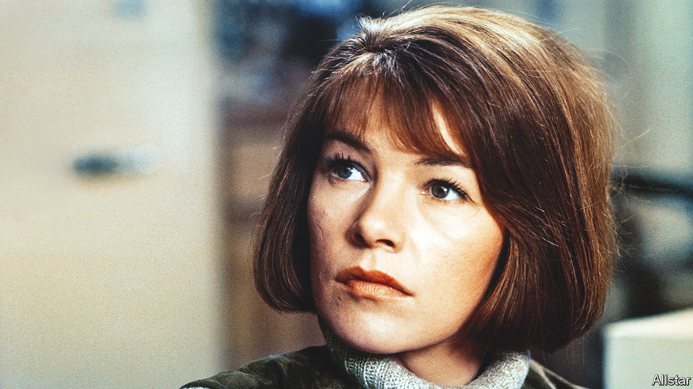

###### Her working life

# Glenda Jackson left acting for politics—and then returned 

##### The actress acclaimed on stage and in film died on June 15th, aged 87 

 

> Jun 29th 2023 

Asked what her greatest or her best role was, Glenda Jackson’s reaction was usually a snort or a sigh. Was it Gudrun in “Women in Love” in 1969, blithely doing her amorous eurhythmics in front of a herd of cows? Was it Elizabeth R in the TV series in 1971, an imperious mask of shaven head and white paint? Or was it the asylum patient playing Charlotte Corday in “Marat/Sade” in 1967, falling dazed to her knees to sing a song to Marat, before tenderly contemplating the knife with which she would kill him? 

No, none of those, she would say, searching for a hanky or looking the other way as the clips played behind her. She never watched her old stuff, anyway. She always insisted that her finest performance was in 1971 on the comedy show “Morecambe and Wise”, playing Cleopatra in a glossy black wig beside Ernie Wise as Mark Antony (dodgy tunic, lopsided helmet) and Eric Morecambe, in his owlish glasses, as “Octavian Caesar”. Eric had given her the best note she had ever had: “Don’t laugh, and speak up.” She managed the second, but not the first. 

Praise didn’t interest her, and nor did awards. She won an Oscar for “Women in Love”, another for “A Touch of Class”, nominations for “Sunday Bloody Sunday” and “Hedda”. She won Emmys, Baftas and a Tony. Thank you kindly, she said, while inwardly muttering,  The Oscars went to her mother for bookends and her mother, being a cleaner, soon polished all the gilt off. 

Awards didn’t mean that you got work afterwards. But she had to. She had started acting, as a bored teenager serving in Boots in northerly Birkenhead, because she thought there might be a job in it. (In her family, with a bricklayer father and six in the household, if you didn’t work, you didn’t eat.) Two years of RADA training got her bit parts round the country until the RSC recruited her. Work kept cropping up after that, but she stayed convinced, each time one job finished, that she wouldn’t get another.

This was more than partly because she was a woman, and not conventionally pretty, with her gawkiness and big uneven teeth. She had nowt to sell. Critics often said she had intelligence and power, but who wanted those in women? The whole acting world was tilted against them. They were almost never the dramatic centre of plays, just adjuncts on the sidelines. It was true in the 1960s, and it was still true in the 2020s. Good God, she had bitched about it for all those years, and nothing had changed. 

“Elizabeth R” was an exception. There she was regally, icily in charge. Courtiers cringed before her. She played the part again in the film “Mary, Queen of Scots”, where her contempt almost toppled her rival off her horse. Yet she had also studied Elizabeth’s softer side, finding that, for example, the great queen once went to sleep sucking her thumb. It was a six-part series, so they spent a long time together, that mythical figure and herself. 

Truth was what she was after. Peter Brook, her favourite director, always demanded that. Absolute truth, which made you think in a new way. Shakespeare in his plays asked three great questions: Who are we? Why are we? What are we? Each role was an exploration of a human being, and of how human beings behaved towards each other. When she played standard women’s roles, needy sidekicks to the male leads, such as Alex, the third point of the love-triangle in “Sunday Bloody Sunday”, or even Ophelia in “Hamlet”, she made sure to make them deeply interesting. 

Yet she did not see herself as an actor. She  the character, seeing the world through their eyes. Since they were fascinating, and she was boring, she took on that fascination. Her most difficult role came in 2016 with the tv drama “Elizabeth is Missing”, when she played a grandmother with Alzheimer’s, drifting in and out of self-knowledge. Who was she then? And who was this tearful young woman at the bus stop, who said she was her daughter? Her lined face seemed to collapse with the effort to understand. 

This preoccupation with human behaviour led in 1992 to an extraordinary decision, to give up stage and screen for politics. Pretty similar, really. If there was any one trigger, for she had been Labour all her life, it was Margaret Thatcher’s remark that there was “no such thing as society”. Against her own expectations, she won Hampstead and Highgate—north London wealth with patches of poverty—and represented it, seriously but passionately, for 23 years. The House of Commons, she would tell people whose main image of her was of coltish rolling in the grass, was not at all a place for performance. You didn’t dissemble or play games, because you were speaking for the voters who had put you there. You didn’t pose. She did wear a scarlet jacket sometimes. 

 Again, it was speaking truth that mattered most. She briefly became a junior transport minister, but savaged Tony Blair over Iraq. And when Thatcher died, rather than join in the syrupy tributes, she furiously attacked “the most heinous economic, social and spiritual damage” her nemesis had caused. In her own constituency, shop doorways were now the bathrooms of the homeless. School walls were held together with Sellotape. Greed, selfishness and scorn for the weaker were now presented as virtues. Over the continuous male heckling her voice rose as strongly as Elizabeth I’s, gravelly from years of smoking. 

She was sometimes asked if she could ever play Thatcher. Awful thought. She couldn’t possibly get into the world Thatcher saw. But even stranger worlds she bravely entered. A year after stepping down from Parliament, in 2016, she played Lear on the London stage, howling in an old suit through the soaking storm. Later she took the show to New York. She was in her 80s. Ridiculous to think she had the energy! But she did, because the energy, like a roaring car, came from the work itself. 

She was glad to note that gender barriers were more fragile as she aged. Playing an old mad king was fine, and a liberation. She still had that bloody worry that, afterwards, she wouldn’t get work again. Yet even as she died she had a film in the can, “The Great Escaper”, with Michael Caine. She helped him to break out of his care home. Independence championed, to the last. ■

