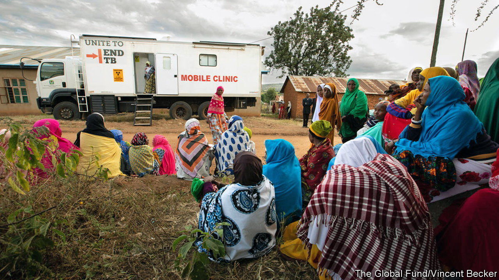

###### The forgotten pandemic

# A new TB vaccine could save 8.5m lives over the next quarter of a century 

##### But testing it will rely on the efforts of two charities 

 

> Jun 28th 2023 

Tuberculosis (TB), which kills one person every 20 seconds, is a forgotten pandemic. About a quarter of the world’s population has been infected with the bacterium . Most will never know, as they are asymptomatic. But these latent infections go on to sicken about one person in ten. And even though TB is treatable, around 1.6m people each year, mostly in poor countries, nonetheless die from it. 

A 100-year-old vaccine, the BCG, has helped, but it is only partially effective. On June 28th two of the world’s wealthiest charities, the Bill &amp; Melinda Gates Foundation and Wellcome, said they would fund a late-stage trial of a new TB vaccine known as M72. That will cost $550m, of which the Gates Foundation will contribute $400m, making it the charity’s biggest ever investment in a single product. 

M72 is a “sub-unit” vaccine. Rather than a dead or weakened form of the bacterium itself, it contains two proteins found on the bug’s surface. GSK, a big pharmaceutical firm, acquired it from Corixa, an American company, in 2005. , the results of which were published in 2019, concluded that it was about 50% effective in preventing TB in the lungs of those with a latent infection—a group in which no other vaccine has worked. But gsk decided developing the vaccine further would not be commercially viable. 

That is where the charities come in. The Foundation will not only pay for most of the bigger trial that is required before the vaccine can be approved by regulators, it will also sort out the logistics. It has identified a dozen sites in Africa and Asia where rates of latent tb infection are unusually high, between 40% and 60%. Testing here will allow scientists to see more quickly whether the vaccine prevents the emergence of active TB. But the trials will still take four to six years, says Trevor Mundel, president of global health at the Foundation. That is one reason for the high cost; others include the number of participants required—around 26,000—and the expense of setting up laboratories. 

If the new jab really is 50% effective, it could save 8.5m lives, and prevent 76m cases of TB, over the next 25 years. It could also avert 42m courses of antibiotic treatment, which might slow the rate at which TB is evolving resistance to such drugs. 

Academic and charitable support for vaccines is not new. But such organisations can only do so much. The vaccine will ultimately need a commercial partner to put it through regulatory assessments and organise sales and distribution. Pharmaceutical firms also conduct post-marketing surveillance, which helps regulators spot side-effects that might have gone unseen during the trials themselves. Despite their financial firepower, “there is no way Wellcome and the Gates Foundation can…become a vaccine company,” says Mr Mundel. Other vaccines, such as one for Lassa fever being developed by the non-profit group IAVI, remain in commercial limbo for such reasons.

Wellcome and the Foundation hope to secure a commercial partner for their new vaccine within 12 months. Indian vaccine-makers, which are more used to investing in developing medicines for low and middle-income countries, seem interested. An earlier GSK  was licensed to Bharat Biotech, an Indian firm, in 2021. As for all the new trial sites built for testing M72, Mr Mundel is hoping the investment may also be of use to others wanting to test other vaccines in future. BioNTech, a German firm, is developing an  to target TB, for example. With a growing pipeline of drugs and vaccines for TB, optimism over better treatments is growing—even if getting them to market needs a helping hand. ■


