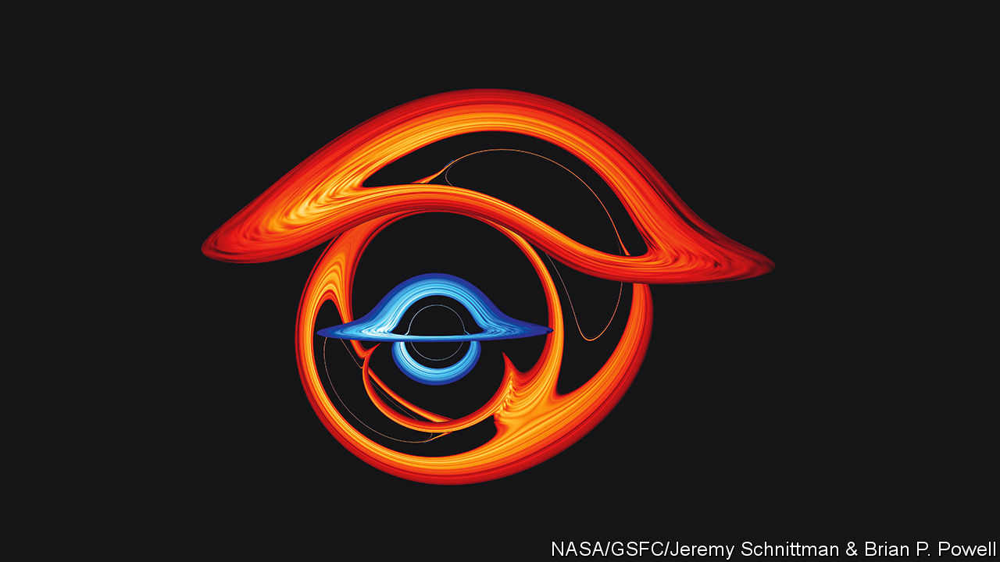

###### Ripples in the sky

# A new gravitational-wave detection has excited astronomers 

##### It could reveal giant black holes—or the beginnings of the universe 

 

> Jun 29th 2023 

The 2017 Nobel prize for physics  for the confirmation of a prediction made 101 years earlier. In 1916 Albert Einstein, whose theories of special and general relativity revolutionised scientists’ understanding of physics at the scale of stars and galaxies, predicted that, in certain circumstances, the fabric of the universe itself should wobble and flex.

The culprits are gravitational waves, which are to gravity as radio waves or visible light are to electromagnetism. In 2015 gravitational waves were directly observed for the first time. LIGO, an American observatory based in Washington state in that country’s north-west, and Louisiana in the south-east, detected waves produced by a pair of colliding black holes, each about 30 times the mass of the sun. That produced ripples in spacetime with a frequency of about 150Hz, or cycles per second, and a wavelength of around 2,000km. 

This detection marked the beginning of the era of , which uses gravity to examine the universe in the same way that conventional astronomy uses electromagnetic radiation, from visible light to radio waves and gamma rays. On June 29th four collaborations led by researchers in America, Australia, China and Europe claimed to have pushed forward the state of that emerging art. They announced the tentative detection of new, ultra-low frequency gravitational waves which could offer insights into some of the hardest-to-study bits of the universe. 

Most gravitational-wave detectors are interferometers. These work by splitting a beam of light in two, and sending each half down one of a pair of long, perpendicular arms. At the end of the arms the light pulses are reflected back towards the source, where they are recombined. If that journey is uninterrupted, the returning beams will cancel each other out when they are put back together. If they do not, then that suggests some disturbance—sometimes a mere seismic tremor, but occasionally a passing gravitational wave—has disturbed them on their journey.

Big-game hunters

Hunting for gravitational waves requires big instruments. LIGO’s arms are 4km long; those at Virgo, a European instrument, span 3km. And the lower the frequency of the waves you want to detect, the bigger you have to go. Waves with a frequency around 1Hz, for instance, require detectors bigger than Earth itself. That is why the European Space Agency is building a spacecraft called LISA, due to fly in the late 2030s. It will use a system of space-going lasers and mirrors to create “arms” that are 2.5m kilometres long. 

But the latest result concerns waves with frequencies in the nanohertz range, billions of times lower still. To detect those, astronomers must rely on light pulses created by Mother Nature—specifically, by pulsars. These are collapsed, spinning stars that emit flashes of light with metronomic regularity. If a passing gravitational wave distorts a region of spacetime between the pulsar and Earth, then some pulses would arrive earlier or later than expected. Monitoring groups of pulsars can create, in effect, interferometers with arms of interstellar size. 

And ultra-low frequency distortions have now been spotted. Doing so was not easy. A great deal of patience was required, as results from the various observatories trickled in over the years. Some of the data included in this week’s research were collected over 25 years ago. 

None of the collaborations believe they have quite enough evidence for a conclusive discovery just yet. Physicists measure the significance of a result using a statistical term called sigma. A score of 5, the gold standard, indicates a roughly 1-in-3.5m chance that what seems like a result is instead the product of chance. Individually, the four detections have sigma values between 2 and 4.6. But combining their data could take them over the 5-sigma mark within a year. “I have no doubt it’s really just a matter of time,” says Vivien Raymond, an astrophysicist at Cardiff University, who was not involved in the work.

The most likely source of the waves, says Alberto Sesana at the University of Milano Bicocca, are pairs of supermassive black holes, each with a mass millions of times that of the sun. They are most commonly found at the centres of galaxies, and are thought to pair off when those galaxies collide and merge. Over billions of years, such pairings are predicted to be frequent, producing a background gravitational “hum” across the sky. Still, says Dr Sesana, “this would be the first observational proof that supermassive black hole binaries do indeed occur in nature.”

There is another possibility, much less likely but far more exciting. It is just about conceivable that the new signal could be the first-ever glimpse of the universe’s earliest history, when a phenomenon known as inflation—in which the size of the universe briefly increased rapidly—would have set spacetime ringing. 

If that is indeed what has been detected, it is hard to think of a more dramatic demonstration of the power of gravitational astronomy. Because it was so hot and dense, the universe is thought to have been opaque to electromagnetic radiation for the first 380,000 years of its existence. That means that no standard telescope (all of which depend on detecting light of various wavelengths) can detect traces of anything that happened before that. That is not a limit to which gravitational telescopes are subject. Watch this space. Or spacetime. ■


