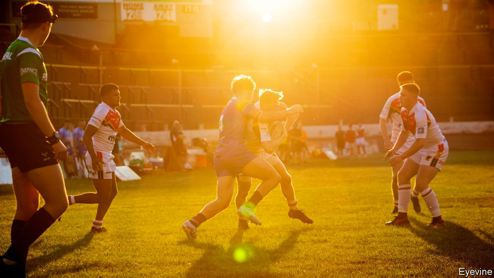

###### Seeing stars

# Even doctors can struggle to diagnose concussions 

##### A new test could make it much easier 

 

> Jun 28th 2023 

On June 23rd a court case brought by more than 200 rugby-union players kicked off in London. The players claim the sport’s administrators failed in the past to protect them from repeated concussions and blows to the head that, they say, have left them with lifelong brain injuries and early-onset dementia. 

Concussions and other forms of brain injury have become one of the  in sports from soccer to ice hockey. In America the National Football League, which governs American football, has had to pay out hundreds of millions of dollars to brain-damaged players. 

Rugby’s current administrators are scrambling to change things. Authorities in France, England and New Zealand have changed the rules to lower the legal height of tackles, in the hope that will prevent at least some head impacts. New rules released in April mean that a player with a suspected concussion must be removed from the pitch immediately.

One of the problems, though, is properly diagnosing concussion in the first place. Currently this is an unreliable art. Pitch-side doctors must rely on a mix of outward clinical signs and self-reported symptoms, which players keen to return to the fray may underplay. Away from professionally organised sports, where people take spills or butt heads without medical supervision, it is even harder to decide whether damage has been done. 

Doctors are trying to help. In May the American Congress of Rehabilitation Medicine published a new set of diagnostic criteria, under which a patient without clear external signs—such as confusion or unconsciousness—would have to report at least two symptoms, such as feeling confused or dizzy, for a concussion to be suspected. But a new development, pioneered by Adam Shuhendler, a biochemist at the University of Ottawa, may bring more rigour. Earlier this month, at the Canadian Chemistry Conference in Vancouver, he laid out how a reliable clinical test for concussion might work.

Dr Shuhendler’s specialty is creating dyes that bind to specific molecules in the body. In this case, the molecules he has in mind are a class of chemicals called aldehydes. Though these are thought to function as messengers between many different cells in the body, they seem to be produced in greater quantities in response to cellular stress—including from injury. Perhaps, he thought, the same thing would happen in the brain as well.

Once Dr Shuhendler and his team had developed a dye, they created concussions in a dish, by squeezing a chunk of lab-grown neurons. They applied the dye and waited for it to make aldehydes visible—which, sure enough, it did. The next step was to check if they could spot concussions in mice. That required concussed mice, which the researchers produced with a device that impacted the animals’ heads with enough force to disorient them for a few seconds, but without causing serious damage. To make the experience better they gave them painkillers—but they did not sedate them, because a sleeping brain is known to react differently to shocks. They then injected the mice with the dye and put them in miniature magnetic-resonance imaging (MRI) scanners, which revealed the dye-marked aldehydes. 

Transferring the technology to humans may take some time. For one thing, the safety of the dye has yet to be proved in people. Dr Shuhendler thinks one option might be to try the dye with positron emission tomography (PET) scans rather than MRIs. Though they tend to be more expensive, PET tests are also much more sensitive, and therefore require only trace amounts of dye. That should make getting approval easier.

Eventually, it might even be possible to do the diagnosis with a simple blood test. In the meantime, though, a hospital test that offered a definitive diagnosis of concussion would still be useful, because so many are missed by doctors. One paper, published in 2018, noted that health statistics suggest around 22m people around the world suffer a mild brain injury every year. When the researchers tried to correct for undercounting, they arrived at a figure of 55m. But that is still merely an informed guess. It would be useful to be sure. ■


