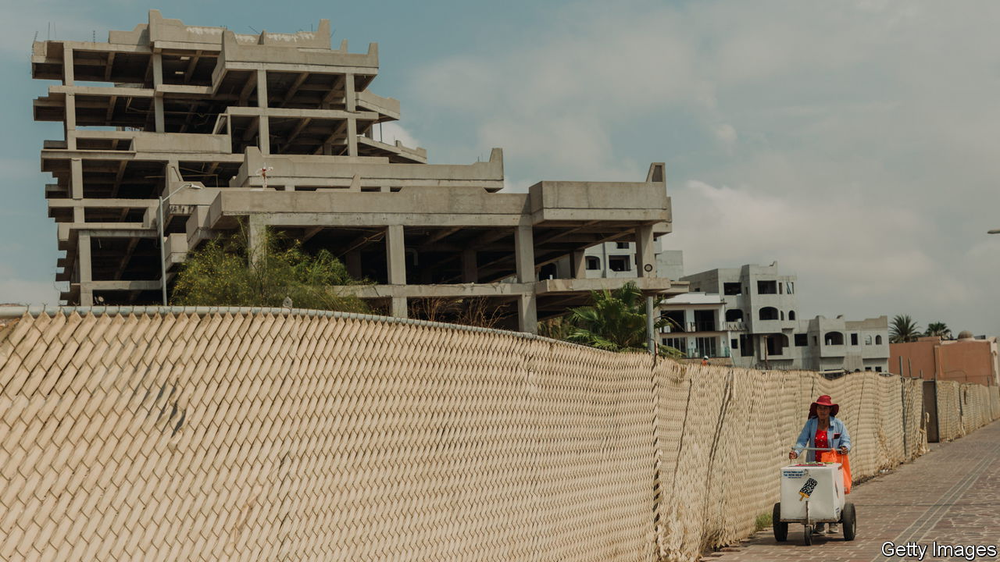
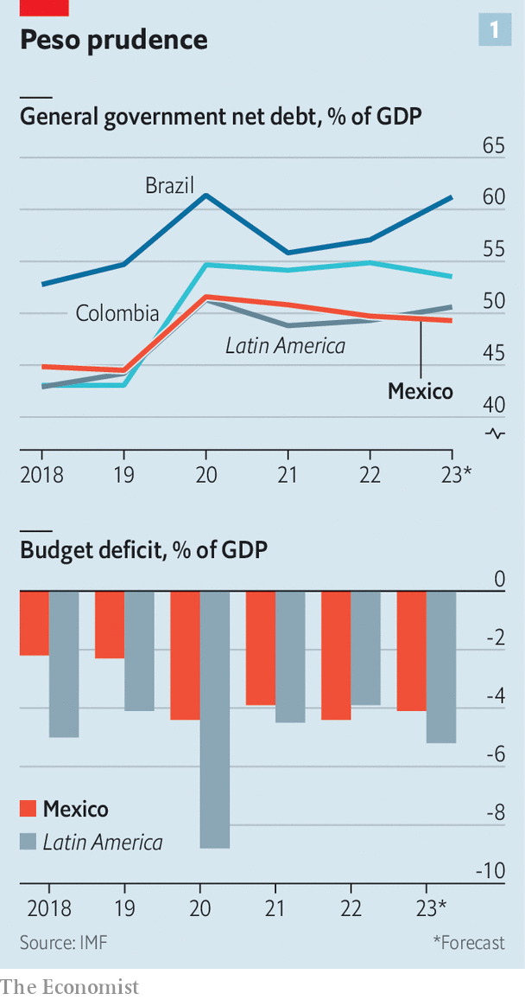
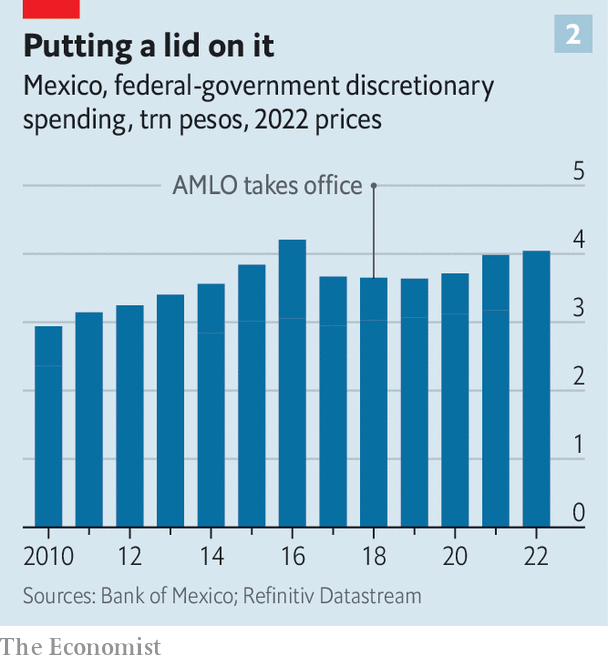

###### The parsimonious populist

# AMLO’s austerity has hurt Mexico 

##### The president has put parts of the state on a starvation diet 

 

> Jun 29th 2023 

WHEN ANDRÉS MANUEL LÓPEZ OBRADOR won Mexico’s presidency in a landslide in 2018, he promised to “transform” the country by putting the poor first. Observers assumed he would spend without restraint to bring that about, jeopardising the stability of public finances. But Mr López Obrador, especially early in his presidency, has been an unusually parsimonious populist. He has run smaller budget deficits and built up less debt than most Latin American leaders (see chart 1). During the pandemic, when presidents from Brazil to Pakistan splurged to protect their economies and strengthen their health systems, Mr López Obrador was tight-fisted. Only in the past couple of years has his government raised discretionary spending significantly in real terms (see chart 2).

As he nears the end of his presidency (he can only have one six-year term), it is becoming possible to judge the effects of his early peso-pinching and the freer spending that followed. AMLO, as he is often known, can boast that inflation is relatively low, which is good for the poor; the currency is strong; and interest rates have risen by less than they might have done.

 


But he has coupled prudence with parsimony in a way that has hurt Mexico. His government has underinvested in health and education, undermined the bureaucracy and cut funding for institutions that underpin democracy. It has taken money away from successful anti-poverty programmes and handed it to ones that are less effective. It has been weirdly reluctant to raise tax revenues. And, while starving some parts of the state, the president has lavished funds on the badly managed state oil company and on pharaonic projects of no proven value. The net effect of AMLO’s spending policies is to make Mexico’s economy, and its democracy, weaker than they should be. 

 


This has not made him unpopular. His approval rating is 65%. The candidate of his Morena party is widely expected to win next year’s election. Luck has helped obscure his mistakes. Mexico is a beneficiary of “friend-shoring”, a shift in investment away from China towards countries that are closer to and have better relations with the United States. In 2021 and 2022 Mexico’s real GDP growth averaged 3.9%. 

AMLO applies “republican austerity” first of all to himself. One of his first acts in office was to cut his own salary by 60% from the 270,000 pesos (then $14,300) a month paid to his predecessor, Enrique Peña Nieto, who sported designer watches. amlo decreed that no one in government could earn more than the president, so salaries of other senior officials were also cut. He sold the presidential aeroplane (although it took until this year to find a buyer, Tajikistan’s government). His frugality adds to an aura of saintliness. AMLO wonders aloud why people need more than one pair of shoes. Recently, he has spoken of his dedication to “Franciscan poverty”. 

This aversion to extravagance is in part a reaction to a debt crisis in 1982, when bondholders bossed the government around and the economy began a decade of slow growth. His extension of frugality to the public sphere is “popular with citizens because the government has long been seen as the enemy”, says Paula Villaseñor of IMCO, a Mexican think-tank. 

What civil servants can spend on such things as phone calls, petrol, seminars and colour-printing has been capped. In 2020 three-quarters of workers in the economy ministry were told to hand back their computers or pay to continue using them. Some civil servants bring their own toilet paper to work. All told, this has demoralised the bureaucracy and made it less effective. Many experienced officials have quit. Complaints about public services rose by 38% between 2018 and 2020. 

Even in the pandemic AMLO did not relent. Mexico was among a small number of states, most of them in sub-Saharan Africa and South-East Asia, that spent less than 2.5% of GDP to protect people from covid-19. Mexico’s toll of excess deaths was the fifth-highest in the world (its population is the tenth-largest). Without extra cash from the government, people had to work—and thus to mingle with others. 

Mr López Obrador is no Thatcherite, restraining the state so that the private sector, and citizens more generally, can flourish. Nor does he deftly redirect scarce funds from wasteful purposes to useful ones. Rather, he has used republican austerity to amass power. Although parsimony has been the rule, especially early on, he makes ill-judged exceptions. 

His pet projects are not feeling the presidential pinch. These include energy schemes that push Mexico away from a green transition, and infrastructure in the country’s poor south. Mr López Obrador justifies secrecy about how much he has spent on these on grounds of national security. It is much more than planned. Last year he admitted that a refinery in his home state of Tabasco had cost 46% more than the $8bn he had forecast. After a period of restraint, spending has recently jumped and is budgeted to soar this year, as the government rushes to complete such projects before AMLO’s term ends. 

Daniel Gutiérrez, a Morena lawmaker from the southern state of Oaxaca, says that AMLO is the first president to invest seriously in the south. Some of that investment may bring more and better jobs. An upgrade of ports, now under way, has been widely praised. But the other main projects for the region—the refinery and a planned railway—are thought to be white elephants. No cost-benefit studies have been carried out on the proposed train. A new airport for Mexico City, completed in March 2022, has not cleared up congestion in the skies. While splashing out on big projects, the government has cut spending on humdrum infrastructure. Between 2018 and 2021 the government reduced by 28% its budget for keeping up roads. 

Seeking to make Mexico self-sufficient in energy, Mr López Obrador has directed 42% of the public-investment budget this year to Pemex and CFE, the inefficient and highly indebted state oil and electricity companies. The state’s implicit guarantee of Pemex’s debt was one reason given by Moody’s, a credit-rating agency, when, despite AMLO’s fiscal prudence, it downgraded Mexico’s government debt last year.

Mr López Obrador has used his odd mix of largesse and miserliness to strengthen institutions he likes while weakening ones he doesn’t. Partly to save money, he has asked the armed forces to help build airports and run ports and bolstered their role in fighting crime. A draft decree published on June 27th would give the navy control of Mexico City’s older (and bigger) airport; the defence ministry is already in charge of the new one. The military budget soared between 2019 and 2022, but even so the army overspent it by 25%. It will be able to keep part of the profits from running infrastructure, giving it access to money without civilian oversight. 

For institutions that annoy Mr López Obrador, there are cuts. Since 2020 he has been trimming the budget of the independent electoral commission, which, he claims without evidence, manipulated the vote count to deny him the presidency in an election in 2006. He cited a need to economise to justify a package of reforms that would have reduced the commission’s staff and network of offices; the Supreme Court rejected it. The budget of the energy regulator has fallen by 14% during Mr López Obrador’s presidency. In April this year he said he would eliminate or merge 18 agencies, including an anti-corruption body, to save money. 

A bigger surprise is the way Mr López Obrador has dealt with programmes that could bring about the transformation he claims to want. Only this year did the budget for transfers to the poor surpass that of 2014. He has shaken up social spending, abolishing a conditional cash-transfer scheme that had improved the health and education of Mexico’s poorest. To replace it he brought in transfers to young people who are not studying or working and a scheme to pay people to plant trees. He presents these as presidential gifts. Unlike the programmes they replaced, they are badly monitored; initially, at least, they did not reach the poorest people. 

It is hard to disentangle the effects on poverty of AMLO’s policies from those of other factors, like the pandemic, which pushed up the official poverty rate between 2018 and 2020, though it is falling again now. One group that has clearly benefited are pensioners: AMLO made a scheme nationwide that pays them 4,800 pesos every two months. 

No more pencils

Underspending on education and health dates back to before Mr López Obrador’s presidency. This year health care got an injection of post-pandemic cash; the budget is the largest in a decade. But this does not make up for his earlier decision to close an insurance programme that provided health care to the poor. Last year, when Mexico reopened schools after a 17-month shutdown prompted by the pandemic, the education budget was 3.1% of GDP, the lowest figure since 2010. The government says that 5.2m children dropped out of school during the pandemic, and that those who stayed have fallen far behind where they should be. The president has raised teachers’ wages, but has taken other measures that harm education. He reversed a reform from 2014 that linked teachers’ pay to performance. He reduced the number of full-time schools, which make it easier for mothers to work and ensure that children get one good meal a day. Most children are in school for half-days. 

Crime-fighting, another supposed priority, has also suffered from presidential parsimony. While militarising law-enforcement, Mr López Obrador has been stingy with the justice system and police. Mexico’s spending on domestic security is 0.7% of GDP, the lowest level among all Latin American and Caribbean countries. The number of recorded murders fell by 8% between 2018 and 2022, but the rise in the number of disappearances—usually murders with no corpse as evidence—suggests that violence has not actually fallen. 

Mr López Obrador’s “starving state” would be better fed if he raised taxes, says Viridiana Ríos, a Mexican analyst and columnist. There is scope for that. Total tax revenue is 16.5% of GDP in Mexico, well below the average of nearly 23% in Latin America and the Caribbean. Although Mr López Obrador has squeezed more from private corporations, he cut Pemex’s tax bill. In 2022 tax revenues fell in real terms for the first time since 2017, partly because the government introduced a tax break on fuel. The subsidy was not targeted and did not help most the people hit hardest by inflation, says Renzo Merino of Moody’s. To his credit, Mr López Obrador has not undermined Mexico’s fiscal foundation. But he has weakened the economic and democratic edifice that stands on top of it. ■

