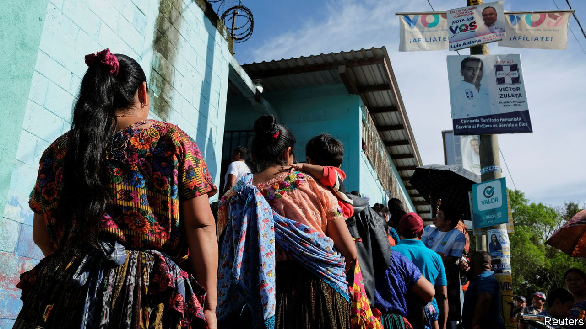

###### Seeds of hope

# Guatemala’s election produces a pleasant surprise 

##### A reformist outsider could win the presidency 

 

> Jun 28th 2023 

EVEN BY THE standards of Central America’s ailing democracies, the run-up to elections in Guatemala on June 25th was ominous. For unconvincing reasons the electoral tribunal banned three popular presidential candidates from running. A court , a prominent investigative journalist. So it was a pleasant surprise for many Guatemalans when an outsider defied the polls to come a close second to a candidate who was backed by the country’s ruling elite. Bernardo Arévalo of Semilla (Seed), a young progressive party, won a place in the run-off in August by getting 12% of the vote. He has a real chance of becoming the country’s next leader.

The vote for Mr Arévalo, who is 64, is a sign of thirst for change in a country where corruption is widespread and standards of democracy are sinking. (More voters left their ballots blank or spoiled them than voted for any single candidate, a sign of their discontent.) Mr Arévalo trailed behind Sandra Torres, a former first lady, by only four percentage points. He also beat other candidates favoured by the political, military and business elites, which Guatemalans damn as “the pact of the corrupt”. Semilla increased its number of lawmakers in Congress from seven to 23, making it the third-biggest party.

The surprise result offers a glimmer of hope in a despairing region. Many of Guatemala’s neighbours are dictatorships or on their way to becoming one. Daniel Ortega has crushed opposition in Nicaragua. In El Salvador Nayib Bukele has taken control of all three branches of the state, and has convinced Salvadoreans to praise him for it. On June 26th his party said he would run for re-election, even though the constitution appears to forbid that. Many of Honduras’s leading politicians are thought to be corrupt and some have been in league with drug-traffickers and other criminals. Juan Orlando Hernández, the country’s president until last year, was extradited to the United States to face drug-trafficking charges. (He has pleaded not guilty.)

Guatemala has gone downhill, especially since 2019, when Jimmy Morales, then the president, closed down , a un-backed anti-corruption body. Under Alejandro Giammattei, the current president, the courts have been politicised and anonymous threats have forced scores of independent-minded judges and journalists out of the country. 

Mr Arévalo, by contrast, has strong democratic credentials. The son of the first democratically elected president, who held office between 1945 and 1951, he has promised to bring greater openness, to fight corruption and to spend more money on education and health to reduce poverty. The World Bank estimates that more than half of Guatemalans live below the national poverty line. Ms Torres promises much the same, but does not look like change to most Guatemalans. Her disapproval rating is far higher than Mr Arévalo’s. 

The widespread discontent in Guatemala suggests that an anti-establishment candidate like Mr Arévalo should be the favourite to win in the second round. But his foes will make it hard. Support for Semilla, whose candidate in 2019, a former attorney-general, was barred from running, began among young people. They in turn persuaded their parents and grandparents to vote for the party.

But the ruling elites are “a formidable enemy” that will do “even the unthinkable” to defeat Mr Arévalo, says Ricardo Sáenz of San Carlos University in Guatemala City. Voices have already started whispering on social media and elsewhere that Mr Arévalo is a communist who will nationalise businesses. (There is no evidence of that.) Dirtier tricks are likely to follow. 

Guatemala has been on the verge of change before, only to be disappointed. In 2015 thousands of Guatemalans celebrated when Otto Pérez Molina resigned from the presidency after CICIG presented evidence of corruption against him. Then came Mr Morales. This time there is no UN-backed body to help. But Semilla is hopeful. The elites “thought that having control of the state, courts and public prosecutor would be enough”, says Samuel Pérez, a Semilla lawmaker. “But they forgot that the will of the people matters too.” ■

