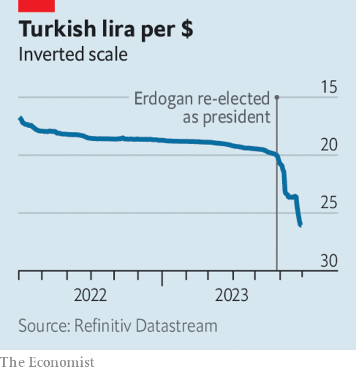

###### The world this week

# Business 

#####  

 

> Jun 29th 2023 

 


Under its new governor, Hafize Gaye Erkan,  took steps to loosen its support for the lira and to encourage savings and lending in the currency. This came soon after the bank made a break with its easy policy of the past few years by raising its benchmark interest rate from 8.5% to 15% (markets were expecting a bigger increase). It said it was beginning a “monetary tightening process in order to establish the disinflation course as soon as possible”. Official annual inflation stood at 39.6% in May, though unofficial measures are much higher. Ms Erkan was appointed governor by Recep Tayyip Erdogan after he was re-elected president in May. 

Britain signed a memorandum of understanding with the European Union on . The agreement establishes twice-yearly meetings through which the two sides will discuss co-operation on issues such as regulation, digital finance and financial crime. Jeremy Hunt, Britain’s chancellor of the exchequer, said he was “absolutely delighted” with the deal. An EU spokesman pointed out that the agreement does not restore Britain’s access to the EU.

It was a busy week for Mr Hunt, who persuaded British banks to give  who fall behind on their payments at least 12 months before repossessing their homes. Mortgage rates have surged in line with interest rates. Mr Hunt also told the banks to pass on higher interest to their customers by increasing. Enticing people to save could help lower inflation. 

The British government held emergency discussions on taking  into public ownership. The company, which provides water and sewage services to London and the surrounding region, has fallen heavily into debt.

 is to leave its global headquarters at London’s Canary Wharf and move to a more central location in the City, according to reports. The decision is a big blow to the Canary Wharf business district, which competes with the City as a base for financial companies. HSBC is searching for smaller premises because of the shift to remote working.

A car crash of a deal

Once hailed as a pioneer in electric pick-up trucks,  filed for bankruptcy protection. The startup, based in a former General Motors factory in Ohio, blamed Foxconn for its woes. Best known as the company that assembles the iPhone, Foxconn had a deal with Lordstown to help produce vehicles. Lordstown claims Foxconn reneged on the deal. Foxconn says it tried to resolve the dispute with Lordstown and accuses the company of making “malicious attacks”. 

, a global energy company based in Italy, agreed to buy , which has its headquarters in London, for $4.9bn. Eni’s acquisition hugely expands its business in producing natural gas. 

Official statistics showed that  in Germany were 6.8% lower in the first quarter than a year earlier, the biggest drop since the series began in 2000. Higher house-financing costs may be to blame. 

 lost a third of its stockmarket value after warning that quality problems with rotor blades and bearings on the wind turbines it supplies across the world were worse than it had thought and may cost €1bn ($1.1bn) to fix. The German company’s problems reflect wider difficulties for the wind-power industry, which is struggling with rising costs for materials and a shortage of components. 

Rupert Stadler, the former boss of Audi, was given a suspended prison sentence in Germany for his role in the Volkswagen , which came to light in 2015. Mr Stadler is the first former board member at VW to receive such a sentence. He has also been fined €1.1m ($1.2m).

With demand for covid-related products on the wane,  reported a lower quarterly profit and reduced its forecast for the year. The pharmacy company is closing a further 150 Walgreens stores in America and 300 Boots locations in Britain. The Boots that are shutting are within 5km (three miles) of another Boots shop; there will still be 1,900 branches left across Britain. 

Riding a wave

Amid a boom in travel and tourism,  reported that its bookings and customer deposits were hitting all-time highs. The cruise line increased its operating-profit forecast for the year. 

Larry Fink, the chief executive of BlackRock, who was in the vanguard of pushing  (environmental, social and corporate governance) investing, said he no longer uses the term because it has become politically “weaponised”. BlackRock has been lambasted from the left for still investing in fossil fuels and from the right for not investing enough in them. Mr Fink said his company’s commitment to invest in green and ethical products was unchanged. 

