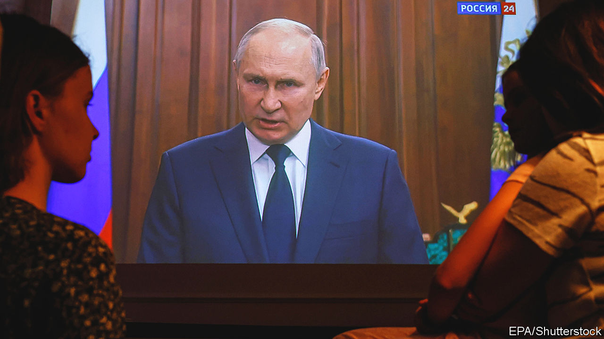
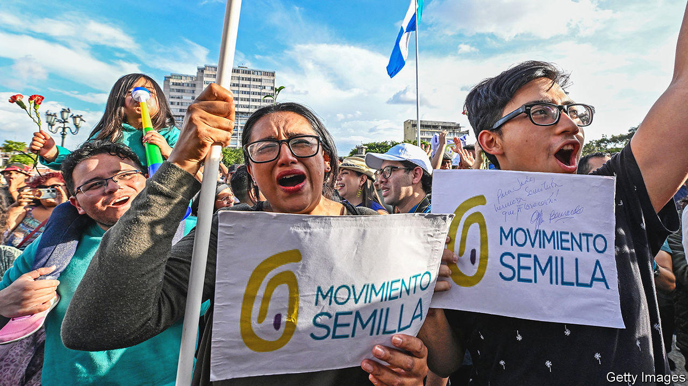

###### The world this week

# Politics 

#####  

 

> Jun 29th 2023 

 resurfaced to address Russians in a televised speech, after a mutiny by troops from the mercenary Wagner Group. Trying to reassert his authority following perhaps the most serious challenge to his two decades in power, the president said the organisers of the revolt had “betrayed their country” but repeated a promise that those who took part could either join the Russian army or move to Belarus. Yevgeny Prigozhin, Wagner’s leader, claimed that his rebellion, which had started to march on Moscow, was a protest at the military’s mishandling of the Ukraine war. The speed at which Wagner’s troops advanced in Russia has led to speculation about collusion with Russian generals and the potential for civil war. 

Mr Prigozhin went into exile in  under a deal brokered by the Belarusian dictator, Alexander Lukashenko. Latvia, Lithuania and Poland, which all border Belarus, warned that the regrouping of Wagner forces in that country posed a threat to their security. 

The failed rebellion by  raised questions about the future of its operations in , where it is thought to have some 5,000 mercenaries and extensive business interests. Press reports suggested that Russia’s government is trying to take direct control of Wagner’s foreign operations, including those in Syria. 

Volodymyr Zelensky, the president of Ukraine, said that  was making gains. In its regular assessment, Britain’s Ministry of Defence reported that Ukraine may have retaken some land in the Donbas region that Russia has occupied since 2014, but described this as a small advance. 

The presidents of Lithuania and Poland met Mr Zelensky to talk about Ukraine’s application to join . Lithuania is hosting a summit of the military alliance on July 11th and 12th that will discuss Ukraine’s bid for membership. 

Right turn

The second election in  in a month was won by the conservative New Democracy party, which now holds a rare majority in parliament. After winning the previous election in May the party called for a new ballot to give it a bigger mandate; it trounced the left-wing Syriza party by 23 percentage points. With the far right also making gains, the new parliament is the most right wing since democracy was restored in 1974. 

Rioting broke out in and other cities in France after police shot dead a teenager of north African descent who drove away from a traffic stop. Police unions criticised Emmanuel Macron, the president, after he described the shooting as “inexcusable”.

 Court of Appeals ruled that the government’s controversial policy of sending some asylum-seekers to Rwanda was unlawful, finding that Rwanda was not a safe third country. The issue may now go to the Supreme Court. 

America’s Office of the Director of National Intelligence published a declassified report on the origins of  in China. The long-awaited study offered no evidence that the virus escaped from a laboratory, but did conclude that both a laboratory-associated leak and a transfer from animals to humans at a live market remain plausible explanations. It also stated that no American intelligence agency thinks that covid was developed as a biological weapon.

The UN’s first independent investigator to visit America’s prison at  said that the remaining 30 men held there faced continuing cruel and degrading treatment. Some of the inmates have been detained without trial for more than 21 years. 

Meanwhile, the UN reported that 1,095 civilians have been killed in  since the withdrawal of America’s remaining troops in August 2021. Most of the deaths were caused by explosive devices. 

defence minister visited the  to discuss security and other regional matters. Australia and the Pacific island country have a long relationship. The visit came shortly before the Solomons’ prime minister was due to visit China, which has increased its investment in and co-operation with the islands. 

Sowing the seeds

 


In a surprise result, Bernardo Arévalo, the candidate of the anti-corruption Semilla (Seed) party, came second in the first round of  presidential election. He will face Sandra Torres, a conservative former first lady, in a run-off in August. Mr Arévalo’s showing has stirred hopes that Guatemala may reverse its recent drift towards authoritarianism. But 17% of voters spoiled their ballots to voice their discontent, more than voted for any single candidate.

New Ideas, the party of authoritarian president, Nayib Bukele, announced that he had registered to run in 2024 for a second five-year term, even though the constitution appears to prohibit re-election. Mr Bukele has an approval rating of over 80%.

 top electoral court began a trial of the former president, Jair Bolsonaro, on charges of spreading false information about the voting system. Mr Bolsonaro, who lost an election to Luis Inácio Lula da Silva last year, had claimed that Brazil’s electronic voting machines were vulnerable to fraud. If the court finds against Mr Bolsonaro it could bar him from holding political office.

Olivia Chow defeated more than 100 rivals to be elected mayor of . A former member of Parliament from the left-leaning New Democratic Party, she succeeds John Tory, a Conservative who resigned after admitting to an affair with a staffer. Ms Chow, an immigrant from Hong Kong, is the Canadian city’s first non-white mayor.

Electoral officials in  said that Julius Maada Bio, the incumbent, had won 56% of the vote in the presidential election. Observers questioned the result.

The UN was expected to vote to end a 13,000-strong peacekeeping mission in  after the Malian government ordered it to leave as soon as possible. The blue helmets have been helping to secure a country overrun by jihadists. 

At least 11 people were killed in Russian strikes on the rebel-held province of Idlib in . According to the Syrian Observatory for Human Rights it was the deadliest Russian attack this year. 

In  Ehud Barak, a former prime minister, and Yair Golan, a former left-wing member of the Knesset, are to be investigated by an official task force established by Itamar Ben-Gvir, Israel’s far-right national-security minister. Both men have been critical of the government’s plans to reform the judiciary.

The , the annual pilgrimage that every able Muslim must complete at least once during a lifetime, began in Saudi Arabia. This is the first time since the pandemic that it has operated at full capacity. More than 2.5m pilgrims are expected.

