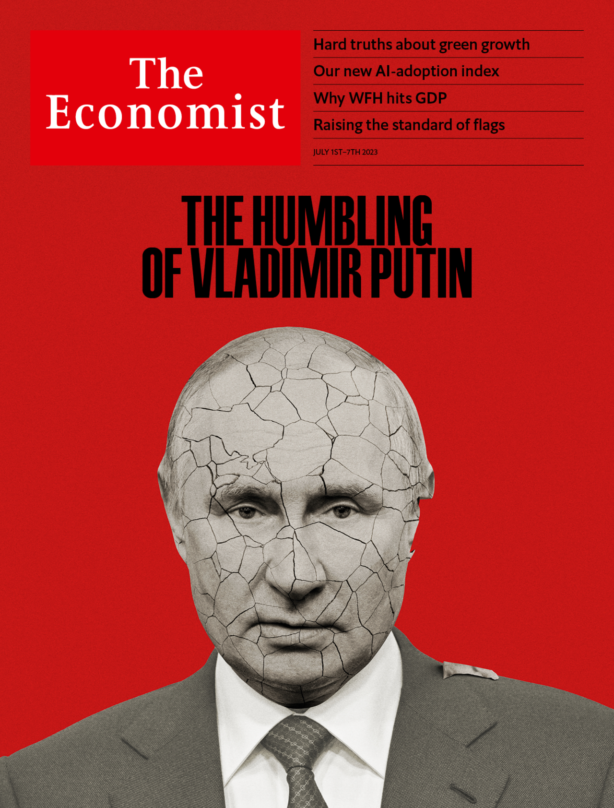
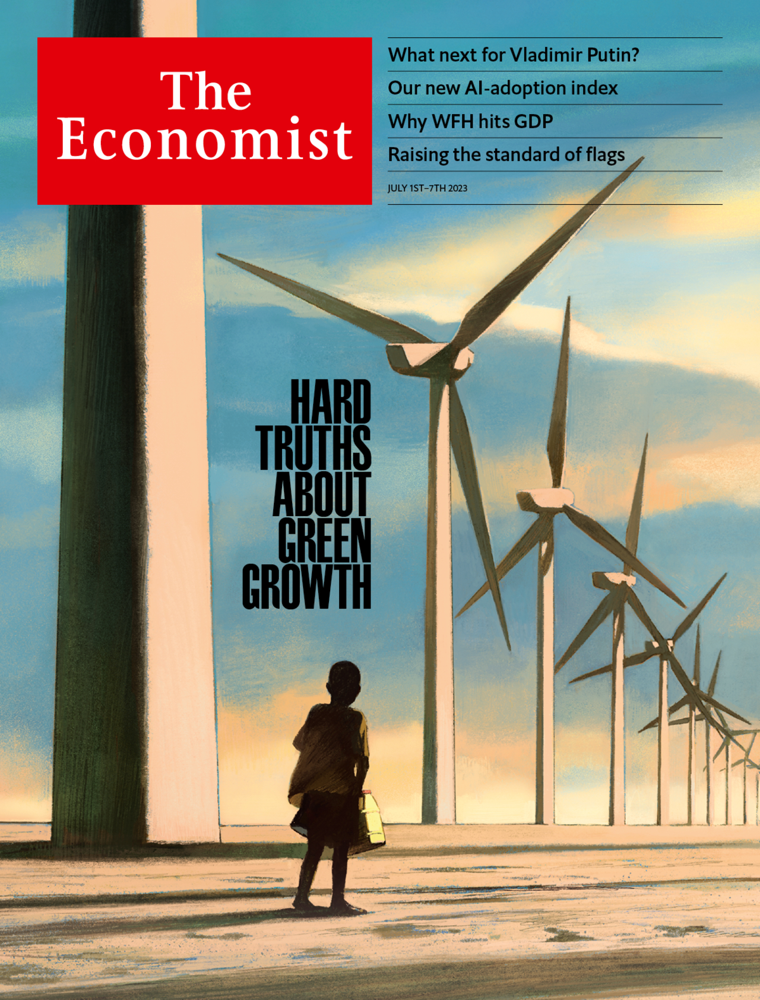

###### The Economist

# This week’s covers 

##### How we saw the world 

> Jun 29th 2023 

WE HAD TWO covers this week. In Europe and the Americas we offered our views of Vladimir Putin. The Wagner mutiny exposes the Russian leader’s growing weakness. He has shown that he cannot discharge a leader’s first and greatest responsibility, to ensure the security of the state. Optimists will take Mr Putin’s weakness as proof that his rule is doomed. If only that were so. The reality is that despots, even weak ones, can survive for a long time if no obvious alternative is available. 

 


: 

: 

: 


In Asia, the Middle East and Africa we considered the trade-off between climate change and development. In the developing world, more growth leads to more emissions. A fight for resources rages between those who favour development as practised in decades past as a way to help the world’s poor and those who want the world’s foreign-aid apparatus to turn wholeheartedly towards decarbonisation. It is a battle over what is worse: a poorer today or a hotter tomorrow.

 


: 

: 

: 

