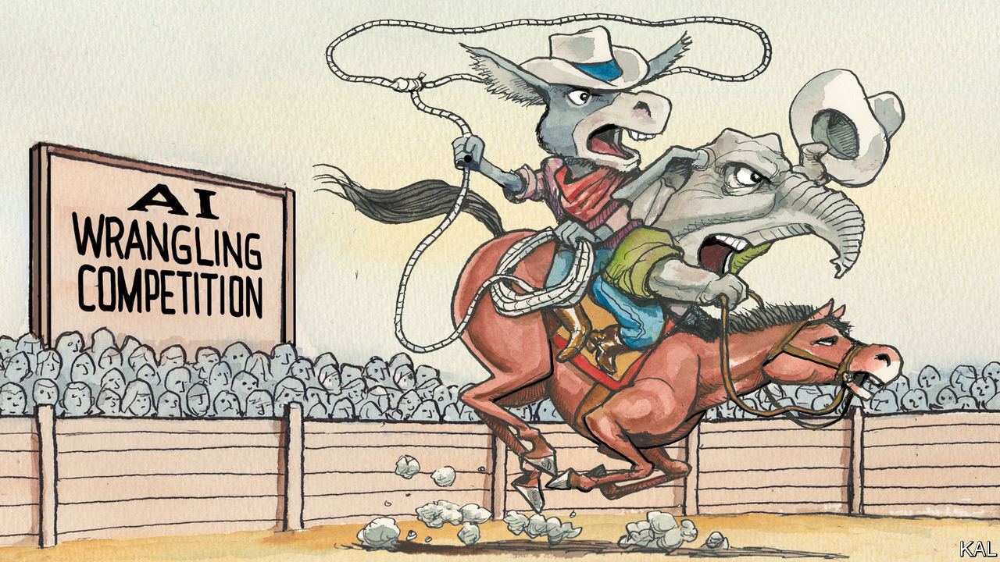

###### Lexington

# AI is making Washington smarter 

##### So far, lawmakers are taking cautious, bipartisan steps toward regulating it 

 

> Jun 29th 2023 

Among the startling, hopeful developments that have greeted the advent of generative artificial intelligence (ai) has been an outbreak of bipartisan focus, curiosity and deliberation in Washington, DC. Legislators and regulators are trying hard to come to grips with the protean technology. Chuck Schumer, the Senate majority leader, has been holding senators-only briefings with experts to educate his chamber. In late June he called for “a new and unique approach” to writing legislation about AI, saying it was “unlike anything Congress has dealt with before”.

“It’s not like labour or health care or defence where Congress has had a long history we can work off of,” he said. “In many ways, we’re starting from scratch.” He has set up a steering group of two Republicans and two Democrats, including himself, and plans this autumn to supplement the normal committee process, or posturing, with ”AI Insight Forums”, to include the industry’s leaders and its critics, to do “years of work in a matter of months”. 

It is understandable that wise guys are making fun of this. Given Congress’s reputation for speed and technological literacy (the Senate was in session for all of 14 days in June, and Mr Schumer uses a flip phone), the jokes write themselves, almost. ChatGPT’s first, unfunny stab reflected the cynicism any sentient being might feel: “Why did the AI refuse to testify before Congress? Because it didn’t want to be caught in a loop of lawmakers asking the same question over and over.”

Yet Americans should bask in this rare season, while it lasts, of good-faith searching and head-scratching. Not only are the regulators interrogating themselves about where and how they should regulate, the industry itself is asking to be regulated, up to a point. Even if it is all doomed to end in partisan impasse and recrimination, now is the time to ask: how could Washington get this right? 

One danger is that lawmakers could wind up bickering over a problem they can address only at the edges. Representatives of both parties regret not more aggressively regulating the internet in general and social media in particular. Being politicians, they are alert to how political actors are already using AI tools to generate political messages, including fabricated images. For their part journalists, being journalists, are obsessed with AI’s potential to create and spread lies. 

These are serious concerns. But because of America’s speech protections, congressional action would probably be less constructive than voluntary standards by campaigns, technical approaches by the private sector to authenticate images and scepticism from a jaded electorate. The more Congress focuses on the flow of information, the more it will be riven by fights over whether a particular chatbot is inclined to disparage one party or another. “If we get drawn into refighting the social-media wars, we risk not realising the promise of machine learning,” warns Kent Walker, the president of global affairs at Google and Alphabet. “Social media isn’t going to cure cancer, but AI has the potential to, and it would be a shame if that promise were politicised. It would be a shame to hold back progress in nuclear fusion because we can’t agree about Twitter.”

A better starting point would be to recognise that the government is already regulating AI. Years ago it set the nerve ends tingling of the federal bureaucracy, another complex, amorphous entity that somehow translates countless inputs into answers that cannot always be explained. Plenty of laws already cover the use of AI. And questions about AI’s use in providing health care, hiring people, driving cars or investing are being asked and answered, albeit too slowly for some industries. The National Institute of Standards and Technology, part of the Commerce Department, has drawn up voluntary standards by which AI might be governed. 

Chris Meserole of the Brookings Institution, a Washington-based think-tank, says Congress could exploit this “incredibly rare moment” of bipartisan seriousness by mandating that each regulatory agency develop a plan to adapt the NIST standards to its sector. It could also mandate disclosure about the use of AI in products, and require transparency into algorithms used in high-risk systems. “If an autonomous vehicle using AI has an accident, we need to understand what went wrong,” he says. 

To walk humbly with Chuck Schumer

Congress might also consider export controls for AI models and chips it deems too powerful. It could look at creating an agency to regulate big tech (disclosure: Lexington’s brother, Senator Michael Bennet of Colorado, has proposed legislation to do so) or whether some other means might bolster the agencies’ AI expertise. It could also help universities pay for the computing power they need to conduct AI research in the public interest. 

The good news is that these are the sorts of measures that Congress and the Biden administration are weighing. The most striking word in Mr Schumer’s recent speech was “humility”, as in, “We must exercise humility as we proceed.” Like many of his colleagues, Mr Schumer is not celebrated for this quality. Nor are the technology companies, but, in the face of AI, they are embracing it, too. Mr Walker notes that AI researchers have spoken of the “AI half-pipe of heaven and hell”, meaning it tends to be treated as either wonderful or terrible. “There’s very little market for, ‘Well, AI has a lot of important pros and cons, and we have to incrementally navigate’,” he says. “But that’s probably where the wisdom is.”

China has forbidden AI-generated images that impersonate people without their consent, and the European Union has proposed sweeping AI rules (which, like the EU’s data rules, may reverberate globally). But America’s reactive, incremental approach to making regulation up as its industries develop has kept it in the lead since the Industrial Revolution, and seems particularly suited to such a rapidly evolving, disruptive technology. Maybe AI and America’s lawmakers, in the end, can help each other grow up. ■


