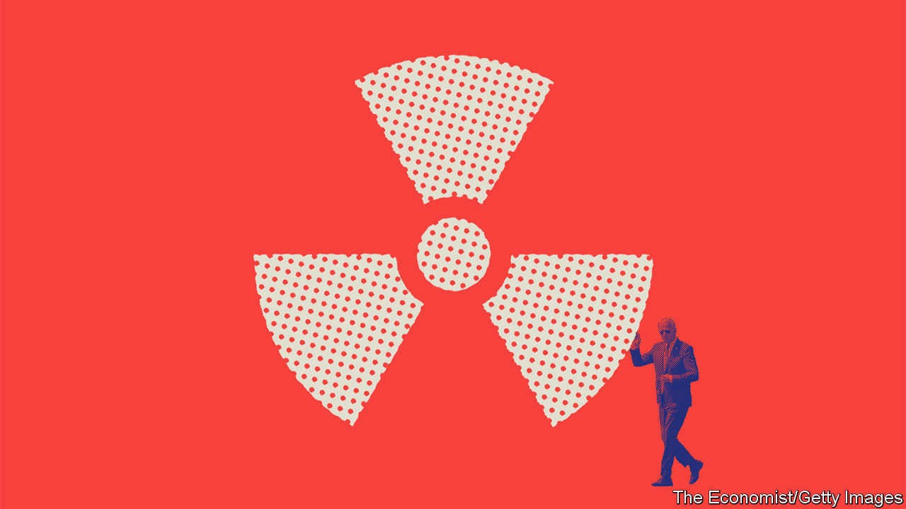
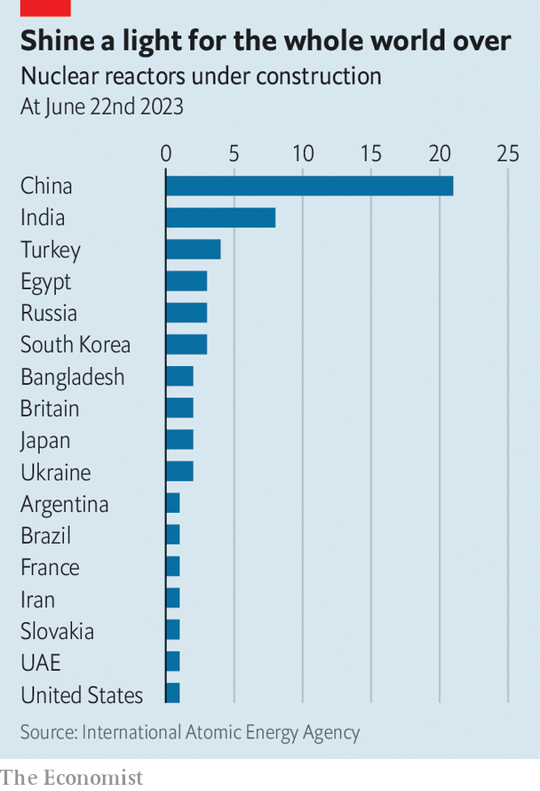

###### New nukes

# America aims for nuclear-power renaissance 

##### The Biden administration is pouring billions into the industry. The payoff isn’t certain 

 

> Jun 25th 2023 

AFTER THE second world war, America’s new Atomic Energy Commission was on the hunt for a remote site where engineers could work out how to turn the raw power contained in a nuclear bomb into electricity. They settled on the desert shrubland of south-eastern Idaho. Towns in the area fell over themselves to compete for the headquarters of the reactor test site, seeing it as a catalyst for growth. Idaho Falls, then a city of 19,000, launched what it called “the party plan”. Locals wooed officials at lunches, cocktail parties and on city tours. The guest lists included women who were “as winsome as possible” to make the town seem attractive to the (male) engineer in charge of choosing. 

The plan worked. Nearly 75 years later, Idaho Falls (population 67,000) remains home to the test site’s successor and the centre of nuclear-power research in America: the Idaho National Laboratory (INL). 

Now America’s nuclear-power industry is partying again. Nuclear is a carbon-free alternative to other sources of steady baseload power, such as coal and gas. Nuclear reactors are much smaller than wind or solar farms, which  and attract legal challenges from groups with other ideas on how the land should be used. The need to limit greenhouse-gas emissions has spurred liberals, historically wary of nuclear’s toxic-waste problem, to rethink their stance. In America 46% of Democrats favour using nuclear energy for electricity, the highest proportion in a decade. Republicans have  of it. 

But the biggest reason for celebration is the billions of dollars the Biden administration is pumping in through the Inflation Reduction Act (IRA), which made nuclear power eligible for the same tax credits as renewables like wind and solar; and the Infrastructure Investment and Jobs Act of 2021, which created a $6bn fund to help keep existing plants running. The administration is even offering developers a bonus tax break if they build reactors in fossil-fuel areas, such as a coal-mining town, to funnel workers into green jobs. 

Boosters predict an atomic renaissance after decades in the dark ages. Nuclear provides about 19% of America’s electricity generation, but at least 13 reactors have been shut down since 2013 alone. California had planned to shutter its last remaining nuclear plant, Diablo Canyon, which provides 9% of the state’s power. It is now using a $1.1bn grant from the infrastructure law to try to extend the plant’s life. West Virginia repealed a ban on new reactors. Bill Gates, who founded TerraPower, a nuclear startup, has expressed interest in building a plant there. The Nuclear Energy Institute (NEI), a lobby group, counts 12 states that passed laws in 2022 to help keep plants running, and attract new ones. 

The Department of Energy (DoE) is praying that the party turns into a fully fledged rager. A recent report from the DoE suggests that America could triple its nuclear-power generation, to 300 gigawatts, by 2050, the year by which the Biden administration has pledged to reach net-zero emissions. This push would be driven by the development of new advanced reactors that the DoE is helping to fund. 

But three massive difficulties could dampen the mood. The first is cost. Because their designs are so technical and take years to get approved, nuclear plants are extremely expensive to build. The DoE estimates that nuclear reactors need to cost about $3,600 per kilowatt to be built quickly around the country. But first-of-their-kind reactors are costing anywhere from $6,000 to $10,000 per kilowatt. And an era of elevated interest rates will only complicate matters. NuScale, a startup building a small modular reactor on INL’s campus, recently said that the cost of its project would surge by 75%, to $9.3bn, because of inflation and higher interest rates. 

The second question bedevilling some nuclear startups is where they are going to get fuel. Before the uranium from mines can be plugged into a reactor, it needs to be processed. , and is the world’s only commercial supplier of high-assay, low-enriched uranium (HALEU). Ever since Russia invaded Ukraine last year, American lawmakers and executives have felt queasy about buying Russian uranium. Republicans in Congress have introduced several bills to reduce imports. But TerraPower needs HALEU for the reactor it is planning to build in . In December the firm said the plant would be delayed by at least two years for lack of fuel. The DoE is scrambling to provide firms with an alternative, and plans to release a national uranium strategy this year. 

Add to that the dilemma over what to do about spent fuel. Nevadans remain wary that the federal government will force them to accept the country’s uranium waste at Yucca Mountain, where an underground repository was long planned. Instead Jennifer Granholm, the secretary of energy, said recently that the agency will spend $26m to search for communities willing to host the waste until the government can find a permanent solution. But even a temporary home could take up to 15 years to build. 

Third, officials are worried about finding enough workers to build and operate new nuclear plants. The DoE reckons that America will need an extra 375,000 workers to meet its 2050 target. “The very near term is going to require the skilled trades: electricians, metal workers, fabricators, construction,” says Kathryn Huff, the head of the DoE’s Office of Nuclear Energy. The need for reactor operators and nuclear engineers will come later. 

It is an exciting prospect for a president hellbent on reviving American manufacturing. “Jobs are coming back, pride is coming back…This is a blue-collar blueprint to rebuild America,” said Mr Biden in his latest state-of-the-union message. But in a tight labour market it is unclear where all those workers will come from. 

 


Ask officials and industry people, and the success of American nuclear energy is not just crucial for tackling climate change, but also for national security. America is competing with Russia and China to be the world’s supplier of advanced nuclear technology. Of the 40 reactors being built since 2015 that use Russian technology, 27 are outside Russia’s borders, according to NEI. China has more reactors under construction than any other country (see chart). America’s State Department has set up partnerships with more than a dozen countries to help them fund and develop nuclear-energy programmes and, eventually, small modular reactors.

The next decade is crucial: four small modular reactors are scheduled to come online by 2030. Cost overruns, permit delays and fuel shortages can easily halt construction. The fate of NuScale’s Idaho plant may be decided this year. The electricity wholesaler in Utah that is developing the reactor with the startup wants its customers, which are small towns in the region, lined up to buy 80% of the plant’s power by the end of the year. It is currently at 26%. If it can’t hit the target, says Mason Baker, the wholesaler’s chief executive, “we’re able to terminate the project”.

Nuclear energy has not spurred this much excitement since Idaho’s towns were competing for the reactor test site in 1949. But sceptics have heard industry leaders crow about a nuclear renaissance before. “We’re now on the fourth or fifth nuclear renaissance,” warns David Schlissel of the Institute for Energy Economics and Financial Analysis. There might yet be reason to celebrate, but the bubbly should probably be kept on ice.■


