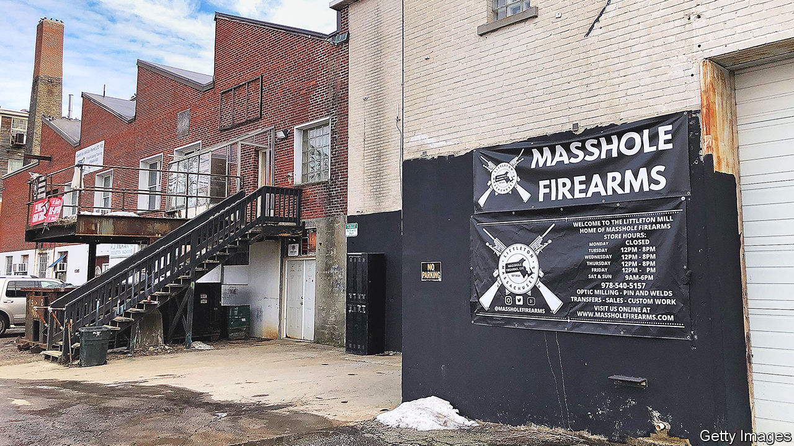

###### Beacon Mill

# Massachusetts is not the gun-control beacon it once was 

##### The state’s mass exporting of firearms has helped fuel the national crisis 

 

> Jun 29th 2023 

NEVER BEFORE had your correspondent been forcibly escorted out of a shop. But when sellers at the Littleton Mill, America’s largest cluster of federally licensed gun dealers, realised they had a reporter in their midst they swiftly kicked her out. Just 45 minutes’ drive north-west of Boston, the old textile mill has operated—in a county that Joe Biden won by a 45-point margin in 2020—for a decade. But tucked behind a fast road, with no signs visible from the street, most locals did not know it existed. That changed when the published an article on it in September. Five months later the Feds raided the place, following the arrest of a 28-year-old dealer for selling guns to a straw buyer that were traced to the scene of a South Boston shooting. 

To many the Mill seems out of place. Progressives laud Massachusetts for its  regime. A 1998 bill banned the sale and possession of new assault weapons and raised the penalties for gun crimes. To avoid steep fines dealers had to make their guns childproof, fit them with state-approved trigger locks and give customers safety warnings. The number of licensed dealers fell from 950 to 469 between 2000 and 2001. Today prospective gun-owners must jump through hoops to get licensed, including applying for a permit with the local police, who can deny requests at their discretion. (An elderly couple was reportedly refused one after saying that aliens had visited their home.) 

Massachusetts now boasts the third-lowest gun-ownership rate in the country, ahead of only Hawaii and New Jersey. Few guns means . In 2020, 3.7 in every 100,000 Bay Staters died by gunfire; nationally 13.6 did. 

That could change as the appetite for guns grows. Firearm sales in Massachusetts doubled to 140,000 in the decade to 2021; local dealers sold 30,000 more handguns in 2020 than in 2019. More people who used not to shoot have taken to it: Boston Pink Pistols, for example, now teaches LGBT folk to wield handguns for self-defence. The rise mirrors . After a dip in gun sales at the start of Donald Trump’s presidency, demand surged in the pandemic. 

New evidence suggests that Massachusetts’s gun-control rules are not being enforced. A  investigation of 112 police stations charged with inspecting gun dealers found that few had been doing their job. More than half had not inspected gun shops in their jurisdiction since 2017. Such inattention may be what allowed the Littleton Mill to grow from three to more than 80 dealers in just eight years.

The legal lines can be blurry. In one Littleton shop, glass cases hold shiny pistols behind a handwritten “PRE-BAN” sign. Though assault weapons were outlawed in 1998, those that were made before the ban can still be lawfully sold. But police have a hard time distinguishing between old and new models, says a former chief. In another room a dealer offers to take apart an AR-15 (the mass-shooter weapon of choice), sell it to a customer and give him instructions to remake it at home, which can be simpler than building an IKEA bookshelf. That could be enough to skirt the assault-weapons ban. 

This week a Massachusetts House Democrat introduced an omnibus gun-control bill that would require that gun parts be serialised, create a database for cops to track them and forbid carrying in schools and while drunk. (Gun lobbyists nicknamed it “The Lawful Citizens Imprisonment Act”. ) The state’s once-pioneering assault-weapons ban now looks deficient. 

And the state remains a haven for gunmakers. Since George Washington chose to store muskets and cannons for the Revolutionary War in Springfield, the region, nicknamed “gun valley”, has been a hub for producers. Firms brought revenue and jobs to the commonwealth; state tax breaks helped them expand. Researchers at Drew University estimate that between 2000 and 2020, 21m firearms, 16% of the country’s new stock, were made in Massachusetts. That is more than in any other state. A 2021 bill to outlaw the manufacture of assault weapons died in committee. ■


