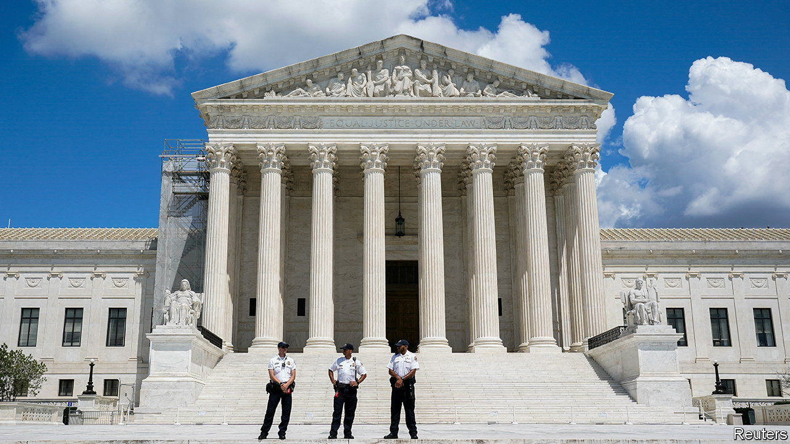

###### A victory for democracy

# The Supreme Court declines to upend American election law 

##### A fringe theory gets a chilly reception from the justices 

 

> Jun 27th 2023 

IN THE RUN-UP to the 2020 presidential election—and in its fraught denouement—supporters of Donald Trump turned to  to boost their candidate’s chances of staying in the White House. Citing the “independent state legislature” theory, they sought to block state-court rulings in Pennsylvania and elsewhere that made voting easier during the covid-19 pandemic by, for instance, extending deadlines for mail-in ballots. And after election day, legal advisers drew on the notion in cooking up a radical scheme to replace electors in states won by Joe Biden with “alternative” slates for Mr Trump.

On June 27th, in the Supreme Court threw cold water on the theory behind these moves: the idea that state legislatures have near-absolute authority, unchecked by state courts, to set the terms of federal elections. As part of an end-of-term rush for the court—several big cases remained to be decided by June 30th, including the fate of  in university admissions and Mr Biden’s student-debt-relief plan—John Roberts, the chief justice, wrote for the three liberal justices (Ketanji Brown Jackson, Elena Kagan and Sonia Sotomayor) and two of Mr Trump’s picks (Amy Coney Barrett and Brett Kavanaugh). Clarence Thomas wrote a dissent that was joined in part by Samuel Alito and in full by Neil Gorsuch.

 began in North Carolina. In 2021 the state’s Republican-dominated legislature drew an electoral map giving Republicans the upper hand in ten of the state’s 14 seats in the House of Representatives. Given the state’s near-even split between Republicans and Democrats, North Carolina’s Supreme Court found this aggressive gerrymander inconsistent with a guarantee in North Carolina’s constitution that all elections “shall be free”. It ordered experts to redraw the district lines. In 2022, using a fairer map, Republicans and Democrats won seven seats apiece. But Republican legislators balked, saying the federal constitution should have stopped the North Carolina Supreme Court from interfering.

The hook for their complaint appears in Article I of the constitution, which says that the “times, places and manner of holding elections” for Congress “shall be prescribed in each state by the legislature thereof”. North Carolina Republicans argued this means no state entity may constrain a state legislature performing the “federal function” of election regulation. 

Chief Justice Roberts roundly rejected this contention. “Since early in our nation’s history”, he wrote, “courts have recognised their duty to evaluate the constitutionality of legislative acts.” The federal constitution might empower state legislatures to make laws governing elections, but it “does not insulate state legislatures from the ordinary exercise of state judicial review”. Citing Supreme Court decisions stretching back more than a century, the chief justice explained how legislatures have never been autonomous actors when it comes to election law. “The reasoning we unanimously embraced” in a 1932 case, he wrote, “commands our continued respect.” State legislators “may not ‘create congressional districts independently of’ requirements imposed ‘by the state constitution with respect to the enactment of laws’.” 

Just eight years ago, the Supreme Court decided that Arizona’s voters were authorised to outsource the legislature’s redistricting tasks to an independent commission. That decision was 5-4, with Chief Justice Roberts writing a spirited dissent. But his vote in 2015 did not stop the chief from relying on the precedent to confirm that legislatures are “subject to constraints set forth in the state constitution”. 

In his dissent, Justice Thomas argued that the court lacked jurisdiction to consider because the North Carolina Supreme Court (after recently gaining a Republican majority) has reversed its ruling on the constitutionality of the warped map. The case is “indisputably moot”, he wrote. But the longest-serving and most conservative justice on the court also rejected the majority’s reasoning on the merits. The court “offers no clear rationale for its interpretation” of the salient constitutional clause. “I worry that today’s opinion”, Justice Thomas warned, “portends serious troubles ahead for the judiciary.”

Some observers on the left think Justice Thomas may have a point. In rejecting full autonomy for state legislatures, Chief Justice Roberts’s opinion also denies state courts complete deference from federal courts. Without laying out a standard, the majority holds that state judges may not “unconstitutionally intrude upon the role specifically reserved to state legislatures”. There are limits, in other words, to what state courts can do when policing state legislatures’ handiwork with elections—and federal courts will keep watch. From the right, Justice Thomas is concerned that the ensuing uncertainty will give federal judges little direction in “some of the most politically acrimonious and fast-moving cases”. From the left, Rick Hasen, an election-law expert at the University of California, Los Angeles, worries that it “sets up a Supreme Court power-grab down the line”. 

But these fears may be overstated. All three of the lawyers arguing against the independent state legislature theory last winter acknowledged that federal courts may need to step in to correct egregious errors in state-court decisions. And judging by the strong affirmation of the role of state courts in  the six-justice majority does not seem inclined to enter the fray idly. After taking a stand against racial discrimination in redistricting earlier this month, the Supreme Court has again stood up against a subversion of democracy. ■


