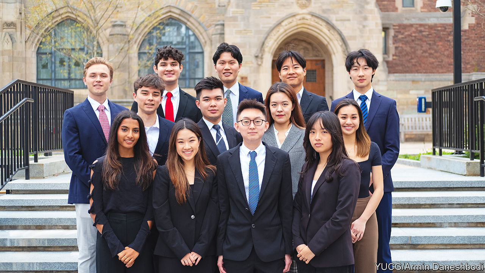

###### Gen C-Suite

# What the rise of student consulting clubs means 

##### Gen Z are apparently delighted to work for nothing 

 

> Jun 29th 2023 

THE EMAIL had a businesslike tone. From a “client recruitment director”, it was “reaching out” to offer  services. In the next sentence, the word “leverage” was used as a verb, relating to a “perspective”. It concluded with a question: “Would you be able to hop on a 15-minute call”? Yet it stood out from the guff that clutters journalists’ inboxes for one reason: it came not from an established firm but from an undergraduate economics student at Yale University. The perspective to be “leveraged” was that of “Gen Z”, a marketing term for people now aged from roughly 11 to 26. The offer was made on behalf of the Yale Undergraduate Consulting Group, a student club with around 60 members.

Postgraduate students have long provided paid services to corporate clients. But over the past decade or so, undergraduate “consulting clubs” have proliferated. The idea is to band together and offer to do work for firms for a fraction of the cost of hiring regular consultants, and in the process learn a lot about business. Like real consultants, they pitch for clients, cold-calling or emailing. Some student clubs have a charitable bent: 180DC, a network of clubs founded in 2007 that has spread to scores of universities around the world, targets “social-impact organisations”. Others are more mercantile: Milan Singh, the sender of the Yale email, says the group he belongs to has also worked with several large companies, doing jobs like market research for fees. 

Students quickly adopt the jargon of the industry they are aping, appointing themselves “project managers”, gathering information from “subject-matter experts” and, at the end, producing “deliverables” for clients: typically in the form of slide presentations. Work is carried out under legally enforceable non-disclosure agreements. All this is done alongside normal studies. 

It consumes plenty of time. Alexandra Koullick, a 21-year-old member of a 180DC-affiliated club in Berkeley that was founded in 2016, says she puts in up to ten hours a week of unpaid work for her clients. Practical skills, like managing spreadsheets, are passed down by “bigs”, as in “big brothers”, to new members.

Why devote a chunk of precious undergraduate years to this? The students defend it creditably. Ms Koullick joined as a way to make friends at a time when a normal university experience was impossible because of covid-19. “It was a big family of folk to spend time with,” she says. Mr Singh points out that the fees his group earns pay for great parties. Both extol the benefits of being able to experiment with different types of work before they commit to a career. 

There are potential financial rewards, too. Clubs provide a fast track to well-paid jobs later. John Paul Rollert, an academic at the Booth Business School at the University of Chicago, notes that uninhibited ambition in America’s youth is not new: “These kids are going to make a fortune,” he says.■


