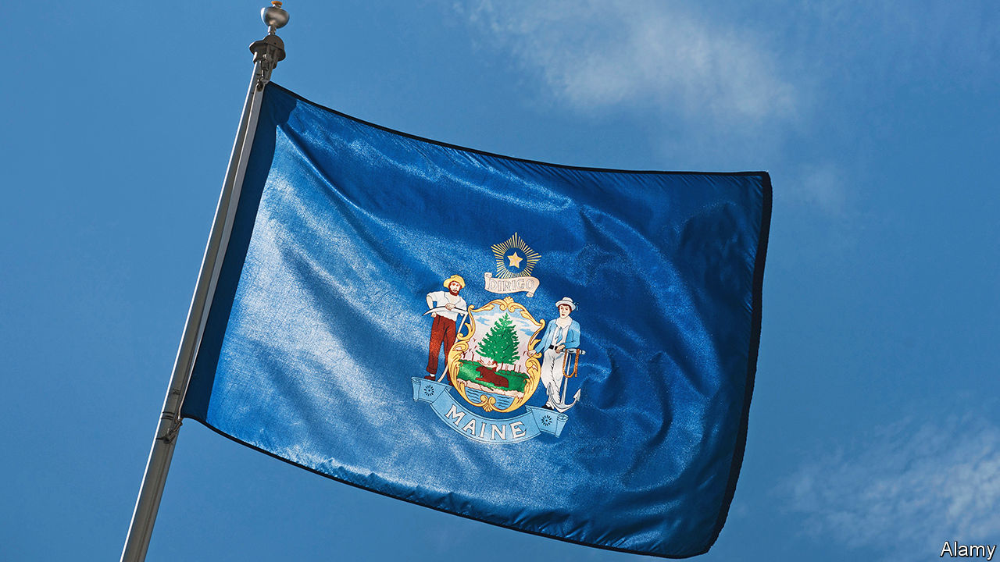

###### Bad banners

# Why many American states and cities are changing their flags 

##### Farewell fussy seals, hello simple pine trees and beehives 

 

> Jun 29th 2023 

THE LOBSTER is ubiquitous in Maine. Its image is on everything from licence plates to home decor. Now another emblem is growing in popularity: a green pine tree with a blue North Star, designed by Bethany Field and Chris Korzen, founders of Maine Flag Company and Original Maine. Their hand-stitched flags are inspired by the original 1901 official flag of Maine and also nod to the state’s maritime burgee. It can be found on sweatshirts, car bumpers, Adirondack-chair cushions and front porches. Its grassroots popularity has given momentum to a legislative proposal to switch from the current official state flag, which features the state seal, to a version of the simpler 1901 banner.

Other states are changing their flags. In March Utah swapped its busy seal for a big beehive, a symbol of industriousness. As simple and lovely as this is, it is not without controversy. Some say the flag, which also has Native American symbolism, is “woke” (despite being proposed by a conservative Republican) and want the old one back. Mississippi scrapped its flag in 2020, because of its Confederate imagery. Massachusetts and Minnesota want to redesign their banners, each based on a seal with troubling depictions of Native Americans.

Many municipal flags are terrible, too. “Why city flags may be the worst-designed thing you’ve never noticed”, a TED talk by Roman Mars, a podcaster, in 2015, shone a light on how awful many official flags are. Since his talk, which has had 7m views, the North American Vexillological Association has documented more than 300 cities redesigning flags. Mr Mars singled out the (still unchanged) flag of Milwaukee as the “kitchen sink”. Its images include a barley stalk for the brewing industry, a gear representing industry, a ship and, bizarrely, a wartime-service flag—a flag within a flag. 

Maine’s seal is also far too fussy. It depicts a pine tree, a star, a moose, a sailor and a farmer, plus the words “Maine’‘ and “” (“I lead” in Latin). Ted Kaye, author of “Good Flag, Bad Flag”, a design primer, calls state flags with seals “SOBS: seals on bed sheets”. Seals were meant to be read on documents, not fly on poles. More than 20 states use seals with blue backgrounds as flags. It is tricky to tell them apart. Some try to solve this problem by including the state’s name. “Imagine if the flag of France said ‘France’ on it,” despairs Mr Kaye.

A good flag creates a connection with the place it represents. Texas’s “Lone Star Flag” is a fine example, and is the best-selling state flag in the country. Earle Shettleworth, Maine’s state historian, points out that “state identity means a great deal to people. And it’s really a question of how are we going to project ourselves?”

“We didn’t set out to change the flag,” says Ms Field. When she and Mr Korzen started making their version, they asked: “Could we make this image be as recognisable as the word ‘Maine’?” Since Maine’s bicentennial in 2020, the star-and-pine-tree image is everywhere. The state Senate recently added an amendment to the bill requiring a referendum on whether to change the flag. Sean Paulus, the state lawmaker who proposed the bill, says it is “embracing what people have already shown that they want”. ■


