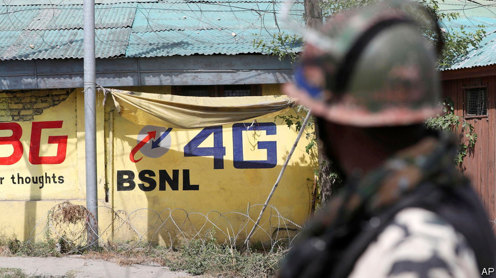

###### Blocked and reported!

# India, an aspiring digital superpower, keeps shutting down the internet 

##### Connectivity blackouts are damaging to millions of Indians reliant on digital services 

 

> Jul 5th 2023 

ON July 1st Elon Musk caused a stir by limiting the number of tweets visible to Twitter users in a single day. Perhaps he was inspired by the High Court of Karnataka, a big south-Indian state, which the day before had issued its own argument for restricting tweets. On June 30th the court ruled against Twitter in a case challenging the constitutionality of an Indian government demand, in 2022, to block content and several accounts critical of it. The court fined Twitter 5m rupees ($61,000) for failing to comply with that demand. 

Twitter is just one bit of the internet India’s leaders wish to subdue. For the past five years India has  in internet shutdowns, according to Access Now, a New York-based advocacy group. Last year the second-highest number of internet disruptions, 22, was recorded in Ukraine, many of them related to the war there. In India, there were 84.

The majority of India’s internet shutdowns are imposed in restive areas such as Jammu &amp; Kashmir, which accounted for more than half of last year’s stoppages. The small north-eastern state of Manipur, which has been  since early May, is entering its third straight month of internet blackout. The state government, run by the Bharatiya Janata Party (BJP), which also controls India’s central government, says the shutdown is necessary for “preventing any disturbances of peace and public order”—and hang the consequences for Manipuris. “Trying to halt misinformation by blacking out the entire information flow is a fool’s bargain,” warned the  newspaper.

State governments run by other parties also block internet access. It is a “non-partisan issue”, says Tanmay Singh of the Internet Freedom Foundation, a digital-rights organisation. India’s parliament is nonetheless concerned. A report by a parliamentary committee called shutdowns “without any empirical study to prove the effectiveness…a matter of great concern”.

Thwarting insurgency and stifling government critics are not the only reasons for the blackouts. According to a new report by Human Rights Watch (HRW), an NGO, almost a third of the disruptions it counted between 2020 and 2022 were intended to prevent cheating in school exams or entry tests for government jobs.

The effects of the shutdowns will be increasingly damaging. India is growing ever more dependent on the internet for everyday life. Its digital utilities, or “”, provide the foundation for payments, identification and access to government services. Tens of millions use online education services. Middle-class Indians rely on apps for taxis, groceries and food delivery, all of which come to a halt without internet access. Welfare provision, too, relies on online authentication. As a woman from Rajasthan told HRW: “When the internet is shut down, I have no work, do not get paid, cannot withdraw any money from my account, and cannot even get food rations.” The “digital India” touted by the bjp government is a fine idea. But not if tetchy politicians keep switching it off. ■

