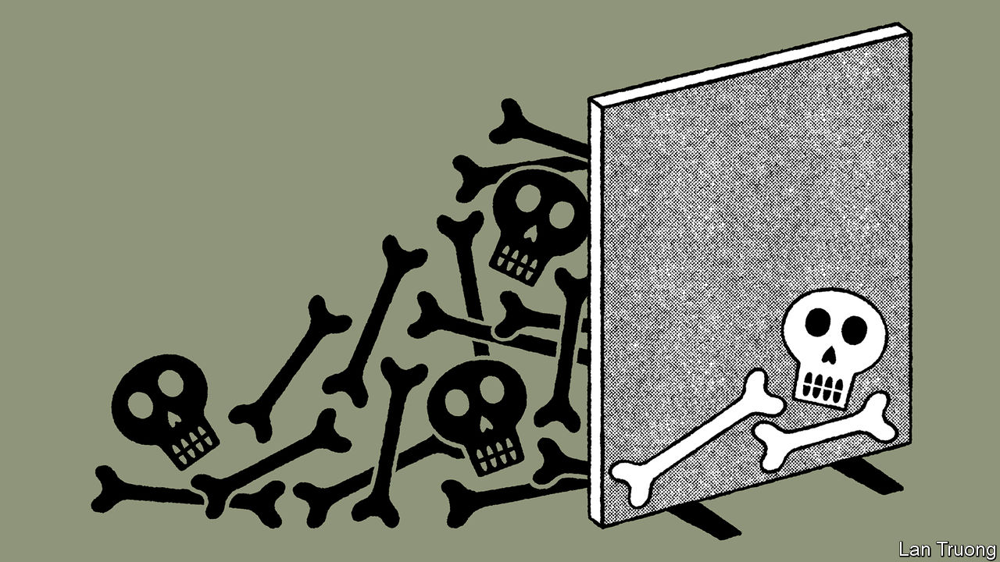

###### Banyan

# Sri Lanka is uncovering mass graves but not the grisly truth of its civil war 

##### History suggests the island-country’s latest effort to heal its terrible war wounds will fail 

 

> Jul 6th 2023 

AS DARK CLOUDS of economic crisis, political chaos and mass protest loomed over Sri Lanka a year ago, optimists saw one silver lining. So incompetent and corrupt was the soon-to-collapse government of President Gotabaya Rajapaksa, it had united the country in anger, crossing the ethnic divide that had blighted its post-independence history. But hopes that this might lead to a lasting rapprochement between the island’s Tamil, and largely Hindu, minority and its Sinhalese Buddhist majority have proved to be short-lived.

This is illustrated by the fragile state of the latest effort at communal bridge-building. In May Sri Lanka’s current government, run by Ranil Wickremesinghe, opted to form a South African-style “Truth and Reconciliation Commission” (TRC) to look at the history of Sri Lanka’s civil war. It started 40 years ago this month and ended in May 2009, with a slaughter of thousands of Tamil civilians on a bloody beach during the Sri Lankan army’s final victorious assault. The vexed and unimpressive efforts of other Asian countries to confront the darker chapters of their recent pasts suggested Sri Lanka’s would not go well. That looks increasingly likely.

Mr Wickremesinghe has said that legislation to establish the commission will be approved by parliament by August, though many details of the commission, including its proposed membership and terms, have not been made public. But Tamil leaders who have seen draft proposals say they do not include any plan to hold those guilty of crimes to account. That is predictable. The “South African model” of truth and reconciliation generally includes an amnesty for perpetrators—an attraction in countries such as Sri Lanka where many officials accused of crimes are still serving.

Yet the particular horrors of its civil war, and the terrible scars it has left on Sri Lanka’s divided society, cannot easily be glossed over. This was underlined last month in a report by local NGOs on efforts to deal with one of the war’s grimmest legacies: a large number of mass graves dotted around the country’s lush forests and paddy-fields. A small fraction—about 20—have been uncovered and hundreds of bodies dug up. The report documents so many failings in the way exhumations were conducted and potential criminal investigations handled that they look less like a process of unearthing the truth than an attempt to rebury it deeper than ever.

In a television interview last month, Mr Wickremesinghe insisted that his efforts to bring the war’s bitter truths to light will succeed where previous ones failed: “No one can say it is a cover-up because we will have foreign observers.” Yet many critics of his efforts already say they will refuse to engage with the TRC because they see it as just another way to sidestep long-standing demands for an international inquiry into the conduct of the war, and for punishment for war criminals. As Nada al-Nashif, the UN’s deputy high commissioner for human rights, put it at a session on Sri Lanka in Geneva last month: “Accountability remains the fundamental gap in attempts to deal with the past.”

The South African model is not the only option. An alternative is offered by Nepal, which is also grappling with the consequences of a civil war—in its case a ten-year Maoist insurgency that ended in 2006. The peace agreement that ended its conflict promised both “reconciliation” and “justice”. More than 60,000 complaints have been lodged with its TRC concerning alleged human-rights violations and breaches of international law, leading to a few prosecutions. A bill now in Nepal’s parliament would strengthen the TRC with a special court.

At the other extreme is Indonesia. For nearly 60 years it has stifled discussion of the national trauma that surrounded the birth of the 32-year Suharto dictatorship in 1966, during which hundreds of thousands were killed in massacres of suspected communists. Only in 2016 did a public debate on the violence begin. Now President Joko Widodo has announced a programme of reparations for victims of Suharto-era and later human-rights abuses (up to 2003), including the mass killings of 1965-66. 

Whatever materialises from that effort will be far too late for the victims and their families. And most of the perpetrators will be dead or otherwise beyond justice. It is the kind of outcome Sri Lanka’s government seems to aspire to. It should aim higher. As Ms al-Nashif put it: “As long as impunity prevails, Sri Lanka will achieve neither genuine reconciliation nor sustainable peace.”■


