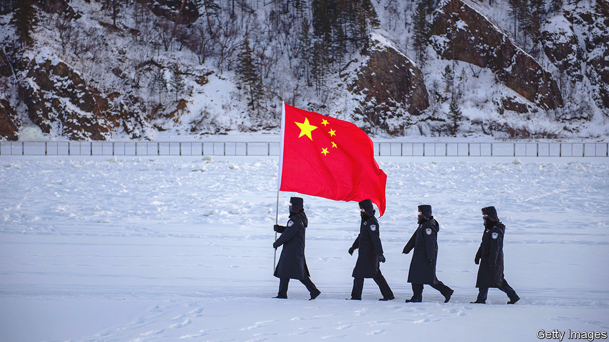
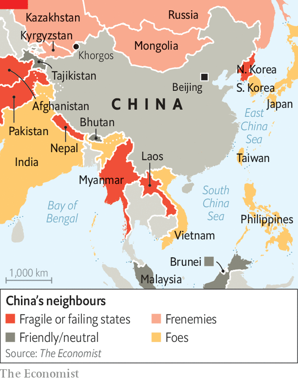
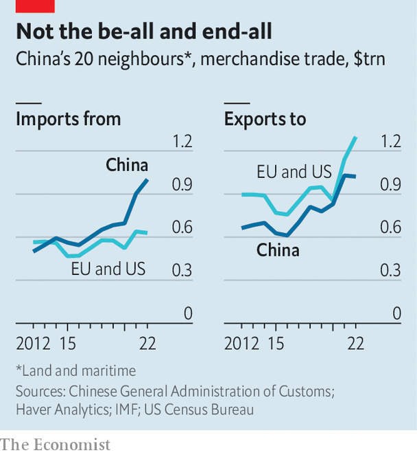
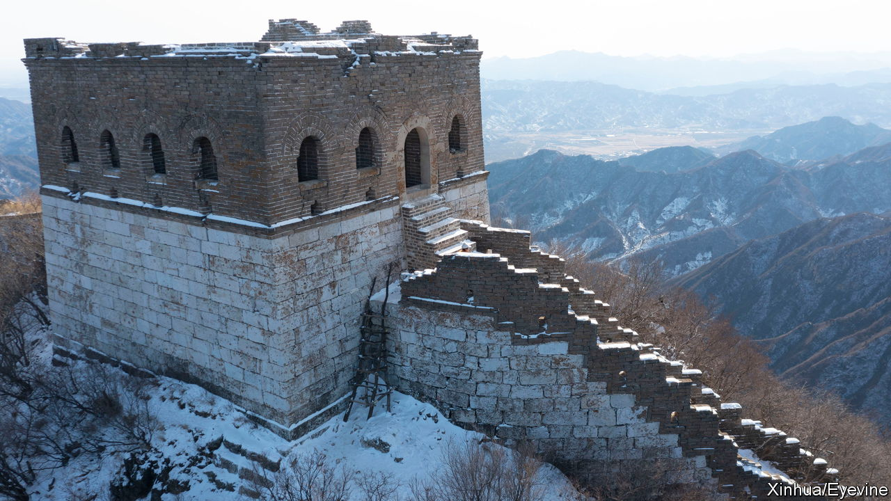

###### Neighbourhood botch

# Why China should be friendlier to its neighbours 

##### If it wants to challenge America’s global leadership, it will need their backing 

 

> Jul 4th 2023 

No country has more neighbours than China, with 14 land borders. And its neighbourhood is not just crowded, but also tumultuous. There is a rogue state, North Korea; war-torn ones, such as Myanmar; ones with which it has festering territorial disputes, such as India; others with which it has overlapping maritime claims, such as Japan; and one—Taiwan—which it is constantly threatening to invade. It is a difficult group to get along with under any circumstances, but China’s flawed diplomacy is making the task even harder.

For centuries Chinese leaders thought of the world as a series of concentric circles emanating from the Dragon Throne. The inner ones formed territory under the emperor’s direct rule. Then came neighbouring kingdoms such as Japan, Korea and Vietnam, which acknowledged the emperor’s ultimate authority by paying tribute. Outermost were foreigners whose trade with China was often seen as tribute, too. 

Xi Jinping, China’s present-day potentate, puts a 21st-century spin on this worldview. At home he has made himself the “core” of the Communist Party and crushed dissent, especially in border areas. Globally, he has made China a more assertive power. But his efforts to bind China’s neighbours more closely to it—“to warm people’s hearts and enhance our affinity, charisma and influence”, as he ordered officials in 2013—have not gone to plan.

Twitchy in Tokyo

Several neighbours are aligning themselves more closely with America, to counteract China’s growing assertiveness. Most of those friendliest to China are unstable. Others fear its intentions. In recent votes at the UN, half of China’s immediate neighbours broke ranks with it to condemn Russia’s invasion of Ukraine and only five backed a statement rejecting criticism of its policies in Xinjiang. That all speaks to a weakness in Chinese foreign policy that could undermine Mr Xi’s ambitions. Put simply, can China really challenge American leadership in the world if it cannot get its own neighbours on board? 

Powerful countries often try to enhance their own prosperity and security by dominating their region in economic, military, political and cultural terms. In the modern era France, Germany, Japan and Russia have all sought local hegemony by force, with devastating consequences. The European Union has expanded peacefully, but remains a marginal power on defence and security. Only America has managed to dominate its region for a long time. 

That is partly owing to geography, which has helped America to keep other big powers at bay. But it has also bound itself to its neighbours through mutually beneficial arrangements, including a free-trade deal with Mexico and Canada, close defence relations with both (especially Canada) and relatively open borders. American soft power helps, too. 

China’s neighbourhood is far trickier. It has 22,800km of land borders, more than any other country. In addition, all eight of its maritime borders are disputed. China’s neighbours include big economic and military powers, such as India and Russia, with their own regional ambitions.

 


China’s neighbours fall into three broad camps (see map): fragile or failing states (Afghanistan, Laos, Myanmar, Nepal, North Korea and Pakistan), frenemies that have close ties but fear Chinese domination (Mongolia, Russia and Central Asian states), and places with either defence treaties with America or military ties to it (India, Japan, the Philippines, South Korea, Taiwan and Vietnam). 

Chinese officials deny seeking regional hegemony. In their telling, China wants only to reclaim its rightful borders, not to expand them or dominate neighbours. They blame America for frustrating Chinese ambitions. “Western countries—led by the US—have implemented all-round containment, encirclement and suppression against us,” Mr Xi complained in a speech in March. 

America has indeed worked hard lately to improve ties with countries near China. Yet many of Mr Xi’s problems with his neighbours date back to a time when they felt either neglected by America (during the presidency of Barack Obama) or alarmed by it (during the presidency of Donald Trump). Reservations about China stem instead from its own missteps, according to officials and academics in neighbouring countries. In particular, they cite excessive muscularity on territorial issues, haphazard or coercive economic policies and a heavy-handed approach to diplomacy that is rooted in China’s imperial past and grand assumptions about its future. Most are unconvinced by China’s reassurances, especially given its support for Russia’s invasion of Ukraine and the implication that might is right.

For 30 years after its inconclusive war with Vietnam in 1979, China took a conciliatory approach to territorial disputes, opting for stability as it focused on economic reform. Between 1991 and 2002 it resolved disagreements about its land borders with Kazakhstan, Kyrgyzstan, Laos, Tajikistan and Vietnam. Perhaps most remarkably, in 2008, it signed the last of a series of agreements affirming Russia’s control over a Ukraine-sized region annexed from China in the 19th century. 

The tilt towards confrontation began before Mr Xi took power, but he has accentuated it, making territorial issues central to his pledge of “national rejuvenation”. China has, without doubt, succeeded in altering the territorial status quo to its advantage in the short term. Its ships and aircraft now regularly patrol around rocky specks where its claims overlap with Japan’s in the East China Sea. The seven fortified artificial islands that it built on disputed reefs in the South China Sea have enhanced its capacity to enforce its claims there. In some contested border areas, Indian troops no longer patrol.

Those gains have come at a cost, however, by alarming China’s neighbours. Japan adopted a new security strategy in December which pledged a doubling of defence spending by 2027 and a new counterstrike capability, moving away from the pacifist principles it has embraced since the second world war. Japan is also co-ordinating more closely on defence with America, including over Taiwan, and stepping up security co-operation with American allies and other Chinese neighbours.

Mr Xi’s approach to the South China Sea has also triggered a change of course in the Philippines, the only formal American ally among the five countries whose claims there overlap with China’s. Its previous president, Rodrigo Duterte, announced a “separation” from America in 2016, pledging to align with China’s “ideological flow”. But relations soured after China continued to harass Philippine ships and failed to build promised infrastructure.

Leery on Luzon

A new president, Ferdinand Marcos Jr, is now re-emphasising relations with America. In February he gave it access to four new military bases, including three in its north that could be useful in a war over Taiwan. In April the two sides held their biggest-ever joint military drills, involving 12,000 American troops. They are planning to resume joint naval patrols in the South China Sea. China, meanwhile, has warned the Philippines that it is falling “into the abyss of geopolitical strife”.

Vietnam also has claims in the South China Sea and had several maritime stand-offs with China there in the 2010s. It, too, has drawn closer to America militarily. In 2018 it let an American aircraft-carrier visit one of its ports for the first time in more than 40 years. Two more have visited since, including one in June this year. America has also supplied Vietnam with defence equipment, such as aircraft, drones and coastguard cutters.

India is another neighbour reassessing ties, after a series of clashes with China on their disputed Himalayan frontier over the past four years, one of which killed at least 20 Indian troops and four from China. That was among the deadliest such skirmishes since China won a brief border war in 1962. Bilateral trade has continued to grow (by 8.6% last year), but India has limited investment from China, banned dozens of Chinese apps and launched tax raids on several Chinese firms. 

India is also now working more closely with America and its allies on defence, bilaterally and as part of the Quad, which includes America, Australia and Japan. During a state visit to Washington in June, Narendra Modi, its prime minister, signed a series of deals on the defence industry which could eventually turn India into a base for the joint manufacturing of Western-designed weapons. 

China’s perturbed neighbours are also collaborating more closely with one another. India has trained Vietnamese submariners, supplied Vietnam with 12 high-speed patrol boats and agreed to give it a missile corvette. India also recently sold cruise missiles to the Philippines. Japan has provided patrol craft for Vietnam and radar for the Philippines, which has also received three navy ships from South Korea since 2020 and is getting several more. 

 


The economic picture is less clear-cut. China is an indispensable partner to all its neighbours, including those with conflicting territorial claims. Bilateral trade in goods with its 20 terrestrial and maritime neighbours was just over $2trn in 2022, an increase of 74% over the past decade. That is more than the combined trade of America and the EU with the same countries. In poorer ones, China is also a big source of investment. A trade deal called the Regional Comprehensive Economic Partnership, which came into force in 2022 and involves China and eight of its neighbours, will further boost cross-border commerce.

But in aggregate China’s neighbours sell more to America and the EU combined than they do to China (see chart). What is more, China has an unsettling habit of using its economic clout to punish neighbours that rile it. That, too, did not start with Mr Xi. An early example came in 2010, when China banned exports of rare-earth minerals to Japan after a clash in the East China Sea. Mr Xi, however, has expanded the practice. This week he imposed .

 


Mongolia was an early target for Mr Xi. After it hosted the Dalai Lama in 2016, China held up loans and customs clearances. Mongolia has since become even more dependent on trade with China, which buys about 84% of its goods exports (mostly coal). But Mongolia’s government hedges through a partnership with Nato, which is helping it build cyber-defences, train officers in English and operate in conjunction with Nato forces (Mongolian troops have served in Kosovo and Afghanistan).

The row over the Dalai Lama also reinforced anti-Chinese sentiment in a country where many resent the treatment of their ethnic kin in the Chinese region of Inner Mongolia. A ban on teaching the Mongolian language there is especially unpopular. A former Mongolian president, Tsakhiagiin Elbegdorj, has called it an “atrocity that seeks to dissolve and eliminate Mongolians as an independent ethnicity”.

Bruised in Busan

But it is South Korea that stands out as an example of ill-judged Chinese arm-twisting. After Park Geun-hye became president in 2013, she sought closer ties with China, even attending a military parade in Beijing. Yet in 2017 China instituted an economic boycott after America deployed an anti-missile battery in South Korea, intended chiefly to deter North Korea, but which China also saw as a threat. Until then a regular survey by South Korea’s Asan Institute that rates public views of other countries consistently gave China more than five out of ten. Last year it scored 2.7. 

South Korea is now strengthening its alliance with America, and setting aside long-running differences with Japan, its former colonial ruler. The two are also joining American-led efforts to reduce China’s role in their supply chains. That is creating new opportunities for others on China’s periphery. Hyundai, a South Korean carmaker, said in May that it would invest $2.5bn in India over the next decade. And Vietnam (where South Korea is already the biggest foreign investor) said in December that Samsung and LG, two South Korean electronics makers, would invest another $6bn between them.

For China’s poorer neighbours, investments in infrastructure help compensate for its domineering ways. Success stories include a cargo rail link across Central Asia that carries 8% of China-Europe trade, a railway from China to Laos, which began passenger services in April and could boost Laotian GDP by 21% according to the World Bank, and power projects that have increased blackout-prone Pakistan’s generation capacity by 8GW.

Yet such initiatives are often undermined by a tendency to over-promise and to ignore local sentiment. In Nepal, China has not completed any of its promised Belt and Road projects. Malaysia has ditched several of them, alleging that costs were inflated. Debt problems related to Belt and Road have pushed Pakistan and Laos to the brink of default. And a civil war in Myanmar has delayed several big Chinese projects and further sapped support for China, which backs the hated military junta. 

China has also failed to stop shady Chinese businesses and criminal gangs from piggybacking on Belt and Road. Laos, Myanmar and the Philippines have all seen a huge influx of Chinese money and workers into gambling ventures, leading to an uptick in crime. They and other poorer neighbours still crave development assistance. But as China confronts an economic slowdown and scales back Belt and Road, many are looking to Japan, whose aid comes with less baggage. 

A recent survey by Singapore’s iseas-Yusof Ishak Institute found little faith in China among its South-East Asian neighbours. More people expressed distrust than trust of it in Malaysia, Myanmar, Vietnam and the Philippines. Japan was more trusted in all six of China’s neighbours in the region and America more so in five. China also ranked below America, Australia and the EU as a place to visit or study. 

Even in Kazakhstan, which does well from its ties with China, people are wary. The tension is striking at Khorgos, a border crossing with a five-square-kilometre duty-free zone spanning the frontier. Rising mirage-like from the steppe, the Chinese side features two dozen multistorey malls selling everything from leather jackets to flat-screen televisions. It teems with Kazakh shoppers, closely watched by Chinese riot police with shields and batons. The Kazakh side, meanwhile, has only a couple of half-built low-rise malls, where customers are scarce and employees mostly Chinese.

Kanat Agibayev, a 22-year-old Kazakh law student, likes the cheap winter clothes and rucksack he just bought on China’s side. But ask about Chinese investment in Kazakhstan, or a recent deal for visa-free access, and he echoes the fears of other interviewees: “We’ll get swamped.” Russian propaganda fans such Sinophobia. But China has contributed, too, not least with its recent detention of up to a million Chinese Muslims, including ethnic Kazakhs, in re-education camps. In 2022 a survey by Central Asia Barometer found that only 35% of Kazakhs supported Chinese involvement in energy and infrastructure projects, down from almost half in 2018. 

Then there are the chest-beating declarations of China’s “wolf warrior” diplomats. In April alone China’s ambassador in Manila appeared to threaten Filipino workers in Taiwan and the one in Paris questioned the legitimacy of former Soviet states. A month later Mr Xi hosted five Central Asian leaders at a summit infused with imagery from the Tang Dynasty, when China ruled much of Central Asia.

“It looked like an emperor receiving tribal chieftains,” says Bekzat Maqsutuly, a Kazakh activist detained for planning a protest against a deal signed at the summit permitting visa-free travel between China and Kazakhstan. A Kazakh official dismisses his complaints as “irrational”. Only 3,412 Chinese nationals work in Kazakhstan, government figures show. The visa deal will benefit Kazakh lorry drivers and business people as much as Chinese visitors. Even so, the official adds, Kazakhstan’s future lies not in subordination to either Russia or China, but in close relations with lots of big powers, including America, Japan and the EU (Kazakhstan’s biggest trade partner and foreign investor), as well as Turkey, which jointly produces weapons in Kazakhstan and is a member of nato. 

None of this means that China’s neighbours are turning their backs on it. Given its economic heft, that is unthinkable. But it points to a future in which Mr Xi’s hegemonic ambitions are frustrated as the more stable and dynamic countries on his borders either resist his initiatives or hedge their bets, while the most volatile ones, with the dimmest prospects, become increasingly reliant on China’s support. The challenge for America and its allies is to offer China’s neighbours ever more ways to hedge. For Mr Xi, the question is more existential: can China accept relations with its neighbours in which it is anything less than pre-eminent? ■

