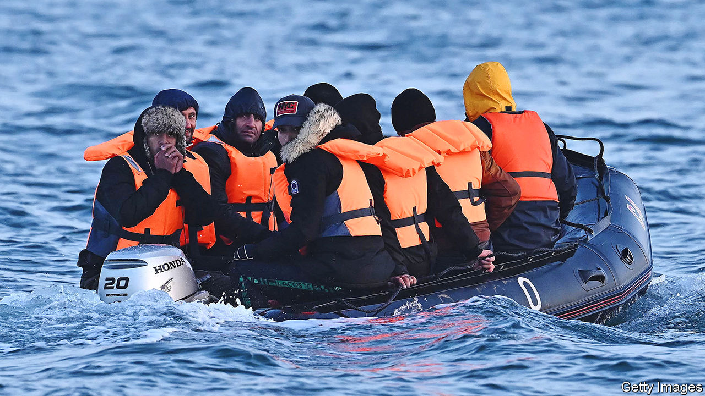

###### Not yet stopping the boats

# Britain’s tough asylum plans are held up in court and by the Lords 

##### Rishi Sunak will push on with efforts to “stop the boats” 

 

> Jul 4th 2023 

RISHI SUNAK’S ambition to “stop the boats” has hit rough water. On June 29th the Court of Appeals ruled that his government’s proposed solution to the problem of asylum-seekers crossing the English Channel —packing some off to Rwanda—was illegal. In the following week the House of Lords put fresh dents in his other plan, the legislation that would allow this to happen. The , which Parliament’s upper chamber is considering, would render inadmissible asylum claims by those who reach Britain in this way and allow the government to detain and deport them. 

Both plans are flawed, as their bumpy passages suggest. The Rwanda scheme was first blocked by the European Court of Human Rights in June 2022, before it was ruled lawful by the High Court. But were it eventually allowed to go ahead it would achieve little. The government in Kigali has said it could only take 200 asylum-seekers initially. Last year 46,000 people crossed the Channel in small boats—a bigger tally is expected this year. 

The Illegal Migration Bill, meanwhile, has so many defects it seems largely unworkable. Many of those who enter Britain in small boats are asylum-seekers who can legitimately expect to be recognised as refugees under the terms of the Refugee Convention, to which Britain is a signatory. Among those who arrived in small boats in 2022 nearly half hailed from just five countries: within that group, of those who have seen a decision made, well over four-fifths were granted asylum. It is unclear where the government would send such people. International law forbids returning asylum-seekers to countries deemed unsafe. Britain does not have a returns agreement with France. It has no other agreement with a third country that would be considered safe. 

Nor is it clear where Britain would hold detained migrants before they were deported. A lack of accommodation means hotels in towns and cities across the country are being used to house asylum-seekers as they wait to have their claims processed. The idea behind the bill is to deter others from crossing the Channel, thus keeping the numbers down. But no one knows whether it really would put anyone off.

On June 28th, prompted by concerns that the government might violate international law in its treatment of asylum-seekers, the Lords passed a cross-party amendment which would mean the bill could not “require that British officials, ministers or His Majesty’s judges breach precious international treaties”. Days later the Lords added new protections for some groups of asylum-seekers. These include stricter time limits for the detention of children and pregnant women. The bill will go back to the Commons, which could overturn some or all of the Lords’ amendments. 

The government’s small-boats policy is thus being slowed, not permanently blocked. The government might prevail on Rwanda. The court’s judgment was made on narrow grounds. Two of the three judges considered the scheme illegal because deficiencies in Rwanda’s asylum system could mean people would be sent to their (unsafe) home countries. The Lord Chief Justice, Lord Burnett of Maldon, disagreed. Yet all three agreed that Rwanda had given assurances in good faith. If the case goes to the Supreme Court, as seems likely, the scheme may get a green light. Even so, the policy may have become less popular with Conservative MPs after the Home Office noted it would cost around £169,000 ($215,000) to send a migrant to a safe third country: £63,000 more than processing them in Britain. If the Supreme Court rules in favour of the government this may nonetheless pave the way to find other safe countries to accept asylum-seekers.

A rule of thirds

The migration bill may yet become law. But it is not likely to change much. The Home Office would probably continue to process the claims of those who come from countries to which they cannot be returned. “The most likely outcome is an ever-growing perma-backlog of undecided asylum cases combined with increasing numbers of refugees disappearing from Home Office records because they have no incentive to stay in touch,” says Colin Yeo, an immigration barrister.

The government must hope that its plans will at least go down well with voters who want tough talk on asylum and migration. They constitute around a third of the electorate, says Sunder Katwala of British Future, a think-tank. About the same share of voters object to the government’s plans on principle, while the rest are somewhere in the pragmatic middle. In the short term the government might be content to blame the impasse on the courts and the Lords. “But by the time the election comes and the policy still hasn’t worked it will have upset all three groups of voters”, he says.■


