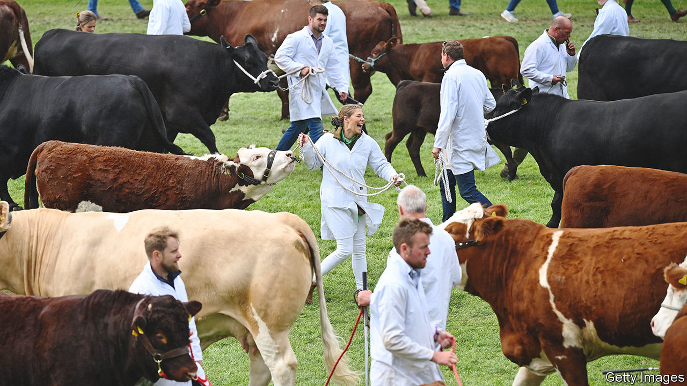

###### Rural shows in Britain

# Britons love country fairs. Why? 

##### Agricultural shows gain moomentum 

 

> Jun 23rd 2023 

ANGUS NEISH dared to hope that his fine-looking cattle, bred at Rodmead Farm in Wiltshire, would nab a prize at the Royal Bath and West Show last month. The annual fair, held near Shepton Mallet, in Somerset, is England’s oldest—and grandest. As well as a fiercely competitive livestock parade, it features Morris dancing, sheep-shearing and a vintage fairground. Its pony-chariot races are second to none. Many contestants on a recent afternoon had first given generous custom at the nearby cider tent. They performed vigorously before a large crowd. Thanks in part to sunny weather, 100,000 turned out for some of the three-day show.

Britons love a fair. No one is sure exactly how many shows there are across the country, but at least 400 days of such rural events happen annually. A parliamentary briefing in 2022 suggested roughly one in ten Britons attend them each year. It appears their popularity is rising.

In late June it was the turn of the Royal Highland Show, near Edinburgh, where 217,000 people—surpassing a record set in 2019—rolled up. Such visitors have a noticeable impact on the local economy. By one estimate the event last year boosted nearby businesses by almost £40m ($51m).

Why do people go? Nostalgia is evidently a draw. At Bath and West, as bunting flapped, visitors formed queues, bought cream teas and listened as a military band played wartime hits. Rural shows also have a purpose, even beyond sending visitors into cider or whisky tents. Many fairs were founded in the 18th or 19th century to spread knowledge of new farming technology among rural populations. Some of that mission lives on. For the likes of Mr Neish, the 600 trade stalls offered at least as much interest as any Morris dancing.

A secondary goal is to better educate those who venture in from towns and cities—urban folk make up a decent share of those who pack the grounds. Some consumers also come armed with formidable knowledge of food supply chains—as well as sometimes fussy personal preferences for organic, local, animal-friendly, vegan, fair-trade and environmentally sound products. Laura Williams, of the Royal Welsh Show, notes that visitors are “much more invested in farming and interested in where their food comes from” than in years past. 

A last purpose, naturally, is for farmers to excel against their rivals in friendly competition. In this respect Mr Neish enjoyed an udderly successful day. In a first for Bath and West, his cattle scooped all four of the top prizes on offer in their categories. Such victories do not bring immediate, large financial rewards, but should boost the reputation of his breeding programme. “It’s a great way for me to advertise,” he says, grinning. ■


