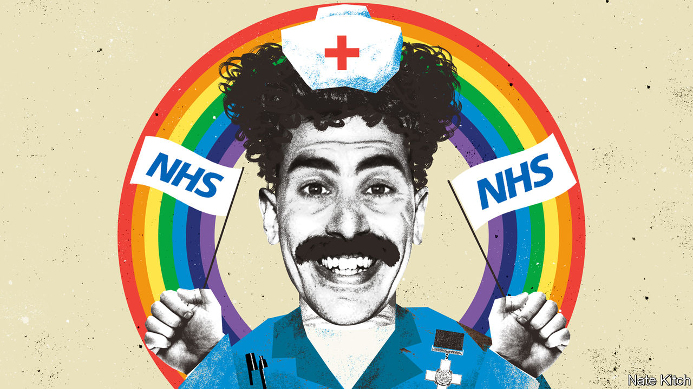

###### Bagehot

# Britons turn into Borat when it comes to health, housing and avocados 

##### Column For Make Benefit of Glorious NHS 

 

> Jul 6th 2023 

Even by the standards of Britain’s odd love affair with the  (nhs), the organisation’s 75th anniversary celebrations were weird. At a special service at Westminster Abbey on July 5th, the nhs’s George Cross award (Britain’s highest civilian accolade for gallantry, no less) was solemnly paraded. The prime minister and leader of the opposition gave readings. “The home of God is among mortals,” said Sir Keir Starmer, the Labour leader, quoting Revelations in homage to an organisation that removes kidney stones. The Dean of Westminster declared that “The nhs sets before us all the better angels of our nature.” 

It was a bizarre spectacle. The nhS is distinctly average. “It is neither leader nor laggard,” according to the King’s Fund, a health think-tank. It is relatively cheap and efficient but still bad at tackling diseases such as cancer;  continues to lag behind that in other rich countries. And yet on its birthday, politicians, royals and 1,500 nhs wallahs crowded into a church to praise it as a remarkable achievement. 

Making sense of Britain’s peculiar attitude to the nhs is, however, easy. Just watch “Borat: Cultural Learnings of America for Make Benefit Glorious Nation of Kazakhstan”. In the 2006 mockumentary, a reporter from a fictionalised Kazakhstan is sent to America. On his tour, the lovable bigot is blown away by everyday items. Upon entering his hotel room, he rolls on the bed in wonder, before laying eyes on a fantastic invention he is seeing for the first time: “Ohh la la! King in the castle. I have a chair, I have a chair!” A similar sensation overcomes Britons when it comes to their .

Britain has low expectations. Treating a bare necessity as wanton decadence is common. Bog-standard housing developments are described as “luxury”. A redbrick, four-bed house in Lichfield, a cathedral city in the Midlands, is by no definition luxurious. Yet it is marketed that way and costs £400,000. Britain does not build luxury homes, it builds expensive ones.

Part of this is blissful ignorance. Britons sometimes seem unaware of how poor the country’s housing stock is compared with elsewhere. Damp is treated as a fact of life. Double-glazing is still listed as a selling-point rather than a given on the same level as “four walls” and “roof”. Britons resemble Borat entering a lift in a hotel and immediately unpacking, thinking it is his room for the night. When the bellboy explains Borat’s error, the Kazakh is affronted: “I will not move to a smaller room.”

When Britain does look abroad, it often peers in the wrong direction. To gauge the nhs, Britons put it against a cartoonish version of the American system, which manages to be expensive and inequitable, rather than myriad alternatives on offer in Europe. Comparing one poor system with another helps no one and leaves the person doing it resembling Borat showing off a decrepit vcr. 

Borat-like wonder at the everyday has afflicted British politics, too. After the tenure of the haphazard Boris Johnson, Rishi Sunak is lauded for the basics, such as actually reading his papers. Brexit, meanwhile, has lowered the bar of statesmanship to a surreal degree. Mr Sunak displayed political nous when renegotiating a deal with the European Union over Northern Ireland. Yet even this was fundamentally about the right to trade within a single state. The result was the peculiar sight of the prime minister boasting about being able to send seed potatoes across the Irish Sea. It conjured the patriotic lyrics of the fictional Kazakh anthem: “Kazakhstan, home of Tinshein swimming pool/Filtration system a marvel to behold/It remove 80% of human solid waste.”


Minor pleasures are treated as big sins. An avocado, a fruit that costs about 75p ($0.95), is a byword for irresponsible consumerism, despite having a smaller carbon footprint than most meat. As Britain has become hotter—last summer peaked at 40°C—air-conditioning units have become more common. “Let’s not pretend this new trend is anything other than extravagance,” moaned a miserable op-ed in the , a newspaper, whining about both the expense and the emissions. And so comfort in a heatwave becomes decadence that would make Borat’s eyes bulge. 

Britain suffers from a form of “negative solidarity”, argued Mark Fisher, a leftie critic: if one person suffers, so must others. For instance, Britain’s state pension is not particularly high by European standards (although the fact all pensioners qualify for it is generous). But it still stokes resentment among youngsters. Likewise, oldies seem to care little that real wages have barely risen since 2008; by comparison, earnings in America and Europe have grown at a healthier clip. It is a worldview straight from Borat, who introduces his hated neighbour: “I get a window from a glass, he must get a window from a glass. I get a step, he must get a step. I get a clock radio, he cannot afford. Great success!”

Boratitude 

Low expectations can hamper a nation. It is difficult to reform a health service if its birthday is greeted with celebrations usually reserved for a Neapolitan saint. Thankfully, cracks in the delusion have emerged. Britons may love their health-care system to a preposterous degree, but they are unhappy with its current service (although not to the point where they would countenance charging people for using it). Younger Britons who suffer most from dismal housing are increasingly angry about it. Outlandish boasts from Conservative ministers are no longer swallowed by voters, who increasingly want rid of them. 

To truly rid itself of Boratitude, Britain must study all its peers more closely. British health care comes across as slightly Soviet if compared with, say, Denmark rather than America. Likewise, a glance at wages in America would hammer home just how lousy wage growth has been. A documentary could be made explaining these differences. “Cultural Learnings of America and Europe for Make Benefit Glorious Nation of Britain” has a certain ring. ■


