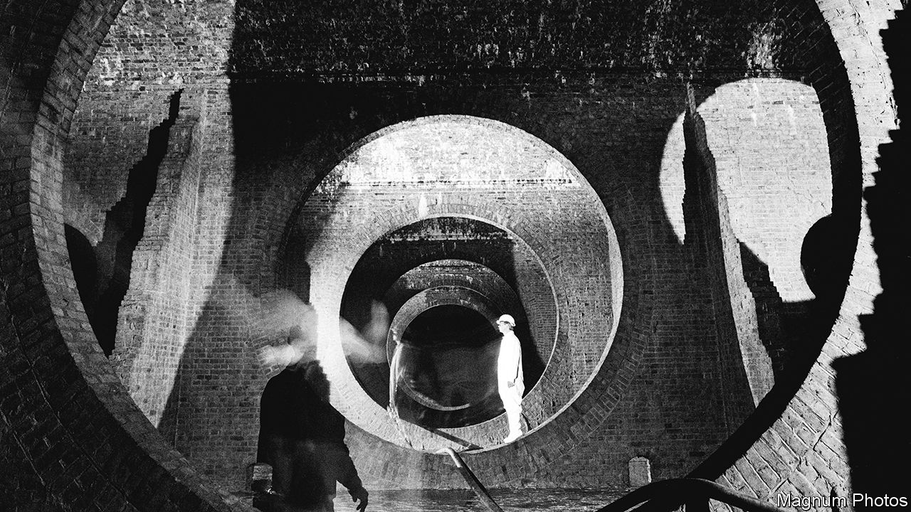

###### Privatisation in Britain

# How to understand the woeful state of Britain’s water utilities 

#####  

 

> Jul 6th 2023 

THE ANNUAL Henley Regatta, a rowing competition, is a fine example of genteel Englishness. Spectators in blazers and boat-club ties sip on Pimms as they watch rowers race on a stretch of the River Thames. Before this year’s event, which began on July 2nd, there was an unwelcome guest: a conservation charity reported high levels of E-coli and other bacterial markers of human faeces in the river. This was the result, it said, of sewage pollution. 

The news was one more blow to embattled Thames Water, which has enjoyed a local monopoly over providing water and managing sewage in the river’s drainage basin since the utility was privatised in 1989. That dominant market position has not stopped Thames from being plunged into turmoil and facing questions over its solvency. Its troubles came to public attention when the chief executive, Sarah Bently, unexpectedly resigned on June 27th, two years into an eight-year turnaround plan. The company’s shareholders, mostly pension funds, have ponied up only £500m of the £1.5bn that the company seeks to change its fortunes. A spell of temporary nationalisation may be needed.

The proximate cause is inflation. Thames Water has vast debts, partly the legacy of a leveraged buy-out backed by Macquarie, a bank, in 2006. It has since been sold to new owners, mostly those pension funds. Much of the interest on this £14bn debt is linked to the retail price index (RPI), a measure of inflation. The water regulator Ofwat, however, only lets water companies raise bills based on the consumer price index adjusted for housing costs (CPIH). As a result there is a persistent “wedge” between the two measures, with the RPI almost always higher than CPIH. The inflationary shock has driven this gap to historic highs. An estimate from Thames’s parent group suggests that a one percentage point increase in inflation would cut company profits by £911m; in 2022 it made an operating profit of £322m.

Thames Water is just the most vulnerable of ten big private water companies in England and Wales. (The state provides water in Northern Ireland and Scotland.) According to Ofwat, Thames has debt equal to 80.6% of its regulated capital value, its measure of the company’s worth, compared with an industry-wide average of 68.5%. Only three companies including Wales’s Dwr Cymru, a not-for-profit, have debt below the 60% level that Ofwat recommends as the upper limit. On June 29th Yorkshire Water, another highly indebted company, said it had raised £500m from shareholders. 

The crisis is the worst faced by the large water companies since privatisation began. At launch, the companies had no debt—government wrote off £13bn (in today’s money) that the Regional Water Authorities had owed the Treasury in 1989. Now the debt pile is over £60bn, slightly less than the £65.9bn the owners have taken in dividends since privatisation. The companies, too, potentially face a vast bill for cleaning up rivers, beaches and other bathing places: raw sewage is repeatedly dumped into them during storms. This week Thames Water was fined £3.3m for polluting two rivers in 2017.

Understandably the prospect of swimming (or rowing) in sewage while shareholders and chief executives enjoy handsome rewards provokes widespread public anger. Left-wing activists and politicians have called for renationalisation (even a majority of Conservative voters say they like the idea) and pointed out that returns to investors since privatisation have largely come from loading up the company’s balance-sheets with debt rather than from efficiency gains. Meanwhile the companies since the 1990s have failed to cut leaks by much. 

The regulator deserves much of the ire. Without the competitive pressure of a market, it must prevent monopolies from gouging consumers. Water companies present business plans to Ofwat every five years for an estimated amount of expenditure needed to improve the system. The regulator often negotiates them down to set the spending allowance and then, based on how it thinks the company should fund itself, sets limits on the cost of capital. From this arcane procedure the regulator produces price controls. Keeping spending down, and therefore investment, has meant smaller bills. 

Ofwat is now fretting about financial stability and is likely to set stricter requirements for debt-financing in its next funding round. Shareholders extracting dividends through unsustainable borrowing is bad news for the bondholders, but not necessarily for Britons as a whole. Bondholders may suffer: any water company that fails should face normal bankruptcy procedure, which means wiping out equity holders and awarding the operating company’s bondholders with whatever the firm is worth when it passes into new hands. Those lenders, too, should bear any costs of keeping the water flowing. Reducing the value of debt held by bondholders would make it easier to attract new capital.

Finding a longer-term fix for the water system is more daunting. As Margaret Thatcher said in 1988, in a debate on water privatisation, “if we want environmental improvement, it will cost money.” Britons, few of whom consider the costs of supplying and taking away water, may decide improvements are not worth it: analysis by the Storm Overflow Discharges Taskforce, a group of conservationists, consumers, the agriculture department, the Environment Agency and water industry bodies, concluded in 2021 that investment to prevent sewage discharges was not worth the tens of billions of pounds it would cost. 

Paying for it, one way or another

Investment to keep the water flowing, however, is needed. Climate change and population growth are putting pressure on the water supply. Britain has not built a new reservoir since the early 1990s and relies on temporary measures, such as hosepipe bans, to limit demand. Too much water is still lost to leaky pipes and Britons use more water than their peers, such as the Dutch. That is partly because only 60% have water meters to monitor usage. 

That means bills will have to rise. The National Infrastructure Commission, an advisory body, estimates that an extra £20bn will be needed between now and 2050 to keep water flowing; preventing sewage discharge would come with an even higher cost. Nationalisation would just transfer this obligation to the state. Private investors, meanwhile, will demand a return to stump up the funding. Equity finance generally comes with a higher cost than debt. Expect ongoing arguments and protests over water to prove far less genteel than the Henley Regatta.■


