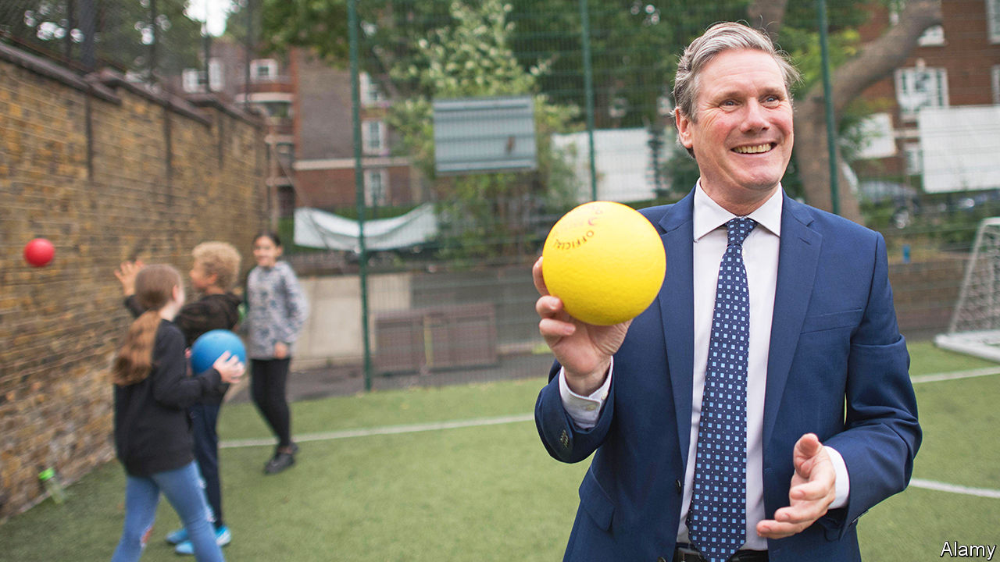

###### Class struggle

# Labour’s cabinet would be Britain’s most state-educated since 1945 

##### But its schools policy appears less radical than the class rhetoric suggests 

 

> Jul 6th 2023 

IF THE labour party wins the next election, its government will be notable in one respect. Our review of the shadow cabinet’s biographies suggests that four people, or 13%, of its 31 members attended independent schools. Barring a big reshuffle, that would make it the cabinet with the most state-educated members since at least 1945. Rishi Sunak’s first cabinet in October 2022 was 61% privately educated, based on a tally by the Sutton Trust, an educational charity. Sir Tony Blair’s first cabinet was 32%, while Harold Wilson’s was 35% and Clement Attlee’s 25%. Under 7% of pupils are taught privately. 

Labour is proud of its status. Sir Keir Starmer’s team often tell of how inspiring teachers got them from tough schools to ancient universities. Rachel Reeves, the shadow chancellor and a former junior chess champion, talks of the snobbery she met while at Cator Park, a threadbare girl’s comprehensive in London. In his autobiography, Wes Streeting, the shadow health secretary, recounts that his school—Westminster City—was dubbed “shitty city”, in which “bullies had free rein to level unprovoked abuse, wallops and kicks.” They would bring a hard-nosed purpose to government.

In a speech on education on July 6th, Sir Keir invoked the meritocratic spirit of the 1970s, and vowed to break the “class ceiling”. His government will aim to decouple the link between the (eventual) earnings of children and their parents. He cited his own well-worn biography, of rising from the grammar-school-educated son of a toolmaker to becoming England’s chief prosecutor. “I don’t think I’m being too sentimental to say I grew up surrounded by hope. We took it for granted,” he said.

Private education has become a handy foe. Whereas Sir Tony (educated at Fettes, Scotland’s poshest school) made the sector work harder for tax breaks, Sir Keir will abolish them. Whether the policy would raise the £1.7bn Labour claims is hotly contested, as no one knows if enrolments would fall. Bridget Phillipson, the shadow education secretary, argues the sector has already priced itself out of reach of the middle classes. Born to a poor Gateshead mother and educated at Oxford, she got hold of messages between private-school lobbyists, in which they dubbed her “very chippy”. 

Yet elsewhere Labour’s policy is shaping up to be less radical than the rhetoric. It has no plans to rethink how schools are structured—a big reform of the Blair era. It will review the curriculum, but won’t touch maths and literacy where Tory reforms seem to be paying off. Rather Labour plans to offer more of the trimmings in which independent schools excel: arts provision, better IT lessons, and the practice of “oracy”—a trendy neologism for articulate speech. That is the pet cause of Peter Hyman, an adviser to Sir Tony and then Sir Keir, who also ran an east London school. “Confident speaking gives you a steely core, and an inner belief to make your case in any environment,” said Sir Keir. Nick Gibb, the long-serving schools minister, questioned whether Labour was retreating from his emphasis on hard subject knowledge towards a woollier focus on skills and creativity. 

Labour senses the Tories are ceding education as an electoral issue. Mr Sunak wants to expand maths provision, but many of his MPs discuss schools only in the context of battling wokery. The rhetoric masks a more fundamental choice. In the New Labour era, spending on schools grew on average by 5% in real terms per year. Tight budgets since means that per-pupil spending in 2024 is forecast to be no higher than it was in 2010. Thus the gap between state and private has widened dramatically: spending per pupil in private schools is now almost double that of state schools, up from just 40% more in 2010. Ms Reeves is promising little extra cash now. How far she would favour schools over other demands will be the true test of Labour ambition.■


