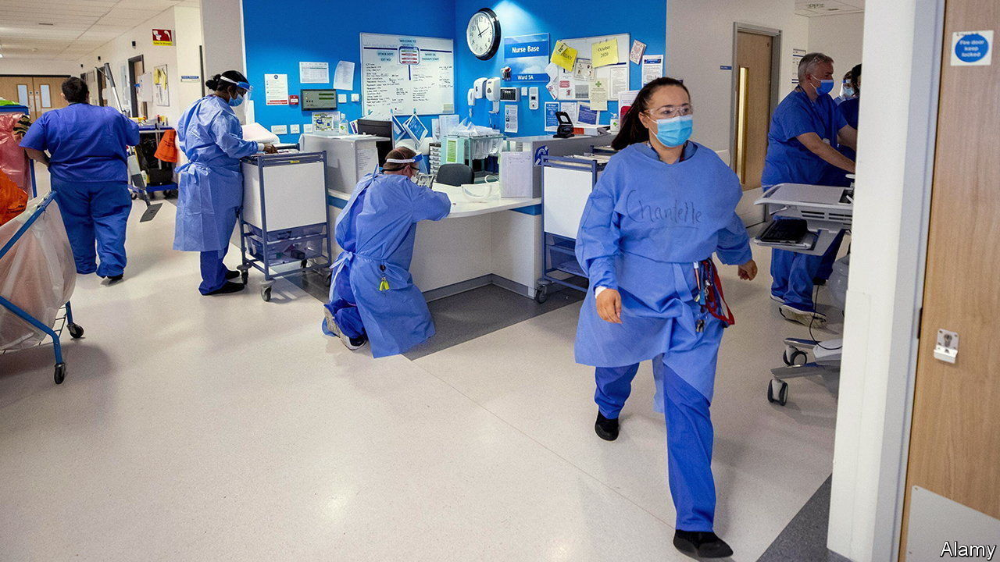
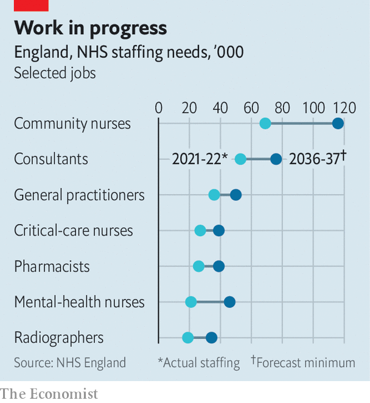

###### Britain’s national health service

# The NHS in England gets a plan for fixing its broken workforce 

##### Yet bigger changes are needed for Europe’s biggest employer 

 

> Jun 30th 2023 

WHEN THE National Health Service in England opened its doors on July 5th 1948 it did so without enough dentists, nurses or midwives to attend to half a million waiting patients. To the frustration of many, the mismatch of supply and demand has persisted, and grown, ever since. In its 75 years, the service never had a long-term workforce plan—an effort to line up and train the right number of doctors, nurses and others needed as the service changes. At last, the government has announced one. Rishi Sunak called its launch, on June 30th, “one of the most significant things” he would do as prime minister. That might turn out to be true. Given the biggest s in the NHS’s history, however, it will also not be enough.

Tackling staff shortages will not be easy. Politicians preoccupied by five-year electoral cycles usually have no incentive to think of what is required over the course of decades. Workforce planning has, therefore, routinely focused on the near term. The Department of Health and Social Care sets priorities, but the Treasury decides whether—and how generously—to provide funds. That the exchequer is today run by Jeremy Hunt, a former health secretary, has surely helped to get a long-term plan delivered, after years of promises.

The new plan contains some bold-sounding targets. Although not legally binding, the government is committed (and, as pertinent, its successor will be) to doubling the number of places for students who study medicine, by 2032. It also wants to almost double training places for nurses. It talks, rightly, of the need to do better at retaining existing staff and calls for  of the ways staff train and work. None of that will be straightforward in a health service which, behind a shared blue-and-white logo, consists of a sprawling colony of public and private providers. Still, the effort is long overdue for Europe’s biggest employer and its 1.4m employees. 

The service looks to be near breaking point. The NHS lacks 112,000 staff—so those who are working report being hugely overstrained. Many are leaving or preparing to do so. Rates of staff sickness are at historic highs. The service is enduring more strikes than ever: consultants, junior doctors and radiographers plan to walk out in July alone. That staff are overstretched (plus the lingering effects of covid-19) helps to explain why waiting lists for treatment are also the longest ever: patients are lining up for 7.4m procedures.

The additional funding is likely to be locked in whoever wins the next election, because the Labour Party has made similar promises. But in one way the plan bodes ill for the coming years. It projects the staff shortfall will worsen in the next decade or so and, by 2036-37, the NHS will be short of between 260,000 and 360,000 workers. As the country’s population grows and ages, and it becomes fatter and sicker, demands on the NHS are also guaranteed to rise. 

What can be done? The service increasingly relies on agency workers (or locums), and outsourced staff, but that’s painfully expensive. In 2021-22 it spent £8bn ($10bn) doing so, some 12% of total staff costs. Cheaper, and more sustainable, is to recruit permanent workers internationally: countries such as the Philippines and Nigeria are becoming big suppliers, especially after Brexit (which has seen fewer Europeans available to work in the NHS). But growing global competition for skilled medical staff, especially as populations of rich countries age, could make that path harder to follow, too.

 


So more Britons are needed. The plan notes a 2% increase in medical graduates who were trained in Britain and joined the workforce since 2017. However, that compared with a 121% rise in international ones. The government says it will provide an extra £2.4bn to pay for more education and training places in the next six years. To train one nurse today costs over £60,000—and typically around a quarter of trainees drop out. Some courses may be shortened, and more apprenticeships are also proposed, to allow for some learning on the job. A cap on medical places had previously meant that some British students moved abroad, to study in countries such as Ukraine and Georgia. A few more of those may now be able to train at home. 

Finding ways to better hold on to existing staff is just as important. This is not only about paying more. Allowing different patterns of working and lifting dismal morale would do a lot to help. Some of that is about getting leaders to listen more to junior staff. Small changes matter. “It’s not rocket science,” says Kate Jarman, a senior manager at Milton Keynes University Hospital and a co-founder of Flex NHS, which promotes flexible working. In her hospital staff are given free parking, for example, which Ms Jarman says does much to lift their spirits.

Overall worker numbers cannot simply rise, however. Staff costs already consume two-thirds of hospitals’ budgets, partly because of a tendency (sometimes called Baumol’s cost disease) of costs to soar in labour-intensive sectors without a corresponding increase in output. Existing workers, therefore, must also become more productive.

Let tech grow

Technology should be a means of achieving this. On the same day as the workforce plan was released, the Health and Social Care Select Committee, in Parliament, issued a report that calls the NHS a laggard in using digital tools. The NHS could do more with artificial intelligence, for example in diagnostics, and with robotics in surgery. Crucially, more administrative tasks could be automated, for example to save the hours that doctors spend on typing up consultation notes: by some estimates, such admin swallows up as much as 70% of a clinician’s time. Yet the use of tech is spreading far too slowly. One in eight NHS trusts still rely on paper records.

The NHS is also investing too little in capital infrastructure; leaky roofs lower staff productivity and morale, as well as hurting patients. The service does too little to shift care out of hospitals, which have taken a growing share of NHS spending in recent years (capital and IT budgets suffer). And whereas family doctors in general practice or in adult social care most desperately need more resources, politicians tend to plough money instead into emergency departments. The new plan does promise a 50% increase in the number of training places for general practice, but it says little about how overworked GPs will be able to supervise newcomers. 

During the birthday celebrations, NHS staff were again feted. But the workforce plan only offers a start for fixing the many problems that they—and their patients—will long face. ■


