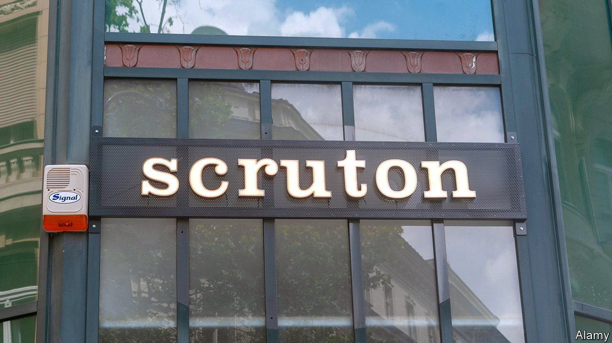

###### Roger Scruton

# Why right-wing Europeans are flocking to an English thinker 

##### The mystery of three grand Budapest cafés 

 

> Jul 2nd 2023 

CUSTOMERS AT THE Scruton café in Budapest don’t turn up just for its chicken and buttered cauliflower. They come for the peculiar contents on show: a writing table, a blue-and-white china tea set and a collection of vinyl records (classical) all shipped from England. Odd goods are also on sale: 4,900 forints (about £11) buys a t-shirt emblazoned with “Conservatism is more an instinct than an idea”. A plaster bust of a tousle-haired, middle-aged man costs twice that. The figure depicted was a political thinker, Roger Scruton.

It’s peculiar to see a café in Budapest devoted to a conservative Englishman who died in 2020. Stranger yet, two more Scruton cafés are in the Hungarian capital. “Scrutopia” are scattered in each: items donated by his widow from his flat in London and farm in Wiltshire. Most striking is the sight of a saddle and riding crop. Scruton took up hunting in middle age, perhaps because the pastime chimed with his love of tradition. The author of over 50 books, he wrote about values of community, reciprocal obligations, courtliness and kingship. Such matters, he believed, were embodied in the hunt. 

In Britain, Scruton’s ideas have gained some traction. As prime minister, Theresa May had him lead official efforts to rewrite planning rules to ensure new constructions went up along traditionalist lines—a process dubbed “building beautiful”. (It fell apart.) A summer school for Scruton disciples takes place in Britain each June. And his ideas still have a strong pull on the New Right of the Conservative Party. Whereas Thatcherism involved ideas of borderless free-market capitalism, which went together with smashing up traditional ways of doing things, Scrutonites hark back to old ways. Sir Jacob Rees-Mogg, who was a senior figure in government, and Suella Braverman, the home secretary, are Scruton-enthusiasts. 

Where Scruton really stirs up interest, however, is on the right wing of continental politics—the most notable adherent is Hungary’s authoritarian leader, Viktor Orban. Scruton’s ideas of the home and the nation resonate especially strongly. Mr Orban can employ them to try to justify his hostility to immigrants and international institutions such as the European Union. Some right-leaning Swedes are fond of Scruton, too. Italy’s prime minister, Giorgia Meloni, is another fan. She likes to quote a saying of his: “it is always right to keep things as they are, in case worse things are proposed”.

Mr Orban was personally fond of Scruton and showed up for his funeral in Britain. The writer had supported the anti-communist underground in the 1970s and 1980s, and frequently visited central European countries to help dissidents. The Hungarian government is also channelling money, through bodies such as the Batthyany Lajos Foundation and the Danube Institute, to promote Scruton’s thought. They support meetings of Scruton-enthusiasts from America, Britain and elsewhere. Plus there are English-language publications, such as the  and the , to propagate his thoughts. As for those cafés, they, too, were set up with money from the Batthyany Foundation, as a sort of home from home. ■


