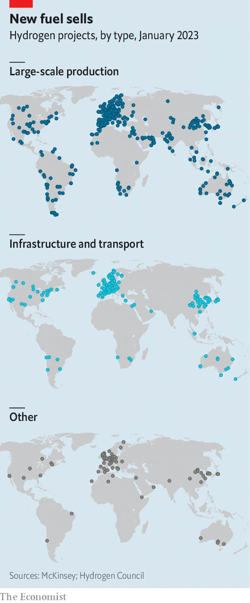
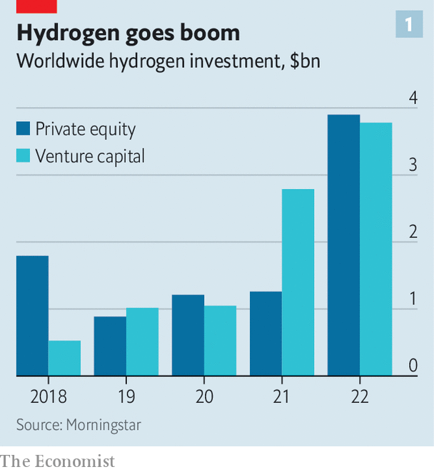
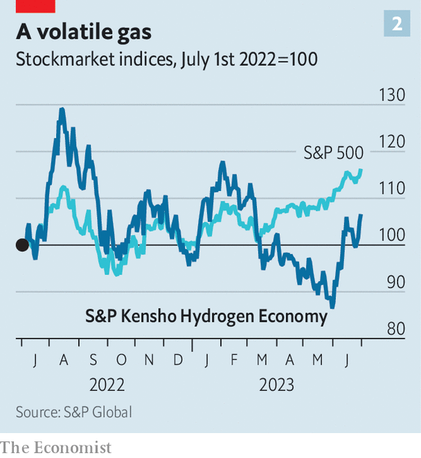
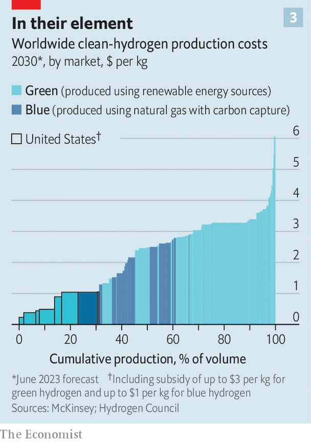

###### The long hydrogen sunrise

# Can a viable industry emerge from the hydrogen shakeout? 

##### Shorn of some of the hype, the hydrogen business is becoming more level-headed—and more promising 

 

> Jul 3rd 2023 

 


HYDROGEN IS THE most abundant element in the universe and a vast source of clean fuel. For investors, it is an equally rich source of hype. As parts of the world get a bit more serious about tackling climate change, hydrogen has emerged as a big part of global decarbonisation efforts. Over 1,000 hydrogen projects are under way worldwide, with more than 350 announced in the past year alone (see map). They could result in some $320bn-worth of investments by 2030. 

Venture capitalists and buy-out barons poured nearly $8bn into hydrogen ventures last year, up from just over $2bn in 2020 (see chart 1). Public markets, too, are getting in on the action. On July 7th, after we published this, Thyssenkrupp Nucera, a pioneering maker of electrolysers, giant machines used to strip hydrogen from oxygen in water, was expected to list in an initial public offering that could value the firm at nearly $3bn. The IPO is backed by a Saudi sovereign-wealth fund and BNP Paribas, a French bank. 

All this frenetic activity is prompting worries of an H bubble akin to an earlier one in the 2000s, which ended in tears for the investors who had ploughed money into such projects. Signs of excess are certainly there. An index of listed hydrogen firms has underperformed America’s S&amp;P 500 blue-chip benchmark over the past year, while displaying a volatility worthy of the gas (see chart 2). ITM Power, a long-standing British electrolyser-maker, ousted its boss last September after repeatedly failing to meet promises for expansion. In October the founder of Nikola, an American startup developing hydrogen-powered lorries, was convicted for misleading investors. Even prominent hydrogen boosters acknowledge that things have become frothy. Olivier Mussat, boss of Atome, a British firm planning to make fertiliser from hydrogen produced using excess hydroelectric power in Paraguay, worries that “a lot of people have been selling ‘hopium’.”

In fact, the problem with today’s boom may be not that there is too much money chasing hydrogen but too little. Deep decarbonisation requires much bigger investments. The International Energy Agency, an official forecaster, reckons that clean hydrogen should comprise roughly a tenth of final energy use by 2050, up from a thimbleful today. To achieve net-zero carbon emissions by 2050, another $380bn will need to be invested in hydrogen by the end of this decade, on top of the $320bn announced so far. 

H to grow

Happily for the planet, there are reasons to think that this investment cycle may be different, even if some investors get their fingers burned. Unlike 20 years ago, when the hype came from enthusiasm for cars fuelled by hydrogen, this time the focus is on emissions-intensive industries such as cement or long-haul transport, which are difficult to decarbonise by electrification alone. Governments, especially those elected by increasingly climate-conscious Western societies, are trying to help lift the industry into existence with generous subsidies. And market forces are blowing away some of the hydrogen froth without snuffing out the business as a whole. David Giordano of BlackRock, an asset manager with big hydrogen bets, says that the hydrogen business is ripe for “a useful correction”. 

 


The reason a clean-hydrogen industry is taking so long to get off the ground has to do with another aspect of the element’s chemistry. Because it is highly reactive, it scarcely exists on Earth in its free state and is instead bound up in molecules with other elements, chiefly carbon (in natural gas and other hydrocarbons) and oxygen (in water). Extracting the stuff from those molecules requires energy and can itself emit carbon—either because stripping hydrogen from hydrocarbons leaves carbon behind or because hydrocarbons are burned to power the splitting process. Today huge quantities of dirty hydrogen are produced from natural gas, primarily for use in making ammonia, a compound of hydrogen and nitrogen that is the main ingredient in artificial fertilisers.

 


To clean things up, any carbon released in making hydrogen from hydrocarbons would need to be mopped up and stored. If done right, with tight emissions controls, this “blue” hydrogen, as energy nerds call it, would dramatically reduce CO emissions (though not eliminate them). The environmentally superior alternative is to crack water into hydrogen and oxygen using electricity that is carbon-free, from either renewable sources (“green” hydrogen, in the sector’s colour-coded lingo) or nuclear power (“pink” hydrogen).

Cleaning things up is, though, costly—and getting more so as rising interest rates raise capital-intensive hydrogen projects’ costs. The difficulties in sourcing critical minerals and other vital components have led many firms to fall behind on expanding capacity. Getting enough renewable power is another bottleneck. Benoît Potier, chairman of Air Liquide, a French industrial-gas giant, says his firm’s planned 200 megawatt (MW) mega-project for making green hydrogen in Normandy is all set to go but cannot secure a large-enough power-purchase agreement for renewables (though a pink version may go ahead by tapping into France’s plentiful nuclear power). 

Bernd Heid, a hydrogen consultant at McKinsey, reckons that “optimism bias” had led promoters to issue over-enthusiastic production targets based on a cost of capital of 8-10%, which now looks rosy. Rising capital costs have prompted Mr Heid to revise the unsubsidised production costs for making hydrogen from renewables upwards by $2 since last year, to between $4.50 and $7 per kilogram.

Still, if the industry is encouraged to grow rapidly, Mr Heid’s fresh forecast predicts that a kilogram of blue or green hydrogen can be made for between $2.50 and $3.50 without subsidy by 2030 (see chart 3). That is beginning to look competitive with the stuff derived from natural gas, which is today made profitably at a cost of less than $2 per kilogram—especially if governments get more serious about pricing carbon properly.


And rapid growth is a distinct possibility. Esben Hegnsholt of BCG, another consultancy, expects the manufacture of electrolysers, fuel cells (which combine hydrogen and oxygen to produce electricity and water vapour) and other hydrogen-economy gear to mature quickly. Companies are finding ways around supply bottlenecks. America’s Plug Power, an integrated firm that makes clean hydrogen, electrolysers and fuel cells, has entered a partnership with Johnson Matthey, a British chemicals and green-tech firm with access to the rare metals required for hydrogen production in electrolysers and for electricity production using fuel cells.

This is helping viable clean-hydrogen projects come on line. In Port Arthur, Texas, Air Products, another industrial-gas firm, is turning the previously dirty hydrogen used at a big refinery run by Valero into blue hydrogen, with the captured CO fed into a pipeline for sale to industrial customers. In Puertollano, an hour by train from Madrid, Iberdrola, a Spanish energy giant, runs a 20MW electrolyser, one of the world’s biggest machines of its kind, using power from its local solar farm. A fertiliser plant next door pays for the clean hydrogen, which replaces the dirtier kind it previously used to make ammonia. Accelera, the clean-energy division of America’s Cummins, a maker of conventional engines, operates a 20MW renewables-powered hydrogen facility in Quebec. Amy Davis, Accelera’s boss, reports that customers with net-zero commitments are willing to pay more for clean hydrogen. 

 


Valero and Iberdrola are illustrative of the industry’s newfound level-headedness. It is increasingly clear that hydrogen makes much more sense in some areas than others. RMI, an American think-tank, calculates the emission-reduction potential of low-carbon hydrogen in a variety of sectors and finds that electrification is a much better choice in passenger cars, which fuelled the brief hydrogen boom 20 years ago, or home heating. A review of 32 studies published in the journal also found that heating homes with hydrogen is less efficient and more resource-intensive than using electrical heat pumps.

Instead, argues Martin Tengler of BloombergNEF, a research firm, the right place to start is by supplying clean hydrogen to sectors that already use dirty hydrogen today, such as in ammonia for fertiliser, methanol for the chemicals industry and oil refining. Perhaps 100m tonnes a year of it is made today from fossil fuels for this purpose. Next, it makes sense to promote hydrogen in areas where few decarbonisation alternatives exist, like steelmaking, shipping and long-term energy storage (where batteries’ tendency to lose charge makes them less useful)—not least because deep-pocketed incumbents in those industries also bring talent, money and business skills that the hydrogen economy needs. In May Felipe Arbelaez of BP, an oil giant pushing into hydrogen, told the World Hydrogen Summit in Rotterdam that the sector’s efforts should first go after industrial applications, which he said were “much easier than, say, using hydrogen for heating homes”. 

This fresh realism comes against the backdrop of another positive trend. Hydrogen is receiving strong policy support in rich countries. Europe took an early lead in kick-starting the industry. The EU’s latest climate package promotes the use of hydrogen in hard-to-decarbonise industries. Its plans to more than halve greenhouse-gas emissions by 2030 include ambitious targets for hydrogen produced using renewable energy. 

America, for its part, is splurging billions of dollars on subsidies. President Joe Biden’s administration is drawing up the final eligibility criteria for a handout of up to $3 per kilogram for clean hydrogen. Combined with America’s bountiful reserves of renewable energy and cheap natural gas, that means the country could become a low-carbon hydrogen production and export powerhouse. A handful of other countries with similar competitive advantages, from Australia and Norway to Chile and Saudi Arabia, are also promoting the industry. In March Air Products and ACWA Power, a Saudi utility, finalised an $8.5bn deal for a mega-project in Saudi Arabia to make hydrogen-related fuels. 

Slowly but unsurely

A lot of things still have to go right for the hydrogen business to live up to its perennial potential. European industry bosses already grumble that the new EU rules are too cumbersome and too hung up on green hydrogen. If written too strictly, the upcoming American eligibility criteria could throttle investment and, worries Andy Marsh, Plug Power’s chief executive, hinder the hydrogen industry for years. If handed out too freely, meanwhile, for example by allowing unlimited amounts of fossil-intensive grid electricity to power electrolysers, subsidies could do more harm than good. Analysis from Princeton University suggests that hydrogen made from water with dirty power could generate more greenhouse gases than hydrogen made directly from fossil fuels. 

If the policymakers and investors are not careful, billions of dollars may yet end up in dead-end applications. Despite a recent turn to electric vehicles, Toyota has not pulled the plug on passenger cars equipped with hydrogen fuel cells, which look unlikely to be competitive with battery-powered wheels. Siemens Energy, a German engineering giant, plans to start making electrolysers at a big new factory in Berlin soon but for now workers are still mostly assembling conventional turbines capable of being modified to burn hydrogen instead of natural gas. The domestic gas industry has persuaded the British government to encourage trials of hydrogen for home heating, prompting one lobbyist to crow: “Christmas has arrived early, hydrogen friends!” Money spent on dubious applications leaves less for the vital ones in genuine need of support. A leading hydrogen advocate in Washington whispers: “It really makes me nervous that business models that don’t serve a greater purpose may get funding and win out.”

Karim Amin of Siemens Energy defends his firm’s strategy of selling hydrogen-burning turbines as a useful step in the transition to cleaner energy. But he accepts that “of course there are better ways of using hydrogen than burning it in a gas turbine”. Policymakers, too, are displaying a welcome dose of realism. After a recent U-turn, for instance, the German government will now allow imports by pipeline of blue hydrogen made from natural gas in Norway. “This is a real dawn for hydrogen,” sums up Mr Hegnsholt of BCG, hopefully—even if, “like the sunrise, it will take longer than people think.” ■


