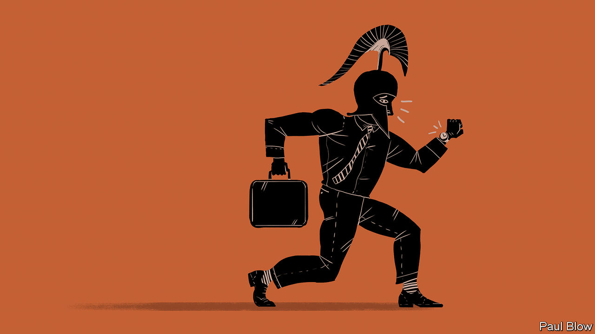

###### Bartleby

# How white-collar warriors gear up for the day 

##### Achilles goes to the office 

 

> Jul 6th 2023 

“The iliad” is a story of glory and gods, revenge and mercy, death and immortality. Squint hard enough and it is also a workplace saga. The epic kicks off with a big row between a pair of co-workers called Agamemnon and Achilles. The gods are the senior leadership team, descending from on high to cause complete chaos. For most of the book Achilles, a prototype of the talented jerk, is on strike. This is a big problem for the Greek management team, who have lost their best performer. A delegation from HR fails to win Achilles over. Eventually, however, he returns to the office, and all is well (Trojans may disagree).

The parallels between the 21st-century workplace and “The Iliad” are admittedly inexact. There are fewer swords and spears glinting in the rosy-fingered dawn today; there is a bit less brain matter on the floor. But to see the modern connections to Homer’s epic, look at Achilles’s preparations to go back to work. 

“Now I shall arm myself for war,” he says in Book 19. The arming of Achilles is the forebear of gearing-up scenes ever since, from Chaucer to Rambo. But it also has echoes of current daily rituals. Achilles puts on bronze greaves and shining breastplates; employees choose clothes that they don’t wear at the weekend. Achilles puts on his golden-plumed helmet; commuters don their Bose headphones. The Homeric hero takes up a shield forged by Hephaestus, the god of fire. The office worker stuffs a laptop and charger into a rucksack. 

Most of this white-collar arming takes place inside the home, but not all. It also happens en route to the battlefield, as compacts emerge and make-up is applied on the Tube. Sometimes the transformation takes place in the office itself. Trainers are swapped for heels. Lycra-clad colleagues disappear from view and emerge in something less off-putting. 

Battle may be close but it does not arrive instantly, whether you are the king of the Myrmidons or Barry from accounts. Both have thresholds to cross before the real action begins. In Homer’s epic, Achilles has been sitting out the war in an encampment; his appearance on the seashore is when the Greeks learn that he is going to rejoin the fray. There is a feast before the fighting starts (Achilles refuses to eat; perhaps there wasn’t a vegan option). Once armed, he gets on his chariot and goes to the front “resplendent as the sun-god Hyperion”. 

For remote workers the gap between their personal and professional lives may be narrow: the walk from the fridge to the living room (and back again, and back again). That is a problem. Entering the workplace means putting on a different persona as well as different clothes—you, but with added self-control. The transition is easier to make when there are clear boundaries separating home and work. 

Office-goers have many more thresholds to cross. They emerge onto the street in the morning and make the journey towards their desks. They enter a café for their morning coffee; carrying a cup and walking briskly is the simplest way to let fellow citizens know you are gainfully employed. At some point they will have their first encounter with a fellow employee. If they are very unfortunate, this meeting will occur at the start of the commute and involve excruciating small talk on public transport for 40 minutes. Normally, it will just mean that the office is close. 

Workers must then make their entry into the office itself. There are security guards to greet, passes to swipe and lift buttons to press. Visitors to the office will participate in an extra arming scene at this point, in which they sign their names illegibly into a register and are given a lanyard. Hyperion, indeed. 

The moment for action is now imminent. Outside the walls of Troy, Achilles springs forward like “a fierce lion”; a cycle of carnage begins that will end with the death of Hector. The white-collar worker must make final preparations for the day ahead, too. The rucksack comes off, and the computer switches on. The salaried hero springs forward, jaws foaming, to take a last bite of croissant; crumbs fleck the keyboard and the carpet. The password is entered, the loading wheel spins, the heart rate remains exactly the same. It’s time.

Homer would never have made a name for himself with an office-based epic: death and glory guarantee a more dramatic narrative than email and meetings. But when you put on your work clothes, change into your professional self and pitilessly strike your first key, you are more than just a foot-soldier. You are a tiny Achilles. ■


