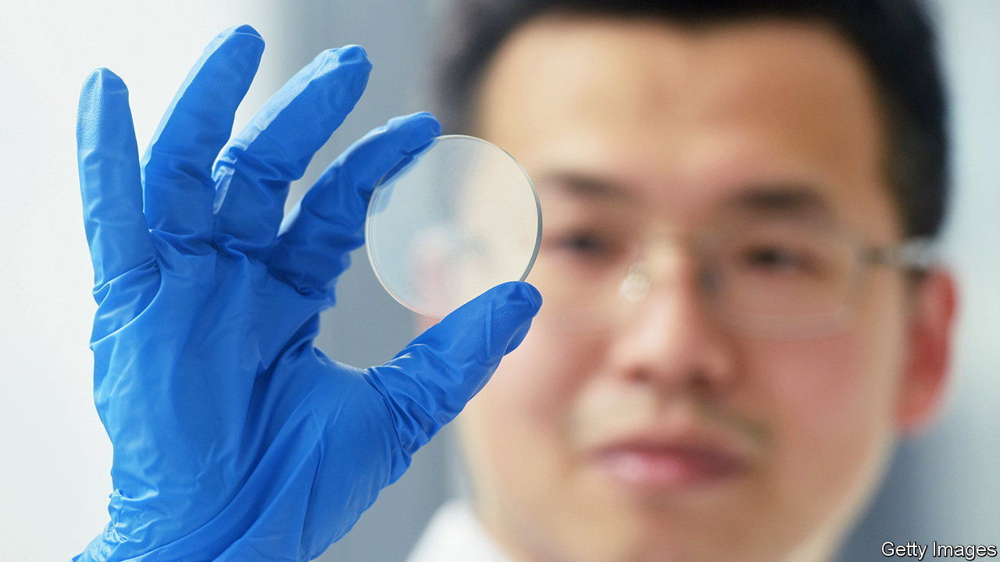

###### Full metal straitjacket

# In its tech war with America, China brings out the big guns 

##### Chinese officials restrict exports of critical chip metals 

 

> Jul 4th 2023 

IN THE TECH battle between , the Western power has been more aggressive of late. Last year President Joe Biden’s administration laid out harsh restrictions limiting Chinese artificial-intelligence (AI) companies’ access to American technology. America has also been coaxing allies to follow its lead. On June 30th the Netherlands, under pressure from the White House, announced that it would restrict the sales of some chipmaking equipment to China: ASML, a Dutch maker of the world’s most advanced lithography machines, will from now on sell Chinese customers only low-yield devices for etching cutting-edge chips. On July 4th the reported that the American government may be preparing to curb Chinese use of American cloud-computing services, which enable Chinese AI firms to circumvent America’s earlier sanctions by taking advantage of the cloud provider’s high-end processors without owning chips of their own. 

China’s communist authorities had so far responded to this barrage of tats with a single, relatively meagre tit: in May it barred some Chinese companies from using memory chips made by Micron, a company from Idaho. But on July 3rd it brought out a bigger gun, saying that it would impose export controls on gallium and germanium, two metals used in high-end semiconductors. 

The new export controls will come into effect on August 1st. Unlike the Micron ban, which has little impact beyond one American chipmaker’s top line, restrictions on the sale of chip metals could reverberate across the global chip industry. China supplies about 80% of the world’s gallium and germanium. America may source as much as 50% of its germanium supply from China, according to Jefferies, an investment bank. 

An all-out ban could disrupt the production of a wide range of existing products, including chips, screens, fibre-optic gear and solar panels. It may also stymie the development of next-generation technologies. Chipmakers hope gradually to replace the silicon used in most processors with gallium nitride or silicon carbide, both of which can handle higher voltages. Gallium and germanium may also be useful in electric vehicles, nuclear energy and other devices, including weapons. 

The Chinese move comes at a delicate moment in . Despite their respective tech manoeuvres, in recent months both sides have also been talking of stabilising relations. Janet Yellen, America’s treasury secretary, was expected to arrive in Beijing for talks as we published this. The visit follows a meeting in Washington in May between China’s and America’s commerce secretaries, and a trip to China in late June by Antony Blinken, America’s secretary of state, in which he briefly met Xi Jinping, China’s leader, and other senior officials. 

China hawks in Washington may argue that China’s bite is weaker than its bark. Like some of the American restrictions, China’s new rules would require exporters to seek government approval and export licences. The Chinese government may well grant these quite freely: after all, a total prohibition would hurt Chinese exporters, who sell a lot of germanium and gallium to American customers. But Mr Biden should make no mistake. China is showing that it will not roll over—and that it can strike back. Expect an increasingly evenly balanced tit-for-tat. ■


