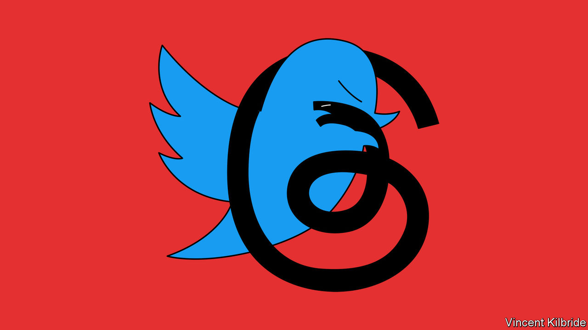
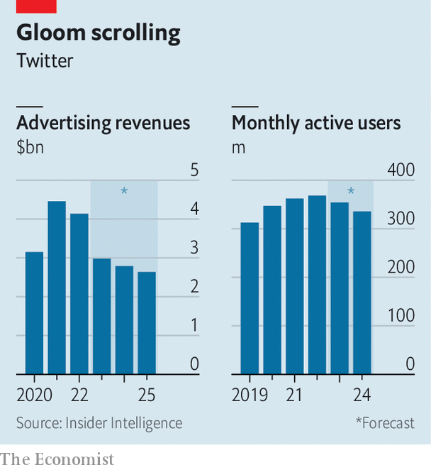

###### Punch-up in the public square

# The Musk-Zuckerberg social-media smackdown 

##### With Threads, a copycat app, Meta hopes to capitalise on Twitter’s travails 

 

> Jul 4th 2023 

In one corner is Mark Zuckerberg: 39 years old, five foot seven inches and, if his selfies are to be believed, a wizard at jiu-jitsu. In the other corner stands Elon Musk: 13 years older, six inches taller and considerably heavier, with a special move known as the walrus (“I just lie on top of my opponent &amp; do nothing”). The two billionaires have agreed to a cage fight, with Mr Musk saying on June 29th that it might take place at the Roman Colosseum.

The rumble in Rome may not happen. Neither the Italian government nor Mr Musk’s mother seems keen. But the new-media moguls are also limbering up for a more consequential fight. On July 5th Meta, Mr Zuckerberg’s firm, added a new app to its social-media empire. Threads, a text-based network, looks a lot like Twitter, the app Mr Musk bought last October for $44bn. An almighty social-media smackdown is about to begin.

 


Mr Musk’s tenure at Twitter has been bruising for many parties. About 80% of the nearly 8,000 employees he inherited have been laid off, to cut costs. Amid a glitchy service, users have started to drift away, believes eMarketer, a research firm (see chart). The introduction on July 1st of a paywall, limiting the number of tweets that can be seen by those who do not cough up $8 a month, may repel more. Advertisers have fled: Twitter’s ad sales this year will be 28% lower than last, forecasts eMarketer. In May Fidelity, a financial-services firm, estimated that the company had lost about two-thirds of its value since Mr Musk agreed to buy it.

From this chaos, the clearest winner is Mr Zuckerberg. By 2021 his business had become synonymous with misinformation and bile. He then irked investors by using his all-powerful position at the firm to pour billions into the metaverse, an unproven passion project that looks years away from making money. On July 4th two years ago he drew ridicule after posting a video of himself vaingloriously surfing a hydrofoil holding an American flag. No one in Silicon Valley was more polarising.

Today Mr Musk’s erratic handling of Twitter makes Mr Zuckerberg’s stewardship of Meta look like a model of good corporate governance. And although Twitter’s new freewheeling approach to content moderation has delighted some conservatives—including Ron DeSantis, governor of Florida, who launched his presidential bid in a glitch-filled live audio session on the app—liberals find it increasingly hard to stomach. Mr Musk remains more popular than Mr Zuckerberg among Americans (who also fancy his odds in the cage), according to polls from YouGov. But as the controversies at Twitter rumble on, and as politicians turn their fire on another social app, the Chinese-owned TikTok, Mr Zuckerberg’s approval rating is now the highest it has been in over three years.

Meta eyes another, commercial victory. Various startups have tried to capitalise on Twitter’s travails, with little success. Mastodon, a decentralised social network with a single employee, said that by November it had added more than 2m members since the Twitter deal closed. But people found it fiddly; by June it had 61% fewer users than at its November peak, estimates Sensor Tower, another data firm. Truth Social, Donald Trump’s conservative social network, has failed to gain traction, especially since Mr Musk steered Twitter rightwards. The latest pretender, Bluesky, faces the same struggle to achieve critical mass.

Meta’s effort, Threads, has a better shot. Cloning rivals is what Meta does best. In 2016, as Snapchat’s disappearing “stories” became popular, Mr Zuckerberg unveiled Instagram Stories, a similar product which helped to keep Instagram on top. Last year, as TikTok’s short videos became a threat, Meta rolled out Reels, a near-identical format that lives within Instagram and Facebook. In April Mr Zuckerberg said Reels had helped to increase the time spent on Instagram by nearly a quarter.

Threads also has a head start. Unlike Reels, it is its own app. But it lets Instagrammers use their existing login details and follow all the same people with one click. Some 87% of Twitter users already use Instagram, according to DataReportal, a research firm; they now have a near-frictionless alternative to Twitter. Will they switch? For some, it may be enough to have a network that is “sanely run”, as Meta’s chief product officer put it recently. Mr Musk may have provided a shove to the others by announcing a paywall days before Threads’ launch.

By Meta’s standards, Twitter’s business is tiny, with one-eighth as many users as Facebook, the world’s largest social network. In 2021 Twitter’s revenue was $5.1bn, against Meta’s $116bn. And those meagre earnings bring big problems. Few platforms attract as many angry oddballs as Twitter. Lately Meta has shied away from promoting news, which brings political controversy and seems not to delight users. News is a big part of what Twitter does. 

Why, then, does Mr Zuckerberg think Threads is worth the headache? One reason is advertising. Twitter has never made much money out of its users because it knows little about them. Between half and two-thirds of those who read tweets are not logged in, estimates Simon Kemp of DataReportal. Many registered users are “lurkers”, who view others’ feeds but seldom engage. Meta, which knows a lot about its users from its other apps, can hit them with well-targeted ads in Threads from day one. And the brand-focused adverts that work best on Twitter would complement the direct-response ads that Facebook and Instagram specialise in. 

Meta’s other possible motive relates to artificial intelligence (AI). Models behind human-sounding apps like ChatGPT place a premium on big troves of text. Online forums like Reddit are scrambling to monetise the billions of words that they hold. Mr Musk has said that Twitter’s paywall is a response to “EXTREME levels of data scraping” by AI firms. In setting up a text-based network alongside the visual feeds of Facebook and Instagram, Meta gets a source of rich language data. Threads is much more than an ad platform, says Mr Kemp. “Zuck is playing the AI content-feeding game.” Whether Meta licensed the data to others or used it in its own AI projects, it would be a new growth story to tell investors. 

Launching a social network is hard. Even with its 3.8bn existing users Meta has had its share of failures: Facebook Dating remains unloved and the company’s gaming and shopping initiatives have yet to take off. But as Twitter bleeds users and advertisers, and as Mr Musk’s management continues on its eccentric path, the opportunity is becoming bigger. Regardless of who prevails in the cage, Mr Zuckerberg may come away with the spoils. ■


