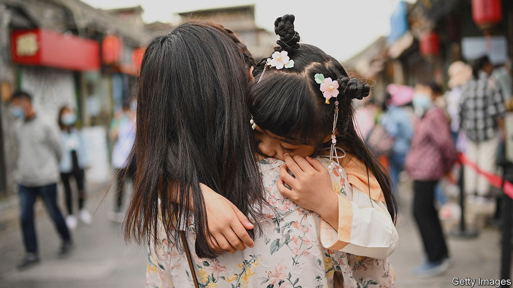

###### Glorious mamas

# Challenging the stigma associated with single mothers in China 

##### Chinese influencers are redefining what a family looks like 

 

> Jul 6th 2023 

At THE age of 29 Gavin Ye decided that she wanted to become a mother, but not a wife. She travelled to America and Russia for in vitro fertilisation (IVF) and gave birth to two daughters. Ms Ye—also known by her Chinese name, Ye Haiyang—now has more than 7.3m followers on Douyin (Chinese TikTok). She posts videos of life with her girls, interspersing occasional advertisements for her skincare company. She dresses in menswear and sports a crew cut. “The powerful aura of a man, the gentleness of a woman, the responsibility of a father, the greatness of a mother—you have it all,” wrote one admirer on Douyin.

Ms Ye’s fans admire not only her wealth and beautiful children, but also her promotion of single parenting. An increasing number of Chinese women are pushing for  and redefining norms. Ms Ye’s channel is one of dozens on Douyin where single mothers share tips about reproductive technology such as IVF and messages about female independence. 

That may cause some discomfort in a society where traditional households are still the norm and single mothers receive unequal access to government benefits. But faced with a declining population, the state is loosening up. Since 2022, four provinces have officially begun allowing children born out of wedlock to be registered with the government. Others are also doing so. “They won’t promote it loudly because it conflicts with their social values,” says Jing, a 33-year-old who is single and living in Shanghai. She expects no trouble registering her son, who is due next month.

Jing has faced other challenges, though. A year ago she decided that she did not have enough time to find a partner and still be a young and energetic mother. “So I should just have a child first,” she decided. But single women are not allowed to use sperm banks or freeze their eggs. So Jing asked a friend, whom she does not intend to marry, to have sex. Her mother and peers have been supportive. Her conservative father took some convincing. Jing says her mother kept telling him, “Times are different. She is not accidentally pregnant. She chose this. She is a glorious mama!”

That puts Jing in the minority. Survey data suggest that most single mothers in China are either divorced or widowed. Many are working-class or poor. Messages about economic self-sufficiency resonate with them, but they acknowledge differences with some of the influencers on Douyin. A divorced single mother in Hubei tells  that few of the women around her are interested in marriage—and neither is she at the moment. Working, cleaning, cooking and raising her son takes up most of her energy. “Not everyone can be a superwoman like Ye Haiyang,” she says. ■


